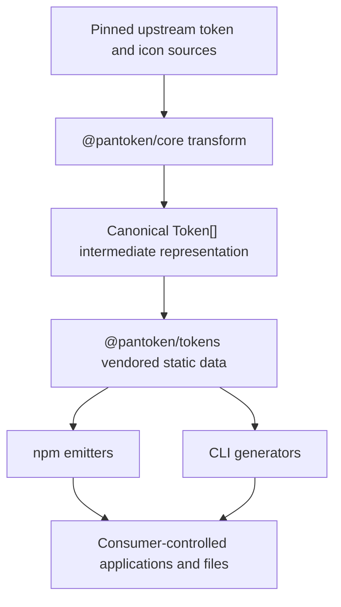
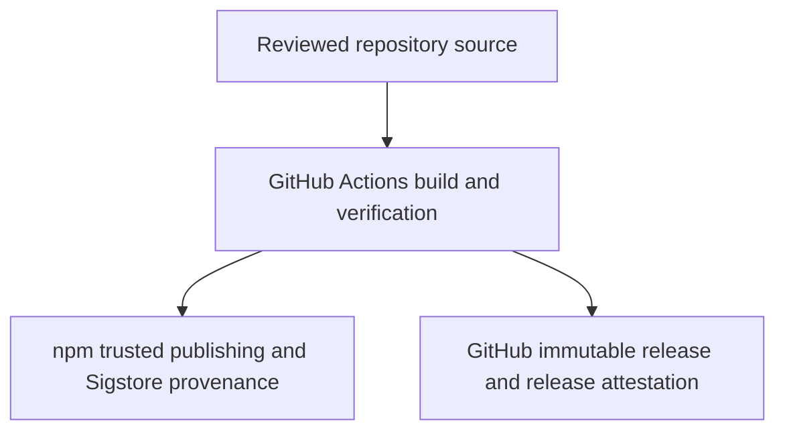

# Pantoken security assurance case

## Purpose and status

This document explains why Pantoken's documented security requirements are met within the project's
intended use and stated trust model. It identifies the assets and threats considered, the trust
boundaries in the system, the secure-design principles applied, the controls used against common
implementation weaknesses, and the evidence supporting each claim.

This assurance case covers the source repository, the generated outputs, the published npm packages,
the command-line generator, the documentation and demo tooling, and the release process. It should be
read with the [security policy](SECURITY.md) and the
[architecture overview](docs/architecture/overview.md).

The case is intentionally qualified. Pantoken transforms trusted design-system inputs; it is not a
sanitizer or a security boundary for attacker-controlled CSS, JavaScript, JSON, Markdown, HTML,
configuration, or plugin code. Known limitations and improvement work are recorded in
[Residual risks and limitations](#residual-risks-and-limitations).

## Top-level claim

**C0: Pantoken's published packages and generated outputs satisfy the security requirements documented
in `SECURITY.md` when Pantoken is used within its documented trust boundaries.**

The argument for C0 is:

1. The requirements and scope are explicit and testable.
2. The architecture limits runtime dependencies and separates trusted transformation from downstream
   consumption.
3. Controls address the credible threats and common implementation weaknesses in that architecture.
4. Automated tests, analysis, packaging checks, and release attestations provide evidence that the
   controls continue to operate.
5. Residual risks are disclosed rather than silently treated as solved.

## System description

Pantoken resolves Instructure design tokens and icons into a canonical `Token[]` intermediate
representation (IR), vendors that IR as versioned static data, and emits it into formats and
integrations for web frameworks, build systems, design tools, and native platforms.

The principal data flow is:

The release path is:

The authoritative architecture description is
[`docs/architecture/overview.md`](docs/architecture/overview.md).

## Assets to protect

The security-relevant assets are:

- The integrity of the source repository and release workflow.
- The integrity and provenance of published npm packages and GitHub releases.
- The correctness and reproducibility of the canonical token IR and generated outputs.
- The integrity of consumer files written by the CLI.
- The confidentiality of repository and release credentials.
- The availability of build, documentation, and transformation tools when processing expected inputs.
- The integrity of a consumer process that loads a Pantoken package or plugin.

Pantoken does not hold end-user accounts, passwords, private cryptographic keys, authorization data,
or confidential application data.

## Security requirements

The requirements below restate the user-visible commitments in
[`SECURITY.md`](SECURITY.md#security-requirements-and-scope) as assurance claims.

| ID   | Requirement                                                                                                                          | Argument and evidence                                                                                                                                                                                                                                                                                         |
| ---- | ------------------------------------------------------------------------------------------------------------------------------------ | ------------------------------------------------------------------------------------------------------------------------------------------------------------------------------------------------------------------------------------------------------------------------------------------------------------- |
| SR-1 | Published consumer packages must not need to retrieve Pantoken's GitHub-only upstream token source at runtime.                       | The build resolves upstream data once and `@pantoken/tokens` vendors the resulting IR and raw data. Consumer packages depend on `@pantoken/model` and `@pantoken/tokens`, not `@pantoken/core`. The dependency boundary is documented and checked by builds, package tests, Publint, and Are the Types Wrong. |
| SR-2 | Generated output must be reproducible from repository source and pinned dependencies.                                                | The lockfile, pinned upstream reference, deterministic generators, and generated-output validation define a repeatable build input. Generated artifacts are rebuilt rather than edited by hand. The `build`, test, and `validate-generated` gates run in CI.                                                  |
| SR-3 | Public releases must be attributable to their source and build process.                                                              | npm packages are published through trusted publishing with `--provenance`; GitHub releases are immutable and receive release attestations. Verification instructions are documented in [`SECURITY.md`](SECURITY.md#verifying-releases).                                                                       |
| SR-4 | Token resolution, output generation, reference integrity, package exports, and supported integrations must be tested before release. | The CI workflow builds all packages and runs type checks, unit and property tests, generated-output validation, linting, package checks, and an aggregate gate on every pull request and push to `main`. Coverage has an enforced 85% statement floor.                                                        |
| SR-5 | Confirmed vulnerabilities in the supported release must receive a coordinated response and corrective release.                       | The reporting channels, acknowledgement target, private assessment, regression-test expectation, release steps, disclosure, and reporter-credit policy are documented in [`SECURITY.md`](SECURITY.md#vulnerability-response-process).                                                                         |
| SR-6 | Pantoken must clearly disclose where it is not a security boundary.                                                                  | The security policy states that caller-provided tokens, plugins, configuration, Markdown, and HTML are trusted unless a package says otherwise, and that emitters do not sanitize attacker-controlled content.                                                                                                |

## Threat model

### Threat sources

The model considers:

- An attacker who compromises or publishes a malicious external dependency.
- An attacker who tampers with a package, release, tag, or download path.
- A malicious or compromised contributor attempting to introduce unsafe code or workflow changes.
- Malformed structured input that attempts prototype pollution, path traversal, excessive regular
  expression work, or parser failure.
- Crafted documentation or demo metadata that attempts markup injection or iframe capability escape.
- Crafted process arguments that attempt shell-command injection.
- Accidental maintainer errors that produce incomplete, stale, or incorrectly packaged output.

### Entry points

Security-relevant entry points include:

- Upstream design-token and icon packages consumed during generation.
- Public JavaScript APIs that accept token arrays, plugin objects, options, Markdown trees, and HTML
  fragments.
- Browser component attributes and CSS custom properties consumed by interaction helpers.
- CLI arguments and caller-selected output paths.
- Documentation demo specifications and generated iframe attributes.
- URLs handled by the local Vite development file server.
- CDN provider/version/package/path values passed to `@pantoken/cdn`'s URL builders (consumed by
  `@pantoken/canvas-theme-editor`'s `buildTheme` and, in future, the docs CDN picker).
- Dependency updates, pull requests, GitHub Actions workflows, and the release workflow.

### Threats and controls

| ID   | Threat                                                                                 | Control argument                                                                                                                                                                                                                                                                                                                                                                                                                                                                                  | Evidence                                                                                                                                                                                                                                                                                                                                                   |
| ---- | -------------------------------------------------------------------------------------- | ------------------------------------------------------------------------------------------------------------------------------------------------------------------------------------------------------------------------------------------------------------------------------------------------------------------------------------------------------------------------------------------------------------------------------------------------------------------------------------------------- | ---------------------------------------------------------------------------------------------------------------------------------------------------------------------------------------------------------------------------------------------------------------------------------------------------------------------------------------------------------- |
| T-1  | A dependency or upstream update changes generated output unexpectedly.                 | Versions are recorded in the lockfile, new dependency releases are delayed, automated update pull requests expose changes for review, and the upstream-drift and generated-output gates fail on unreviewed changes.                                                                                                                                                                                                                                                                               | [`pnpm-lock.yaml`](pnpm-lock.yaml), [`pnpm-workspace.yaml`](pnpm-workspace.yaml), [`renovate.json`](renovate.json), [`tools/upstream-diff`](tools/upstream-diff/), [`tools/validate-generated`](tools/validate-generated/)                                                                                                                                 |
| T-2  | A registry or distribution-path attacker substitutes a release.                        | npm registry signatures and Sigstore provenance bind packages to the source workflow. Each GitHub release has an attached package tarball and a JSON-serialized Sigstore bundle (`*.sigstore.json`) generated by `actions/attest-build-provenance`, binding the tarball to the source commit and Actions workflow. GitHub immutable-release attestations bind a release tag to its commit and attached assets. Users receive verification commands and public verification-material instructions. | [`SECURITY.md`](SECURITY.md#verifying-releases), [release workflow](.github/workflows/release.yml), [`scripts/release/publish-npm.ts`](scripts/release/publish-npm.ts)                                                                                                                                                                                     |
| T-3  | A crafted token name causes prototype pollution in DTCG output.                        | DTCG output begins with a null-prototype root and excludes `__proto__`, `constructor`, and `prototype` keys. Property tests exercise arbitrary and deliberately dangerous names.                                                                                                                                                                                                                                                                                                                  | [`formats/dtcg/src/transform.ts`](formats/dtcg/src/transform.ts), [`formats/dtcg/tests/transform.property.test.ts`](formats/dtcg/tests/transform.property.test.ts)                                                                                                                                                                                         |
| T-4  | A development-server URL escapes the configured file root.                             | Requested paths are resolved against the configured root and rejected when the relative result escapes that root. Only configured file extensions are served; read failures fall through without exposing error detail.                                                                                                                                                                                                                                                                           | [`plugins/vite/workspace-orchestrator/src/file-server.ts`](plugins/vite/workspace-orchestrator/src/file-server.ts), [`plugins/vite/workspace-orchestrator/tests/file-server.test.ts`](plugins/vite/workspace-orchestrator/tests/file-server.test.ts)                                                                                                       |
| T-5  | Crafted strings cause catastrophic regular-expression backtracking.                    | Security-sensitive expressions use bounded or non-ambiguous forms. Property tests exercise arbitrary token and syntax strings, and CodeQL and Snyk Code inspect the source for unsafe patterns.                                                                                                                                                                                                                                                                                                   | [`formats/dtcg/tests/transform.property.test.ts`](formats/dtcg/tests/transform.property.test.ts), [`docs/scripts/build-css-api.property.test.ts`](docs/scripts/build-css-api.property.test.ts), [CodeQL workflow](.github/workflows/codeql.yml)                                                                                                            |
| T-6  | Demo metadata injects markup into generated documentation.                             | Iframe attribute values are escaped before insertion. Executable demonstrations run in sandboxed iframes with an explicit capability list. Tests assert escaping and sandbox emission.                                                                                                                                                                                                                                                                                                            | [`tools/demo/src/index.ts`](tools/demo/src/index.ts), [`tools/demo/tests/index.test.ts`](tools/demo/tests/index.test.ts), [`tools/demo/runner/main.ts`](tools/demo/runner/main.ts)                                                                                                                                                                         |
| T-7  | A value passed to a repository script is interpreted by a command shell.               | Release and repository scripts invoke child processes with argument arrays and `shell: false` rather than interpolating commands into a shell string. Temporary release-note files are created in unique directories and removed after use.                                                                                                                                                                                                                                                       | [`scripts/release/publish-npm.ts`](scripts/release/publish-npm.ts), [`scripts/release/changed-packages.ts`](scripts/release/changed-packages.ts)                                                                                                                                                                                                           |
| T-8  | A generated package is incomplete, points at the wrong files, or exposes broken types. | The build validates generated files and token references. Publint and Are the Types Wrong inspect packed consumer artifacts. Repository metadata and changeset coverage are checked separately.                                                                                                                                                                                                                                                                                                   | [`tools/validate-generated/index.ts`](tools/validate-generated/index.ts), [`scripts/release/check-repository-metadata.ts`](scripts/release/check-repository-metadata.ts), [CI workflow](.github/workflows/ci.yml)                                                                                                                                          |
| T-9  | A workflow or dependency is changed to execute unexpected code with release authority. | Third-party actions are pinned to commit SHAs, workflow permissions are declared, ordinary CI is read-only, and npm publishing uses short-lived OIDC trusted publishing rather than a long-lived npm token. Dependency and workflow updates are automated and reviewed as pull requests.                                                                                                                                                                                                          | [CI workflow](.github/workflows/ci.yml), [release workflow](.github/workflows/release.yml), [Scorecard workflow](.github/workflows/scorecard.yml), [`renovate.json`](renovate.json)                                                                                                                                                                        |
| T-10 | A defect or malicious change is not detected before release.                           | Every pull request and push to `main` runs build, type checking, tests, coverage, linting, generated-output validation, package validation, and static analysis. Releases rebuild the publish set and use the verified `main` commit.                                                                                                                                                                                                                                                             | [CI workflow](.github/workflows/ci.yml), [release workflow](.github/workflows/release.yml), [`vite.config.ts`](vite.config.ts), [`codecov.yml`](codecov.yml)                                                                                                                                                                                               |
| T-11 | A crafted CDN version string breaks out of a URL and corrupts generated CSS/JS/markup. | `@pantoken/cdn` rejects version strings containing quotes, angle brackets, whitespace, or path separators before building any URL. Package/path values are caller-controlled by design (see TB-4) and are not treated as untrusted user input.                                                                                                                                                                                                                                                    | [`packages/cdn/src/version.ts`](packages/cdn/src/version.ts), [`packages/cdn/tests/index.test.ts`](packages/cdn/tests/index.test.ts)                                                                                                                                                                                                                       |
| T-12 | An external translation model changes a source literal that must remain exact.         | Translation entries marked `verbatim: "required"` are copied from the trusted source directly into locale caches and are excluded from adapter prompts, including forced translation runs. Tests assert adapter bypass and replacement of stale translated cache values.                                                                                                                                                                                                                          | [`tools/translation-adapters/src/index.ts`](tools/translation-adapters/src/index.ts), [`tools/translation-adapters/tests/index.test.ts`](tools/translation-adapters/tests/index.test.ts), [`docs/scripts/translation-memory.ts`](docs/scripts/translation-memory.ts), [`docs/scripts/translation-memory.test.ts`](docs/scripts/translation-memory.test.ts) |

## Trust boundaries

### TB-1: Upstream source to Pantoken transformation

The upstream design-token and icon packages are external inputs. Pantoken trusts the selected
versions only after dependency resolution, review, generation, drift analysis, and CI complete. The
resolved IR, not the live upstream package, crosses into consumer packages.

### TB-2: Repository source to CI and release infrastructure

GitHub Actions executes repository-controlled workflows and third-party actions. Pull requests run
with read-only repository access. Release permissions are confined to the release job, and npm
publishing uses an OIDC identity scoped to the configured repository and workflow. GitHub and npm are
trusted to enforce their access controls, attestations, and immutable-release guarantees.

### TB-3: Pantoken packages to consumer applications

Pantoken packages provide generated values, CSS, components, and integration helpers. They do not
provide authentication, authorization, output sanitization, Content Security Policy, or a browser
security boundary. The consuming application owns those controls.

### TB-4: Caller configuration and plugins to the Pantoken process

Configuration and plugins are executable or code-generating inputs and run with the privileges of
the process that loads them. Pantoken treats them as trusted. A plugin boundary is an extension
boundary, not a sandbox. Consumers must not load attacker-controlled plugins or configuration.

### TB-5: CLI invocation to the local filesystem

The CLI writes to a caller-selected location with the caller's operating-system permissions. The
caller is trusted to choose the destination. Pantoken does not claim to confine a deliberately
malicious local user who already controls the CLI invocation.

### TB-6: Documentation content to browser execution

Repository-controlled documentation and demo specifications become HTML and iframe URLs. Pantoken
escapes generated attributes and applies iframe sandboxing. The documentation toolchain still treats
the underlying Markdown and example code as trusted project content.

## Application of secure-design principles

### Economy of mechanism

Pantoken has one canonical token IR and a shared resolver instead of independent parsers in every
output package. Type contracts live in the zero-dependency `@pantoken/model` package. Consumer
packages use the vendored IR and avoid the upstream transformer unless transformation is their
purpose. This reduces duplicated security-sensitive logic and the consumer attack surface.

### Fail-safe defaults

The CLI rejects unknown commands and generation targets, unsupported swatch formats are rejected,
unsupported file-server paths fall through without being served, and release or CI gate failures
stop publication. Generated-output validation reports failure rather than silently accepting missing
or inconsistent artifacts.

### Complete mediation

Every request handled by the development file server passes through extension and path-containment
checks. Every proposed repository change passes through the aggregate CI gate. Every published
package passes through the repository-metadata and packaging gates, and releases are created through
the single release workflow.

### Open design

The architecture, trust assumptions, security limitations, workflows, release scripts, tests, and
verification commands are public. Security does not depend on keeping the implementation secret.
Authentication secrets and short-lived credentials, rather than hidden algorithms, protect release
authority.

### Separation of privilege

Source changes, CI verification, GitHub release authority, and npm trusted publishing are distinct
steps. npm publication requires the repository, workflow identity, npm trusted-publisher
configuration, and an OIDC exchange to agree. Release attestations and registry verification provide
an independent check after publication.

### Least privilege

Ordinary CI receives read-only repository access. Workflows declare permissions, checkout credentials
are not persisted where they are unnecessary, and the release job receives write and OIDC permissions
only for release work. Pantoken packages themselves do not request elevated operating-system
privileges.

### Least common mechanism

Packages are individually consumable, so users do not need to install the entire integration set.
Heavy or side-effectful integrations remain subpaths rather than eager imports. Temporary release
data uses per-operation directories instead of a shared predictable file.

### Psychological acceptability

Unsafe or unsupported cases produce direct error messages where validation exists. The contribution
guide provides one standard development gate, while release and verification commands are documented
for maintainers and consumers. Security reporting has a private GitHub path and an email fallback.

### Limited attack surface

Consumer packages do not fetch the GitHub-only upstream at runtime. Browser-facing component graphs
remain Node-free. The project does not implement authentication, cryptography, or network protocols.
Sandboxed iframes constrain demonstrations, and users can install only the package they need.

### Input validation

Pantoken applies allowlists at several constrained entry points: CLI commands and targets, native
platform selections, DTCG dangerous-key filtering, expected file extensions, path containment,
CSS custom property name pattern for plugin-contributed tokens, and an SVG script-injection strip
for decoded icon SVGs and plugin-contributed SVG assets.
Browser interaction helpers validate numeric configuration before scheduling work; missing,
non-finite, and non-positive alert timeouts leave the element mounted.
ProgressCircle animation delays are normalized to a finite, non-negative millisecond value.
Progress web-component values are normalized to a finite range between a minimum and larger maximum.
HTML attributes are escaped at the output boundary.

## Common implementation weaknesses and countermeasures

| Weakness                              | Countermeasure                                                                                                                                                    |
| ------------------------------------- | ----------------------------------------------------------------------------------------------------------------------------------------------------------------- |
| Prototype pollution                   | Null-prototype DTCG root, dangerous-key exclusions, `validatePlugin` structural checks, example tests, and property tests over arbitrary token names.             |
| Path traversal                        | Canonical path resolution followed by a relative-path containment check before file reads. CLI warns when output path escapes cwd.                                |
| Command injection                     | Child-process argument arrays, `shell: false`, and temporary files for release notes instead of shell interpolation.                                              |
| Markup and attribute injection        | Output-boundary attribute escaping; `sanitizeSvg` strip on decoded icon SVGs and plugin SVG output; documented trusted-content boundary for raw HTML.             |
| Plugin output injection               | Token names validated against CSS custom property pattern; `<image>` SVG sanitized; `</style>` check on CSS contributions; invalid tokens dropped with a warning. |
| Untrusted active content              | Explicit iframe sandbox capabilities for rendered and self-hosted demonstrations.                                                                                 |
| Regular-expression denial of service  | Non-ambiguous expressions, bounded property-test inputs, high-iteration scheduled property tests, CodeQL, and Snyk Code.                                          |
| Unsafe object mutation                | Frozen public mapping tables where mutation would alter global behavior, null-prototype generated maps, and immutable inputs where practical.                     |
| Malformed browser numeric input       | Alert timeouts and ProgressCircle delays accept only finite values; Progress web-component values clamp between zero and a positive maximum.                      |
| Malformed or missing generated output | Build-before-test ordering, generated-output validation, reference-integrity checks, package export checks, and failure aggregation.                              |
| Dependency vulnerabilities            | Renovate and Dependabot monitoring, a dependency release-age delay, Snyk dependency scanning, CodeQL, and OpenSSF Scorecard.                                      |
| Release tampering                     | npm registry signatures, Sigstore provenance, npm OIDC trusted publishing, GitHub immutable releases, and public verification instructions.                       |
| Credential persistence                | Token-free npm publishing through short-lived OIDC credentials; secrets remain in GitHub's secret store rather than source or generated packages.                 |
| Regression reintroduction             | Automated tests on every pull request and push to `main`, an 85% statement-coverage floor, property tests, and regression tests for corrected defects.            |

## Verification evidence

The principal continuous evidence is:

- [CI workflow](.github/workflows/ci.yml): build, type checking, tests, coverage, linting,
  generated-output validation, package validation, documentation build, and aggregate status.
- [CodeQL workflow](.github/workflows/codeql.yml): automated semantic static analysis.
- [`scripts/quality/snyk-code-gate.ts`](scripts/quality/snyk-code-gate.ts): reviewed Snyk Code policy
  and explicit handling of accepted findings.
- [`vite.config.ts`](vite.config.ts): test discovery, V8 coverage, enforced thresholds, property-test
  setup, and the development gate.
- [`codecov.yml`](codecov.yml): project and patch coverage reporting.
- [`tools/validate-generated/index.ts`](tools/validate-generated/index.ts): generated-file,
  reference-integrity, CLI-target, and published-CSS checks.
- [`scripts/release/check-repository-metadata.ts`](scripts/release/check-repository-metadata.ts):
  package metadata, provenance configuration, engine, license, and export prerequisites.
- [Release workflow](.github/workflows/release.yml): scoped release permissions, build and package
  gates, OIDC publishing, and immutable GitHub releases.
- [`SECURITY.md`](SECURITY.md): supported versions, security requirements, reporting and response,
  supply-chain controls, and release-verification instructions.

## Residual risks and limitations

The following risks remain or are deliberately outside the security claim:

1. **Trusted transformation inputs.** Token values, configuration, plugins, Markdown, and raw HTML
   can produce active CSS, JavaScript, markup, or source code. Pantoken does not sanitize
   attacker-controlled transformation inputs. Defense-in-depth: `sanitizeSvg` strips `<script>`
   elements and event-handler attributes from decoded icon SVGs (`@pantoken/icons`) and from
   plugin-contributed SVG at the IR boundary (`@pantoken/core`). This is a defense-in-depth
   measure for trusted-but-pinned sources, not a general untrusted-input sanitizer.
2. **Plugin authority.** Plugins execute with the loading process's privileges. `validatePlugin`
   asserts structural integrity (non-empty name, function hooks, no unrecognised keys) before any
   plugin is run. Plugin output is validated at the IR boundary: token names are checked against the
   CSS custom property pattern, `<image>` token SVG data-URIs are sanitized, and plugin-contributed
   icon SVGs are sanitized before encoding. Full execution sandboxing (Worker thread heap isolation
   and child-process `--permission` model) is planned; the API redesign required to make hook
   contexts serializable is a prerequisite.
3. **CLI validation gaps.** ~~Closed.~~ `--theme`, `--class`, `--format` (rust target), and all
   unknown flags are now validated against allowlists at parse time and rejected with a descriptive
   error. Regression tests cover each rejection case. The CLI warns when the output path escapes the
   current working directory.
4. **Caller-selected output paths.** The CLI intentionally writes to the path selected by its caller.
   Operating-system permissions, workspace isolation, and review of build configuration protect the
   surrounding filesystem.
5. **Development file server.** The workspace file server is intended for local Vite development. It
   is not a production server and does not provide rate limiting or authentication.
6. **Consumer security controls.** Authentication, authorization, Content Security Policy, safe
   handling of user content, and output encoding remain the consuming application's responsibility.
   Application-controlled Pendo guide classes, compact color/glyph suffixes, and layout attributes
   select presentation rules only; they do not validate or sanitize Pendo-injected guide HTML.
7. **Static-analysis availability.** CodeQL runs in CI. The Snyk Code pre-push gate requires local
   authentication and warns when it cannot run, so it is supplementary rather than the sole control.
8. **Generated GitHub source archives.** GitHub can verify an immutable release tag and attached
   assets. Each release now has an attached package tarball and SLSA `*.sigstore.json` provenance
   bundle; the automatically-generated source archives are separate and not covered by those
   signatures. npm packages are additionally covered by registry signatures and Sigstore provenance.

These limitations do not weaken the narrower requirements in SR-1 through SR-6 because they are
included in the documented scope and trust model. They do prevent Pantoken from claiming that it
safely accepts arbitrary untrusted transformation input.

## Maintenance of this assurance case

The maintainer should review this document:

- When a new public input surface, plugin type, network operation, or privileged workflow is added.
- When the trust model or security requirements in `SECURITY.md` change.
- After a confirmed vulnerability reveals a missing threat or ineffective control.
- When release, signing, dependency, or CI infrastructure changes materially.
- At least annually as part of the roadmap and security-documentation review.

Changes to security claims must update the corresponding evidence links. A control that is planned but
not implemented must remain in the residual-risk section and must not be presented as evidence.
