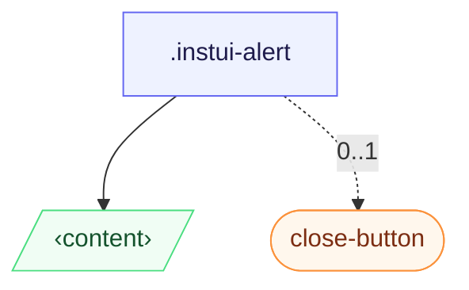

# CSS: alert

`.instui-alert` · <span class="instui-pill -color-success pantoken-doc-tag">stable</span> — رسالة مضمنة بها شريط لون الحالة وحرف حالة مخفي من مجموعة الرموز المشتركة.

يتبادل `-icon-&lt;name&gt;` المخصص حرف الحالة لكنه يحتفظ بشريط الألوان في المتغير؛ يتم إعادة تأكيد ملء الشريط بدقة أعلى بحيث لا يستهلكها رسام الرموز المشترك.

**المصدر:** [alert.css](https://github.com/thedannywahl/pantoken/blob/main/formats/components/src/components/alert/alert.css)

<!-- js-requirement -->

> [!TIP]
> **JS Enhancement** — يتم عرض CSS الخاص بهذا المكون والعمل بشكل مستقل؛ اجمعه مع `@pantoken/interactions` لإضافة السلوك التفاعلي. معدل `-timeout` الخاص به يتم تشغيله بهذا السلوك. راجع [جدول المعدلات أدناه](#modifiers).

## Accessibility

لرسالة مهمة، أضف `role="alert"` أو منطقة `aria-live` حتى تعلن التكنولوجيا المساعدة عنها؛ عنصر التحكم في الإغلاق هو زر إغلاق مصنف (يحمل `.instui-close-button` في المثال `aria-label="Close"`).

## Usage

```css
@import "@pantoken/components/components.css";
@import "@pantoken/components/alert.css";
```

## Examples

-nocard

```html
<div class="instui-alert -icon-megaphone --mb-md">
  An alert with the default <code>info</code> color, and a custom icon.
</div>
<div class="instui-alert -color-success">
  Congratulations! You're using the "success" color.
  <button class="instui-close-button -size-sm" aria-label="Close"></button>
</div>
```

## Structure

```text
.instui-alert
  ‹content›
  close-button (component, 0..1)
```



## Slots

| Slot      | Description                               |
| --------- | ----------------------------------------- |
| `content` | محتوى رسالة التنبيه؛ قد يتضمن زر الإغلاق. |

## Modifiers

| Modifier                 | Description                                                                                                                                                                                                      |
| ------------------------ | ---------------------------------------------------------------------------------------------------------------------------------------------------------------------------------------------------------------- |
| `.-color-danger`         | رسالة خطأ.                                                                                                                                                                                                       |
| `.-color-info`           | معلوماتي (افتراضي).                                                                                                                                                                                              |
| `.-color-success`        | رسالة إيجابية/تأكيدية.                                                                                                                                                                                           |
| `.-color-warning`        | رسالة تحذيرية.                                                                                                                                                                                                   |
| `.-has-shadow-false`     | <span class="instui-pill -color-info pantoken-doc-tag">Alias</span> — maps to `.-without-shadow`.                                                                                                                |
| `.-icon-*`               | استبدل الرمز الحالة برمز مخصص (على سبيل المثال `-icon-megaphone`)، محتفظ باللون الأبيض على شريط المتغير الملون.                                                                                                  |
| `.-render-custom-icon-*` | <span class="instui-pill -color-danger pantoken-doc-tag">Deprecated</span> — The former `renderCustomIcon` prop; still works as an alias, but use `-icon-<name>` (or override `--pantoken-alert-glyph`) instead. |
| `.-screen-reader-only`   | مخفي بصرياً لكن معلن.                                                                                                                                                                                            |
| `.-timeout`              | <span class="instui-pill pantoken-doc-tag pantoken-doc-tag-interaction">Interaction</span> — The alert will automatically dismiss after a default of 5 seconds.                                                  |
| `.-timeout-1`            | ثانية واحدة قبل الإغلاق التلقائي.                                                                                                                                                                                |
| `.-timeout-2`            | ثانيتان قبل الإغلاق التلقائي.                                                                                                                                                                                    |
| `.-timeout-3`            | ثلاث ثوان قبل الإغلاق التلقائي.                                                                                                                                                                                  |
| `.-timeout-4`            | أربع ثوان قبل الإغلاق التلقائي.                                                                                                                                                                                  |
| `.-timeout-5`            | خمس ثوان قبل الإغلاق التلقائي.                                                                                                                                                                                   |
| `.-variant-error`        | <span class="instui-pill -color-danger pantoken-doc-tag">Deprecated</span> — use `.-color-danger`.                                                                                                               |
| `.-variant-info`         | <span class="instui-pill -color-danger pantoken-doc-tag">Deprecated</span> — use `.-color-info`.                                                                                                                 |
| `.-variant-success`      | <span class="instui-pill -color-danger pantoken-doc-tag">Deprecated</span> — use `.-color-success`.                                                                                                              |
| `.-variant-warning`      | <span class="instui-pill -color-danger pantoken-doc-tag">Deprecated</span> — use `.-color-warning`.                                                                                                              |
| `.-without-shadow`       | إزالة ظل الارتفاع الافتراضي (InstUI `hasShadow={false}`).                                                                                                                                                        |

## Pseudo-elements

| Pseudo-element | Description                                                          |
| -------------- | -------------------------------------------------------------------- |
| `::after`      | رمز الحالة الأبيض، مقنع ومتمركز فوق الشريط.                          |
| `::before`     | شريط الحالة الملون المتغير الصلب، محاذاة إلى حافة البداية المستديرة. |

## Custom properties

| Property                   | Type        | Default | Description                                                                                         |
| -------------------------- | ----------- | ------- | --------------------------------------------------------------------------------------------------- |
| `--pantoken-alert-glyph`   | `<url>`     | —       | مصدر رمز الحالة منخفض المستوى؛ يضبطه لك `-icon-&lt;name&gt;`. تجاوز رمز مخصص (ملف SVG مرمز بـ URL). |
| `--pantoken-alert-icon-bg` | `<color>`   | —       | ملء شريط الحالة الملون خلف الرمز؛ يعيّن كل متغير `-color-*` خاصته.                                  |
| `--timeout`                | `<integer>` | —       | ميلي ثانية قبل الإغلاق التلقائي؛ يعطله `0`. يتطلب حزمة تفاعل التنبيه.                               |

## Tokens consumed

| Token                                                 | Type                                               | Value                                                                                                                                                                                                                                                                                                                                                                                                                                                                                                                                         |
| ----------------------------------------------------- | -------------------------------------------------- | --------------------------------------------------------------------------------------------------------------------------------------------------------------------------------------------------------------------------------------------------------------------------------------------------------------------------------------------------------------------------------------------------------------------------------------------------------------------------------------------------------------------------------------------- |
| `--instui-component-alert-background`                 | `<color>`                                          | `light-dark(#ffffff, #171B21)`                                                                                                                                                                                                                                                                                                                                                                                                                                                                                                                |
| `--instui-component-alert-border-radius`              | `<length>`                                         | `0.75rem`                                                                                                                                                                                                                                                                                                                                                                                                                                                                                                                                     |
| `--instui-component-alert-border-style`               | —                                                  | `solid`                                                                                                                                                                                                                                                                                                                                                                                                                                                                                                                                       |
| `--instui-component-alert-border-width`               | `<length>`                                         | `0.125rem`                                                                                                                                                                                                                                                                                                                                                                                                                                                                                                                                    |
| `--instui-component-alert-color`                      | `<color>`                                          | `light-dark(#273540, #ffffff)`                                                                                                                                                                                                                                                                                                                                                                                                                                                                                                                |
| `--instui-component-alert-content-font-family`        | `[ <font-family-name> \| <generic-font-family> ]#` | `Atkinson Hyperlegible Next, "Helvetica Neue", Helvetica, Arial, sans-serif`                                                                                                                                                                                                                                                                                                                                                                                                                                                                  |
| `--instui-component-alert-content-font-size`          | `<length>`                                         | `1rem`                                                                                                                                                                                                                                                                                                                                                                                                                                                                                                                                        |
| `--instui-component-alert-content-font-weight`        | `<integer>`                                        | `400`                                                                                                                                                                                                                                                                                                                                                                                                                                                                                                                                         |
| `--instui-component-alert-content-line-height`        | `<percentage>`                                     | `125%`                                                                                                                                                                                                                                                                                                                                                                                                                                                                                                                                        |
| `--instui-component-alert-content-padding-horizontal` | `<length>`                                         | `1.5rem`                                                                                                                                                                                                                                                                                                                                                                                                                                                                                                                                      |
| `--instui-component-alert-content-padding-vertical`   | `<length>`                                         | `0.75rem`                                                                                                                                                                                                                                                                                                                                                                                                                                                                                                                                     |
| `--instui-component-alert-danger-border-color`        | `<color>`                                          | `#E62429`                                                                                                                                                                                                                                                                                                                                                                                                                                                                                                                                     |
| `--instui-component-alert-danger-icon-background`     | `<color>`                                          | `#E62429`                                                                                                                                                                                                                                                                                                                                                                                                                                                                                                                                     |
| `--instui-component-alert-icon-color`                 | `<color>`                                          | `#ffffff`                                                                                                                                                                                                                                                                                                                                                                                                                                                                                                                                     |
| `--instui-component-alert-info-border-color`          | `<color>`                                          | `#2B7ABC`                                                                                                                                                                                                                                                                                                                                                                                                                                                                                                                                     |
| `--instui-component-alert-info-icon-background`       | `<color>`                                          | `#2B7ABC`                                                                                                                                                                                                                                                                                                                                                                                                                                                                                                                                     |
| `--instui-component-alert-success-border-color`       | `<color>`                                          | `#03893D`                                                                                                                                                                                                                                                                                                                                                                                                                                                                                                                                     |
| `--instui-component-alert-success-icon-background`    | `<color>`                                          | `#03893D`                                                                                                                                                                                                                                                                                                                                                                                                                                                                                                                                     |
| `--instui-component-alert-warning-border-color`       | `<color>`                                          | `#CF4A00`                                                                                                                                                                                                                                                                                                                                                                                                                                                                                                                                     |
| `--instui-component-alert-warning-icon-background`    | `<color>`                                          | `#CF4A00`                                                                                                                                                                                                                                                                                                                                                                                                                                                                                                                                     |
| `--instui-component-base-button-medium-height`        | `<length>`                                         | `2.5rem`                                                                                                                                                                                                                                                                                                                                                                                                                                                                                                                                      |
| `--instui-elevation-above`                            | `none \| <shadow>#`                                | —                                                                                                                                                                                                                                                                                                                                                                                                                                                                                                                                             |
| `--instui-icon-circle-check`                          | `<image>`                                          | `url('data:image/svg+xml;utf8,%3Csvg%20xmlns%3D%22http%3A%2F%2Fwww.w3.org%2F2000%2Fsvg%22%20width%3D%2224%22%20height%3D%2224%22%20viewBox%3D%220%200%2024%2024%22%20fill%3D%22none%22%20stroke%3D%22currentColor%22%20stroke-width%3D%222%22%20stroke-linecap%3D%22round%22%20stroke-linejoin%3D%22round%22%3E%3Ccircle%20cx%3D%2212%22%20cy%3D%2212%22%20r%3D%2210%22%2F%3E%3Cpath%20d%3D%22m9%2012%202%202%204-4%22%2F%3E%3C%2Fsvg%3E')`                                                                                                   |
| `--instui-icon-circle-x`                              | `<image>`                                          | `url('data:image/svg+xml;utf8,%3Csvg%20xmlns%3D%22http%3A%2F%2Fwww.w3.org%2F2000%2Fsvg%22%20width%3D%2224%22%20height%3D%2224%22%20viewBox%3D%220%200%2024%2024%22%20fill%3D%22none%22%20stroke%3D%22currentColor%22%20stroke-width%3D%222%22%20stroke-linecap%3D%22round%22%20stroke-linejoin%3D%22round%22%3E%3Ccircle%20cx%3D%2212%22%20cy%3D%2212%22%20r%3D%2210%22%2F%3E%3Cpath%20d%3D%22m15%209-6%206%22%2F%3E%3Cpath%20d%3D%22m9%209%206%206%22%2F%3E%3C%2Fsvg%3E')`                                                                   |
| `--instui-icon-info`                                  | `<image>`                                          | `url('data:image/svg+xml;utf8,%3Csvg%20xmlns%3D%22http%3A%2F%2Fwww.w3.org%2F2000%2Fsvg%22%20width%3D%2224%22%20height%3D%2224%22%20viewBox%3D%220%200%2024%2024%22%20fill%3D%22none%22%20stroke%3D%22currentColor%22%20stroke-width%3D%222%22%20stroke-linecap%3D%22round%22%20stroke-linejoin%3D%22round%22%3E%3Ccircle%20cx%3D%2212%22%20cy%3D%2212%22%20r%3D%2210%22%2F%3E%3Cpath%20d%3D%22M12%2016v-4%22%2F%3E%3Cpath%20d%3D%22M12%208h.01%22%2F%3E%3C%2Fsvg%3E')`                                                                        |
| `--instui-icon-triangle-alert`                        | `<image>`                                          | `url('data:image/svg+xml;utf8,%3Csvg%20xmlns%3D%22http%3A%2F%2Fwww.w3.org%2F2000%2Fsvg%22%20width%3D%2224%22%20height%3D%2224%22%20viewBox%3D%220%200%2024%2024%22%20fill%3D%22none%22%20stroke%3D%22currentColor%22%20stroke-width%3D%222%22%20stroke-linecap%3D%22round%22%20stroke-linejoin%3D%22round%22%3E%3Cpath%20d%3D%22m21.73%2018-8-14a2%202%200%200%200-3.48%200l-8%2014A2%202%200%200%200%204%2021h16a2%202%200%200%200%201.73-3%22%2F%3E%3Cpath%20d%3D%22M12%209v4%22%2F%3E%3Cpath%20d%3D%22M12%2017h.01%22%2F%3E%3C%2Fsvg%3E')` |
| `--instui-spacing-space-xs`                           | `<length>`                                         | `0.25rem`                                                                                                                                                                                                                                                                                                                                                                                                                                                                                                                                     |
| `--pantoken-glyph`                                    | `<url>`                                            | —                                                                                                                                                                                                                                                                                                                                                                                                                                                                                                                                             |

## Subcomponents

- [close-button](/ar/api/css/close-button.md)

## Related

- [close-button](/ar/api/css/close-button.md) — عنصر التحكم في الإغلاق الذي قد يتضمنه التنبيه.
