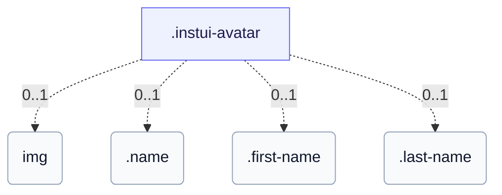

# CSS: avatar

`.instui-avatar` · <span class="instui-pill -color-success pantoken-doc-tag">stable</span> — صورة رمزية للمستخدم توضح الأحرف الأولى أو صورة، دائرية بشكل افتراضي.

بشكل افتراضي، يلون لون لوحة الألوان الأحرف الأولى على سطح شفاف؛ `-has-inverse-color` يملأ السطح بالاللون ويضع الأحرف الأولى على اللون. المتغير `-color-ai` يملأ دائماً بتدرج بنفسجي → بحري. بالنسبة إلى اسم عرض كامل، ضعه في المحتوى (حتى يبقى في شجرة الوصول) وأضف `data-initials="XX"` للعرض المضغوط — النص الفعلي هو ما يعلنه قارئ الشاشة. بدون `data-initials`، يتم قص المحتوى الممتد بشكل مباشر (بدون علامة حذف)؛ لفه في `.name` بدلاً من ذلك للحصول على قص حرف واحد في البداية بدقة، أو قسمه إلى `.first-name`/`.last-name` لحرفين مقصوصين (يمكن حذف أي نصف والآخر يبقى متمركزاً).

**المصدر:** [avatar.css](https://github.com/thedannywahl/pantoken/blob/main/formats/components/src/components/avatar/avatar.css)

<!-- js-requirement -->

> [!TIP]
> **JS Enhancement** — يتم عرض CSS الخاص بهذا المكون والعمل بشكل مستقل؛ اجمعه مع `@pantoken/interactions` لإضافة السلوك التفاعلي. راجع [جدول المعدلات أدناه](#modifiers).

## Accessibility

أعط صورة رمزية للصورة `alt` ذات معنى (اسم الشخص)، وليس "avatar" عام؛ بالنسبة للصور الرمزية التي تحتوي على أحرف أولى فقط، فضّل محتوى الاسم الحقيقي (نص عادي، بيانات أحرف أولى، .name، أو .first-name/.last-name) على الأحرف المختصرة مسبقاً، حتى تعلن التكنولوجيا المساعدة عن الاسم الحقيقي.

## Usage

```css
@import "@pantoken/components/components.css";
@import "@pantoken/components/avatar.css";
```

## Examples

```html
<span class="instui-avatar --me-sm">LH</span>
<span class="instui-avatar -color-ai --me-sm">AI</span>
<span class="instui-avatar --me-sm" data-initials="NV">Dr. Nguyen Van Thoc</span>
<span class="instui-avatar"><span class="name">Miguel Sanchez</span></span>
<span class="instui-avatar"
  ><span class="first-name">Miguel</span> <span class="last-name">Sanchez</span></span
>
```

## Structure

تعرض الصورة الرمزية إحدى: &lt;img&gt;، نص أحرف أولى عادية/بيانات، تغليف .name، أو زوج .first-name/.last-name.

```text
.instui-avatar
  img (0..1)
  .name (0..1)
  .first-name (0..1)
  .last-name (0..1)
```



## Modifiers

| Modifier               | Description                                                                                           |
| ---------------------- | ----------------------------------------------------------------------------------------------------- |
| `.-color-accent1`      | <span class="instui-pill -color-danger pantoken-doc-tag">Deprecated</span> — use `.-color-blue`.      |
| `.-color-accent2`      | <span class="instui-pill -color-danger pantoken-doc-tag">Deprecated</span> — use `.-color-green`.     |
| `.-color-accent3`      | <span class="instui-pill -color-danger pantoken-doc-tag">Deprecated</span> — use `.-color-red`.       |
| `.-color-accent4`      | <span class="instui-pill -color-danger pantoken-doc-tag">Deprecated</span> — use `.-color-orange`.    |
| `.-color-accent5`      | <span class="instui-pill -color-danger pantoken-doc-tag">Deprecated</span> — use `.-color-ash`.       |
| `.-color-accent6`      | <span class="instui-pill -color-danger pantoken-doc-tag">Deprecated</span> — use `.-color-grey`.      |
| `.-color-ai`           | لون لوحة الألوان مع لكنة ذكاء اصطناعي.                                                                |
| `.-color-ash`          | لون لوحة الألوان الرمادي.                                                                             |
| `.-color-blue`         | لون لوحة الألوان الأزرق.                                                                              |
| `.-color-green`        | لون لوحة الألوان الأخضر.                                                                              |
| `.-color-grey`         | لون لوحة الألوان الرمادي.                                                                             |
| `.-color-orange`       | لون لوحة الألوان البرتقالي.                                                                           |
| `.-color-red`          | لون لوحة الألوان الأحمر.                                                                              |
| `.-has-inverse-color`  | استخدم لون النص العكسي (على الأسود).                                                                  |
| `.-shape-rectangle`    | شكل مربع (مستطيل) بدلاً من الدائرة.                                                                   |
| `.-show-border`        | <span class="instui-pill -color-info pantoken-doc-tag">Alias</span> — maps to `.-show-border-always`. |
| `.-show-border-always` | فرض حلقة الحد على، حتى على صورة أو ملء عكسي.                                                          |
| `.-show-border-never`  | فرض إيقاف حلقة الحد.                                                                                  |
| `.-size-2xl`           | حجمان أكبر.                                                                                           |
| `.-size-2xs`           | حجمان أصغر.                                                                                           |
| `.-size-large`         | كبير. اسم مستعار طويل الشكل لـ `-size-lg`.                                                            |
| `.-size-lg`            | كبير.                                                                                                 |
| `.-size-md`            | متوسط (الافتراضي).                                                                                    |
| `.-size-medium`        | متوسط (الافتراضي). اسم مستعار طويل الشكل لـ `-size-md`.                                               |
| `.-size-sm`            | صغير.                                                                                                 |
| `.-size-small`         | صغير. اسم مستعار طويل الشكل لـ `-size-sm`.                                                            |
| `.-size-x-large`       | كبير جداً. اسم مستعار طويل الشكل لـ `-size-xl`.                                                       |
| `.-size-x-small`       | صغير جداً. اسم مستعار طويل الشكل لـ `-size-xs`.                                                       |
| `.-size-xl`            | كبير جداً.                                                                                            |
| `.-size-xs`            | صغير جداً.                                                                                            |
| `.-size-xx-large`      | حجمان أكبر. اسم مستعار طويل الشكل لـ `-size-2xl`.                                                     |
| `.-size-xx-small`      | حجمان أصغر. اسم مستعار طويل الشكل لـ `-size-2xs`.                                                     |

## Parts

| Part          | Description                                                                 |
| ------------- | --------------------------------------------------------------------------- |
| `.first-name` | اختياري (يقترن مع .last-name): يلف الاسم المعطى، مقصوص إلى حرفه الأول.      |
| `.last-name`  | اختياري (يقترن مع .first-name): يلتف حول اسم العائلة، مقطوع إلى حرفه الأول. |
| `.name`       | اختياري: لف الاسم الكامل لقصه إلى حرف أول واحد بدون data-initials أو JS.    |

## Pseudo-elements

| Pseudo-element | Description |
| -------------- | ----------- |
| `::before`     | —           |

## Tokens consumed

| Token                                                | Type                                               | Value                                                                        |
| ---------------------------------------------------- | -------------------------------------------------- | ---------------------------------------------------------------------------- |
| `--instui-component-avatar-ai-bottom-gradient-color` | `<color>`                                          | `#00828E`                                                                    |
| `--instui-component-avatar-ai-top-gradient-color`    | `<color>`                                          | `#9E58BD`                                                                    |
| `--instui-component-avatar-ash-background-color`     | `<color>`                                          | `light-dark(#273540, #1C222B)`                                               |
| `--instui-component-avatar-ash-text-color`           | `<color>`                                          | `light-dark(#273540, #C7CACD)`                                               |
| `--instui-component-avatar-background-color`         | `<color>`                                          | `light-dark(#ffffff, #10141A)`                                               |
| `--instui-component-avatar-blue-background-color`    | `<color>`                                          | `#2B7ABC`                                                                    |
| `--instui-component-avatar-blue-text-color`          | `<color>`                                          | `light-dark(#2871AF, #7FB4F1)`                                               |
| `--instui-component-avatar-border-color`             | `<color>`                                          | `light-dark(#8D959F, #6A7883)`                                               |
| `--instui-component-avatar-border-width-md`          | `<length>`                                         | `0.125rem`                                                                   |
| `--instui-component-avatar-border-width-sm`          | `<length>`                                         | `0.0625rem`                                                                  |
| `--instui-component-avatar-font-family`              | `[ <font-family-name> \| <generic-font-family> ]#` | `Atkinson Hyperlegible Next, "Helvetica Neue", Helvetica, Arial, sans-serif` |
| `--instui-component-avatar-font-size-lg`             | `<length>`                                         | `1.25rem`                                                                    |
| `--instui-component-avatar-font-size-md`             | `<length>`                                         | `1rem`                                                                       |
| `--instui-component-avatar-font-size-sm`             | `<length>`                                         | `0.875rem`                                                                   |
| `--instui-component-avatar-font-size-xl`             | `<length>`                                         | `1.75rem`                                                                    |
| `--instui-component-avatar-font-size-xs`             | `<length>`                                         | `0.75rem`                                                                    |
| `--instui-component-avatar-font-size2xl`             | `<length>`                                         | `2.5rem`                                                                     |
| `--instui-component-avatar-font-size2xs`             | `<length>`                                         | `0.75rem`                                                                    |
| `--instui-component-avatar-font-weight`              | `<integer>`                                        | `600`                                                                        |
| `--instui-component-avatar-green-background-color`   | `<color>`                                          | `#03893D`                                                                    |
| `--instui-component-avatar-green-text-color`         | `<color>`                                          | `light-dark(#037D37, #61C378)`                                               |
| `--instui-component-avatar-grey-background-color`    | `<color>`                                          | `light-dark(#4A5B68, #576773)`                                               |
| `--instui-component-avatar-grey-text-color`          | `<color>`                                          | `light-dark(#4A5B68, #F2F4F5)`                                               |
| `--instui-component-avatar-orange-background-color`  | `<color>`                                          | `#CF4A00`                                                                    |
| `--instui-component-avatar-orange-text-color`        | `<color>`                                          | `light-dark(#BB4200, #FF905A)`                                               |
| `--instui-component-avatar-rectangle-radius`         | `<length>`                                         | `0.25rem`                                                                    |
| `--instui-component-avatar-red-background-color`     | `<color>`                                          | `#E62429`                                                                    |
| `--instui-component-avatar-red-text-color`           | `<color>`                                          | `light-dark(#CF1F24, #FA917F)`                                               |
| `--instui-component-avatar-size-lg`                  | `<length>`                                         | `3.5rem`                                                                     |
| `--instui-component-avatar-size-md`                  | `<length>`                                         | `3rem`                                                                       |
| `--instui-component-avatar-size-sm`                  | `<length>`                                         | `2.5rem`                                                                     |
| `--instui-component-avatar-size-xl`                  | `<length>`                                         | `4rem`                                                                       |
| `--instui-component-avatar-size-xs`                  | `<length>`                                         | `2rem`                                                                       |
| `--instui-component-avatar-size2xl`                  | `<length>`                                         | `5rem`                                                                       |
| `--instui-component-avatar-size2xs`                  | `<length>`                                         | `1.5rem`                                                                     |
| `--instui-component-avatar-text-on-color`            | `<color>`                                          | `#ffffff`                                                                    |

## Related

- [byline](/ar/api/css/byline.md) — يمكن استضافة الصورة الرمزية كشخصية البطل الرائدة.
