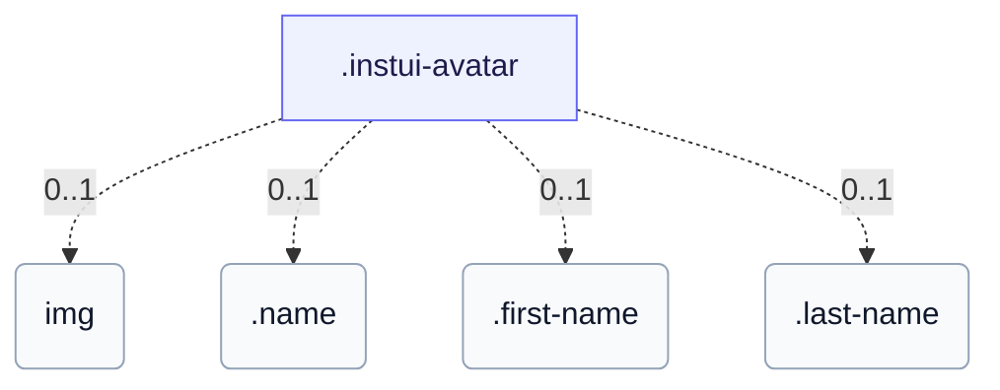

# CSS: avatar

`.instui-avatar` · <span class="instui-pill -color-success pantoken-doc-tag">stable</span> — صورة رمزية للمستخدم تعرض الحروف الأولى أو صورة، دائرية بشكل افتراضي.

بشكل افتراضي، يلوّن لوحة الألوان الحروف الأولى على سطح شفاف؛ `-has-inverse-color` يملأ السطح باللون ويضع الحروف الأولى بلون السطح. متغير `-color-ai` يملأ دومًا بتدرج بنفسجي→بحري. لاسم عرض كامل، ضعه في المحتوى (حتى يبقى في شجرة إمكانية الوصول) وأضف `data-initials="XX"` للنسخة المدمجة المرئية — النص الحقيقي هو ما يعلنه قارئ الشاشة. بدون `data-initials`، يُقصّ المحتوى الزائد بقسوة (بدون نقاط الحذف)؛ غلّفه بـ `.name` لقص حرف قيادي واحد بدقة، أو قسّمه إلى `.first-name`/`.last-name` لحرفين مقصوصين (يمكن حذف أي نصف ويبقى الآخر مصطفًا).

**المصدر:** [avatar.css](https://github.com/thedannywahl/pantoken/blob/main/formats/components/src/components/avatar/avatar.css)

<!-- js-requirement -->
> [!TIP]
> **تحسين JS** — تقوم CSS الخاصة بهذا المكوّن بالعرض والعمل بمفردها؛ اقترن بها `@pantoken/interactions` لإضافة السلوك التفاعلي. راجع [جدول المعدّلات أدناه](#modifiers).


## سهولة الوصول

قدّم لصورة رمزية بالصور `alt` ذي معنى (اسم الشخص)، ليس "avatar" عامًّا؛ بالنسبة للصور الرمزية بالحروف الأولى فقط، فضّل محتوى الاسم الحقيقي (نص خام، data-initials، .name، أو .first-name/.last-name) على الحروف المختصرة مسبقًا، حتى تعلن تقنيات المساعدة الاسم الحقيقي.

## الاستخدام

```css
@import "@pantoken/components/components.css";
@import "@pantoken/components/avatar.css";
```

## أمثلة

```html
<span class="instui-avatar --me-sm">LH</span>
<span class="instui-avatar -color-ai --me-sm">AI</span>
<span class="instui-avatar --me-sm" data-initials="NV">Dr. Nguyen Van Thoc</span>
<span class="instui-avatar"><span class="name">Miguel Sanchez</span></span>
<span class="instui-avatar"><span class="first-name">Miguel</span> <span class="last-name">Sanchez</span></span>
```

## الهيكل

تعرض الصورة الرمزية أحد العناصر التالية: &lt;img&gt;، نص خام/data-initials، غلاف .name، أو زوج .first-name/.last-name.

```text
.instui-avatar
  img (0..1)
  .name (0..1)
  .first-name (0..1)
  .last-name (0..1)
```



## المعدّلات

| معدّل | الوصف |
| --- | --- |
| `.-color-accent1` | <span class="instui-pill -color-danger pantoken-doc-tag">مهجور</span> — use `.-color-blue`. |
| `.-color-accent2` | <span class="instui-pill -color-danger pantoken-doc-tag">مهجور</span> — use `.-color-green`. |
| `.-color-accent3` | <span class="instui-pill -color-danger pantoken-doc-tag">مهجور</span> — use `.-color-red`. |
| `.-color-accent4` | <span class="instui-pill -color-danger pantoken-doc-tag">مهجور</span> — use `.-color-orange`. |
| `.-color-accent5` | <span class="instui-pill -color-danger pantoken-doc-tag">مهجور</span> — use `.-color-ash`. |
| `.-color-accent6` | <span class="instui-pill -color-danger pantoken-doc-tag">مهجور</span> — use `.-color-grey`. |
| `.-color-ai` | لون لوحة تمييز الذكاء الاصطناعي. |
| `.-color-ash` | لون لوحة الرماد. |
| `.-color-blue` | لون لوحة الأزرق. |
| `.-color-green` | لون لوحة الأخضر. |
| `.-color-grey` | لون لوحة الرمادي. |
| `.-color-orange` | لون لوحة البرتقالي. |
| `.-color-red` | لون لوحة الأحمر. |
| `.-has-inverse-color` | استخدم لون النص المعكوس (على الداكن). |
| `.-shape-rectangle` | شكل مربع (مستطيل) بدلًا من دائرة. |
| `.-show-border` | <span class="instui-pill -color-info pantoken-doc-tag">Alias</span> — maps to `.-show-border-always`. |
| `.-show-border-always` | أجبر حلقة الحدّ على الظهور، حتى فوق صورة أو تعبئة معكوسة. |
| `.-show-border-never` | أوقف إجبار حلقة الحدّ. |
| `.-size-2xl` | أكبر بمقاسين. |
| `.-size-2xs` | أصغر بمقاسين. |
| `.-size-large` | كبير. اسم بديل طويل لـ `-size-lg`. |
| `.-size-lg` | كبير. |
| `.-size-md` | متوسط (الافتراضي). |
| `.-size-medium` | متوسط (الافتراضي). اسم بديل طويل لـ `-size-md`. |
| `.-size-sm` | صغير. |
| `.-size-small` | صغير. اسم بديل طويل لـ `-size-sm`. |
| `.-size-x-large` | كبير جدًا. اسم بديل طويل لـ `-size-xl`. |
| `.-size-x-small` | صغير جدًا. اسم بديل طويل لـ `-size-xs`. |
| `.-size-xl` | كبير جدًا. |
| `.-size-xs` | صغير جدًا. |
| `.-size-xx-large` | أكبر بمقاسين. اسم بديل طويل لـ `-size-2xl`. |
| `.-size-xx-small` | أصغر بمقاسين. اسم بديل طويل لـ `-size-2xs`. |

## الأجزاء

| جزء | الوصف |
| --- | --- |
| `.first-name` | اختياري (يرتبط مع .last-name): يغلف الاسم المعطى، مقصوصًا إلى حرفه القيادي. |
| `.last-name` | اختياري (يرتبط مع .first-name): يغلف اسم العائلة، مقصوصًا إلى حرفه القيادي. |
| `.name` | اختياري: غلّف الاسم الكامل لقصه إلى حرف قيادي واحد بدون data-initials أو JS. |

## عناصر زائفة

| عنصر زائف | الوصف |
| --- | --- |
| `::before` | — |

## الرموز المستهلكة

| رمز | نوع | قيمة |
| --- | --- | --- |
| `--instui-component-avatar-ai-bottom-gradient-color` | `<color>` | `#00828E` |
| `--instui-component-avatar-ai-top-gradient-color` | `<color>` | `#9E58BD` |
| `--instui-component-avatar-ash-background-color` | `<color>` | `light-dark(#273540, #1C222B)` |
| `--instui-component-avatar-ash-text-color` | `<color>` | `light-dark(#273540, #C7CACD)` |
| `--instui-component-avatar-background-color` | `<color>` | `light-dark(#ffffff, #10141A)` |
| `--instui-component-avatar-blue-background-color` | `<color>` | `#2B7ABC` |
| `--instui-component-avatar-blue-text-color` | `<color>` | `light-dark(#2871AF, #7FB4F1)` |
| `--instui-component-avatar-border-color` | `<color>` | `light-dark(#8D959F, #6A7883)` |
| `--instui-component-avatar-border-width-md` | `<length>` | `0.125rem` |
| `--instui-component-avatar-border-width-sm` | `<length>` | `0.0625rem` |
| `--instui-component-avatar-font-family` | `[ <font-family-name> \| <generic-font-family> ]#` | `Atkinson Hyperlegible Next, "Helvetica Neue", Helvetica, Arial, sans-serif` |
| `--instui-component-avatar-font-size-lg` | `<length>` | `1.25rem` |
| `--instui-component-avatar-font-size-md` | `<length>` | `1rem` |
| `--instui-component-avatar-font-size-sm` | `<length>` | `0.875rem` |
| `--instui-component-avatar-font-size-xl` | `<length>` | `1.75rem` |
| `--instui-component-avatar-font-size-xs` | `<length>` | `0.75rem` |
| `--instui-component-avatar-font-size2xl` | `<length>` | `2.5rem` |
| `--instui-component-avatar-font-size2xs` | `<length>` | `0.75rem` |
| `--instui-component-avatar-font-weight` | `<integer>` | `600` |
| `--instui-component-avatar-green-background-color` | `<color>` | `#03893D` |
| `--instui-component-avatar-green-text-color` | `<color>` | `light-dark(#037D37, #61C378)` |
| `--instui-component-avatar-grey-background-color` | `<color>` | `light-dark(#4A5B68, #576773)` |
| `--instui-component-avatar-grey-text-color` | `<color>` | `light-dark(#4A5B68, #F2F4F5)` |
| `--instui-component-avatar-orange-background-color` | `<color>` | `#CF4A00` |
| `--instui-component-avatar-orange-text-color` | `<color>` | `light-dark(#BB4200, #FF905A)` |
| `--instui-component-avatar-rectangle-radius` | `<length>` | `0.25rem` |
| `--instui-component-avatar-red-background-color` | `<color>` | `#E62429` |
| `--instui-component-avatar-red-text-color` | `<color>` | `light-dark(#CF1F24, #FA917F)` |
| `--instui-component-avatar-size-lg` | `<length>` | `3.5rem` |
| `--instui-component-avatar-size-md` | `<length>` | `3rem` |
| `--instui-component-avatar-size-sm` | `<length>` | `2.5rem` |
| `--instui-component-avatar-size-xl` | `<length>` | `4rem` |
| `--instui-component-avatar-size-xs` | `<length>` | `2rem` |
| `--instui-component-avatar-size2xl` | `<length>` | `5rem` |
| `--instui-component-avatar-size2xs` | `<length>` | `1.5rem` |
| `--instui-component-avatar-text-on-color` | `<color>` | `#ffffff` |

## ذات صلة

- [byline](/ar/api/css/byline.md) — يمكنه استضافة صورة رمزية كبطل قيادي لها.

