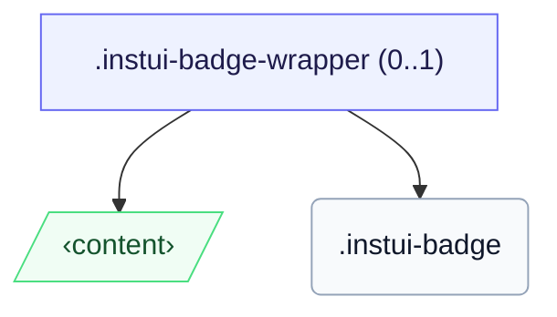

# CSS: badge

`.instui-badge` — نقطة صغيرة للعد أو الحالة توضع فوق زاوية الهدف.

لوضع شارة فوق هدف، غلف كليهما داخل `.instui-badge-wrapper` (مرساة الموضع) وثبت الشارة بمعدِّل `-placement-*`.

**المصدر:** [badge.css](https://github.com/thedannywahl/pantoken/blob/main/formats/components/src/components/badge/badge.css)

## الاستخدام

```css
@import "@pantoken/components/components.css";
@import "@pantoken/components/badge.css";
```

## عرض توضيحي

```demo
self:badge
```

## أمثلة

```html
<span class="instui-badge-wrapper">
  <button class="instui-button">Inbox</button>
  <span class="instui-badge -placement-top-end">4</span>
</span>
```

## الهيكل

تعرض الشارة كسطر داخلي بمفردها، أو داخل `instui-badge-wrapper` اختياري يربطها فوق هدف.

```text
.instui-badge-wrapper (0..1)
  ‹content›
  .instui-badge
```



## المعدّلات

| معدّل | الوصف |
| --- | --- |
| `.-color-danger` | عدد انتباه/خطأ. |
| `.-color-inverse` | على الخلفيات الداكنة: شريحة فاتحة بنص داكن. |
| `.-color-success` | عدد إيجابي/مكتمل. |
| `.-placement-bottom-end` | الموضع عند الزاوية السفلية-عند النهاية. |
| `.-placement-bottom-start` | الموضع عند الزاوية السفلية-عند البداية. |
| `.-placement-end-center` | الموضع مركزي على الحافة النهائية. |
| `.-placement-start-center` | الموضع مركزي على الحافة الابتدائية. |
| `.-placement-top-end` | الموضع عند الزاوية العلوية-عند النهاية. |
| `.-placement-top-start` | الموضع عند الزاوية العلوية-عند البداية. |
| `.-pulse` | حلقة انتباه نابضة. |
| `.-standalone` | تعرض كسطر داخلي، ولا تُوضع فوق زاوية هدف. |
| `.-type-notification` | نقطة فقط، بدون عد. |

## عناصر زائفة

| عنصر زائف | الوصف |
| --- | --- |
| `::before` | حلقة الانتباه النابضة مرسومة بلون تمييز الشارة (متغير `-pulse`). |

## خصائص مخصّصة

| خاصية | نوع | افتراضي | الوصف |
| --- | --- | --- | --- |
| `--pantoken-badge-accent` | `<color>` | — | ملء الشريحة؛ يُقرأ كل متغير `-color-*` وحلقة النبض منه. |
| `--pantoken-badge-text` | `<color>` | — | لون النص، مرتبط بالتمييز ليبقى مقروءًا. |

## التحريكات

| تحريك | الوصف |
| --- | --- |
| `pantoken-badge-pulse` | الرسوم المتحركة لحلقة النبض. |

## الرموز المستهلكة

| رمز | نوع | قيمة |
| --- | --- | --- |
| `--instui-border-width-md` | `<length>` | `0.125rem` |
| `--instui-component-badge-border-radius` | `<length>` | `999rem` |
| `--instui-component-badge-color` | `<color>` | `#ffffff` |
| `--instui-component-badge-color-danger` | `<color>` | `#E62429` |
| `--instui-component-badge-color-inverse` | `<color>` | `#273540` |
| `--instui-component-badge-color-primary` | `<color>` | `light-dark(#1D354F, #EEF4FD)` |
| `--instui-component-badge-color-success` | `<color>` | `#03893D` |
| `--instui-component-badge-font-family` | `[ <font-family-name> \| <generic-font-family> ]#` | `Atkinson Hyperlegible Next, "Helvetica Neue", Helvetica, Arial, sans-serif` |
| `--instui-component-badge-font-size` | `<length>` | `0.75rem` |
| `--instui-component-badge-font-weight` | `<integer>` | `600` |
| `--instui-component-badge-padding` | `<length>` | `0.25rem` |
| `--instui-component-badge-size` | `<length>` | `1rem` |
| `--instui-spacing-space-sm` | `<length>` | `0.5rem` |

## ذات صلة

- [pill](/ar/api/css/pill.md) — النظير الشريحي الملصق الداخلي.

