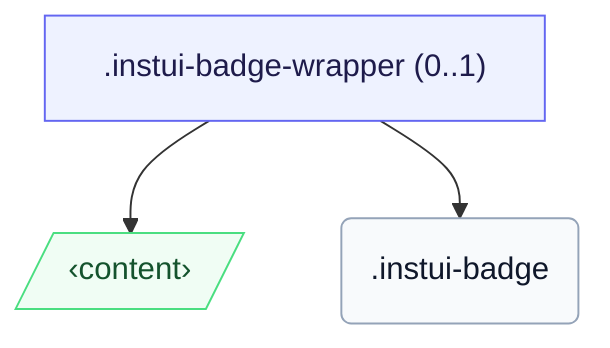

# CSS: badge

`.instui-badge` — نقطة صغيرة للعد أو الحالة توضع فوق زاوية الهدف.

لوضع شارة فوق هدف، لف كلاهما في `.instui-badge-wrapper` (مرساة الموضع) وثبت الشارة باستخدام معدل `-placement-*`.

**المصدر:** [badge.css](https://github.com/thedannywahl/pantoken/blob/main/formats/components/src/components/badge/badge.css)

## Usage

```css
@import "@pantoken/components/components.css";
@import "@pantoken/components/badge.css";
```

## Demo

```demo
self:badge
```

## Examples

```html
<span class="instui-badge-wrapper">
  <button class="instui-button">Inbox</button>
  <span class="instui-badge -placement-top-end">4</span>
</span>
```

## Structure

تعرض الشارة بشكل مضمن بمفردها، أو داخل `instui-badge-wrapper` اختياري يرسيها فوق هدف.

```text
.instui-badge-wrapper (0..1)
  ‹content›
  .instui-badge
```



## Modifiers

| Modifier                   | Description                                  |
| -------------------------- | -------------------------------------------- |
| `.-color-danger`           | عداد الانتباه/الخطأ.                         |
| `.-color-inverse`          | على الظلام: شريحة فاتحة مع نص داكن.          |
| `.-color-success`          | عداد إيجابي/كامل.                            |
| `.-placement-bottom-end`   | الموضع في زاوية النهاية السفلى.              |
| `.-placement-bottom-start` | الموضع في زاوية البداية السفلى.              |
| `.-placement-end-center`   | موضع متمركز على حافة النهاية.                |
| `.-placement-start-center` | موضع متمركز على حافة البداية.                |
| `.-placement-top-end`      | الموضع في زاوية النهاية العليا.              |
| `.-placement-top-start`    | الموضع في زاوية البداية العليا.              |
| `.-pulse`                  | حلقة انتباه نابضة.                           |
| `.-standalone`             | عرض بشكل مضمن، وليس موضعيًا فوق زاوية الهدف. |
| `.-type-notification`      | نقطة فقط، بدون عد.                           |

## Pseudo-elements

| Pseudo-element | Description                                                              |
| -------------- | ------------------------------------------------------------------------ |
| `::before`     | حلقة الانتباه النابضة المرسومة بلون التركيز على الشارة (متغير `-pulse`). |

## Custom properties

| Property                  | Type      | Default | Description                                             |
| ------------------------- | --------- | ------- | ------------------------------------------------------- |
| `--pantoken-badge-accent` | `<color>` | —       | ملء الشريحة؛ كل متغير `-color-*` وحلقة النبض تقرأ منها. |
| `--pantoken-badge-text`   | `<color>` | —       | لون النص، مقترن بالتركيز ليبقى مقروءًا.                 |

## Animations

| Animation              | Description            |
| ---------------------- | ---------------------- |
| `pantoken-badge-pulse` | رسم متحرك لحلقة النبض. |

## Tokens consumed

| Token                                    | Type                                               | Value                                                                        |
| ---------------------------------------- | -------------------------------------------------- | ---------------------------------------------------------------------------- |
| `--instui-border-width-md`               | `<length>`                                         | `0.125rem`                                                                   |
| `--instui-component-badge-border-radius` | `<length>`                                         | `999rem`                                                                     |
| `--instui-component-badge-color`         | `<color>`                                          | `#ffffff`                                                                    |
| `--instui-component-badge-color-danger`  | `<color>`                                          | `#E62429`                                                                    |
| `--instui-component-badge-color-inverse` | `<color>`                                          | `#273540`                                                                    |
| `--instui-component-badge-color-primary` | `<color>`                                          | `light-dark(#1D354F, #EEF4FD)`                                               |
| `--instui-component-badge-color-success` | `<color>`                                          | `#03893D`                                                                    |
| `--instui-component-badge-font-family`   | `[ <font-family-name> \| <generic-font-family> ]#` | `Atkinson Hyperlegible Next, "Helvetica Neue", Helvetica, Arial, sans-serif` |
| `--instui-component-badge-font-size`     | `<length>`                                         | `0.75rem`                                                                    |
| `--instui-component-badge-font-weight`   | `<integer>`                                        | `600`                                                                        |
| `--instui-component-badge-padding`       | `<length>`                                         | `0.25rem`                                                                    |
| `--instui-component-badge-size`          | `<length>`                                         | `1rem`                                                                       |
| `--instui-spacing-space-sm`              | `<length>`                                         | `0.5rem`                                                                     |

## Related

- [pill](/ar/api/css/pill.md) — نظير شريحة التسمية المضمنة.
