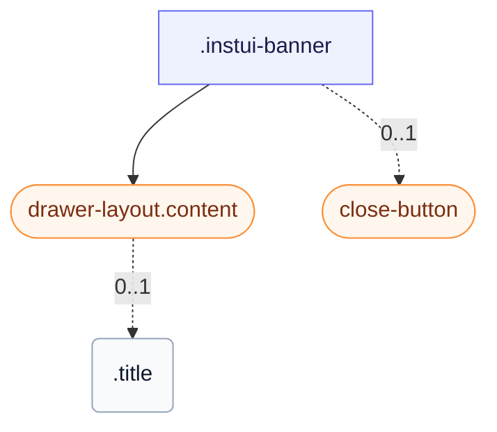

# CSS: banner

`.instui-banner` · `alpha` — سطح رسالة قابل للإغلاق مع أيقونة للإعلانات على مستوى الصفحة أو في السياق.

**الحجم** يتحكم في الحشوة والفجوة: `relaxed` (الافتراضي) أكثر اتساعًا؛ `compact` يُضيِّق كلاهما.
  **اللون** يحدد التعبئة: النمط العاري (بدون مُعدِّل) غير مملوء — الحد والأيقونة فقط؛ `-color-violet`
  و `-color-sea` يضيفان خلفية ملوَّنة ونقشة أيقونة متطابقة.

## سهولة الوصول

أضف `role="status"` (أو `role="alert"` للرسائل العاجلة) لكي تعلن تقنيات المساعدة عن الشريط؛ علّم الأيقونة الزخرفية بـ `aria-hidden="true"` وأعط زر الإغلاق `aria-label`.

## الاستخدام

@import "@pantoken/plugin-custom-components/custom-components.css";

```css
@import "@pantoken/plugin-custom-components/custom-components.css";
```

## أمثلة

-nocard
```html
<div class="instui-banner -color-violet -icon-megaphone" role="status">
  <div class="content">
    <div class="title">New feature</div>
    This is a violet banner with a custom icon.
  </div>
  <button class="instui-close-button" aria-label="Close"></button>
</div>
```

## الهيكل

```text
.instui-banner
  drawer-layout.content (component)
    .title (0..1)
  close-button (component, 0..1)
```



## المعدّلات

| معدّل | الوصف |
| --- | --- |
| `.-color-sea` | خلفية ونعومة أيقونة بدرجة لون بحرية. |
| `.-color-violet` | خلفية ونعومة أيقونة بدرجة لون بنفسجية. |
| `.-icon-*` | استبدِل شكل `info` الافتراضي بأيقونة من مجموعة الأيقونات المشتركة (على سبيل المثال، `-icon-megaphone`). |
| `.-size-compact` | حشوة وفجوة أضيق. |
| `.-size-md` | <span class="instui-pill -color-info pantoken-doc-tag">Alias</span> — maps to `.-size-relaxed`. |
| `.-size-relaxed` | حشوة وفجوة أوسع (الافتراضي). |
| `.-size-sm` | <span class="instui-pill -color-info pantoken-doc-tag">Alias</span> — maps to `.-size-compact`. |

## الأجزاء

| جزء | الوصف |
| --- | --- |
| `.content` | محتوى الرسالة، مكدَّس في عمود. |
| `.title` | عنوان اختياري، يستخدم طباعة عنوان البطاقة المناسبة للحجم النشط. |

## عناصر زائفة

| عنصر زائف | الوصف |
| --- | --- |
| `::after` | — |
| `::before` | — |

## الحالات

| حالة | الوصف |
| --- | --- |
| `[aria-disabled="true"]` | — |
| `:disabled` | — |

## الرموز المستهلكة

| رمز | نوع | قيمة |
| --- | --- | --- |
| `--instui-color-background-interactive-action-primary-disabled` | `<color>` | `light-dark(#DFE1E3, #334450)` |
| `--instui-color-text-interactive-action-primary-disabled` | `<color>` | `light-dark(#9EA6AD, #6A7883)` |
| `--instui-component-banner-border-color` | `<color>` | `light-dark(#5F6E7A, #9EA6AD)` |
| `--instui-component-banner-border-radius` | `<length>` | `1rem` |
| `--instui-component-banner-border-style` | — | `solid` |
| `--instui-component-banner-border-width` | `<length>` | `0.0625rem` |
| `--instui-component-banner-close-button-margin-right` | `<length>` | `0.5rem` |
| `--instui-component-banner-close-button-margin-top` | `<length>` | `0.5rem` |
| `--instui-component-banner-color` | `<color>` | `light-dark(#273540, #ffffff)` |
| `--instui-component-banner-compact-content-gap-horizontal` | `<length>` | `0.5rem` |
| `--instui-component-banner-compact-icon-border-radius` | `<length>` | `0.5rem` |
| `--instui-component-banner-compact-padding-horizontal` | `<length>` | `0.75rem` |
| `--instui-component-banner-compact-padding-vertical` | `<length>` | `0.75rem` |
| `--instui-component-banner-content-gap-vertical` | `<length>` | `0.75rem` |
| `--instui-component-banner-icon-color` | `<color>` | `#ffffff` |
| `--instui-component-banner-relaxed-content-gap-horizontal` | `<length>` | `1rem` |
| `--instui-component-banner-relaxed-icon-border-radius` | `<length>` | `0.75rem` |
| `--instui-component-banner-relaxed-padding-horizontal` | `<length>` | `1.5rem` |
| `--instui-component-banner-relaxed-padding-vertical` | `<length>` | `1.5rem` |
| `--instui-component-banner-sea-background` | `<color>` | `light-dark(#CFF0F6, #00424A)` |
| `--instui-component-banner-sea-icon-background` | `<color>` | `#00828E` |
| `--instui-component-banner-violet-background` | `<color>` | `light-dark(#F3E5F7, #522965)` |
| `--instui-component-banner-violet-icon-background` | `<color>` | `#9E58BD` |
| `--instui-component-base-button-medium-height` | `<length>` | `2.5rem` |
| `--instui-component-base-button-primary-inverse-active-background` | `<color>` | `#B6CCEA` |
| `--instui-component-base-button-primary-inverse-background` | `<color>` | `#ffffff` |
| `--instui-component-base-button-primary-inverse-border-color` | `<color>` | `#ffffff` |
| `--instui-component-base-button-primary-inverse-color` | `<color>` | `#213D5B` |
| `--instui-component-base-button-primary-inverse-hover-background` | `<color>` | `#D5E2F6` |
| `--instui-component-base-button-primary-on-color-active-border-color` | `<color>` | `#B6CCEA` |
| `--instui-component-base-button-primary-on-color-hover-border-color` | `<color>` | `#D5E2F6` |
| `--instui-component-base-button-small-height` | `<length>` | `2rem` |
| `--instui-component-heading-title-card-mini-font-size` | `<length>` | `1rem` |
| `--instui-component-heading-title-card-mini-font-weight` | `<integer>` | `700` |
| `--instui-component-heading-title-card-regular-font-size` | `<length>` | `1.25rem` |
| `--instui-component-heading-title-card-regular-font-weight` | `<integer>` | `700` |
| `--instui-component-text-content-font-size` | `<length>` | `1rem` |
| `--instui-component-text-content-font-weight` | `<integer>` | `400` |
| `--instui-component-text-content-line-height` | `<percentage>` | `150%` |
| `--instui-component-text-content-small-font-size` | `<length>` | `0.875rem` |
| `--instui-component-text-content-small-font-weight` | `<integer>` | `400` |
| `--instui-component-text-content-small-line-height` | `<percentage>` | `150%` |
| `--instui-font-size-text-base` | `<length>` | `1rem` |
| `--instui-icon-info` | `<image>` | `url('data:image/svg+xml;utf8,%3Csvg%20xmlns%3D%22http%3A%2F%2Fwww.w3.org%2F2000%2Fsvg%22%20width%3D%2224%22%20height%3D%2224%22%20viewBox%3D%220%200%2024%2024%22%20fill%3D%22none%22%20stroke%3D%22currentColor%22%20stroke-width%3D%222%22%20stroke-linecap%3D%22round%22%20stroke-linejoin%3D%22round%22%3E%3Ccircle%20cx%3D%2212%22%20cy%3D%2212%22%20r%3D%2210%22%2F%3E%3Cpath%20d%3D%22M12%2016v-4%22%2F%3E%3Cpath%20d%3D%22M12%208h.01%22%2F%3E%3C%2Fsvg%3E')` |
| `--instui-line-height-standalone-text-base` | `<length>` | `1rem` |
| `--pantoken-banner-glyph` | `<url>` | `url('data:image/svg+xml;utf8,%3Csvg%20xmlns%3D%22http%3A%2F%2Fwww.w3.org%2F2000%2Fsvg%22%20width%3D%2224%22%20height%3D%2224%22%20viewBox%3D%220%200%2024%2024%22%20fill%3D%22none%22%20stroke%3D%22currentColor%22%20stroke-width%3D%222%22%20stroke-linecap%3D%22round%22%20stroke-linejoin%3D%22round%22%3E%3Ccircle%20cx%3D%2212%22%20cy%3D%2212%22%20r%3D%2210%22%2F%3E%3Cpath%20d%3D%22M12%2016v-4%22%2F%3E%3Cpath%20d%3D%22M12%208h.01%22%2F%3E%3C%2Fsvg%3E')` |
| `--pantoken-banner-icon-background` | — | `transparent` |
| `--pantoken-banner-icon-inset-block-start` | `<length>` | `1.5rem` |
| `--pantoken-banner-icon-inset-inline-start` | `<length>` | `1.5rem` |
| `--pantoken-banner-icon-size` | `<length>` | `2rem` |
| `--pantoken-glyph` | `<url>` | — |

## مكونات فرعية

- [close-button](/ar/api/css/close-button.md)
- [drawer-layout.content](/ar/api/css/drawer-layout.content.md)

## ذات صلة

- [alert](/ar/api/css/alert.md) — نظير غير قابل للإغلاق وملوَّن بالحالة للرسائل المضمَّنة.
- [close-button](/ar/api/css/close-button.md) — عنصر التحكم بالإغلاق الذي قد يشمله الشريط.

