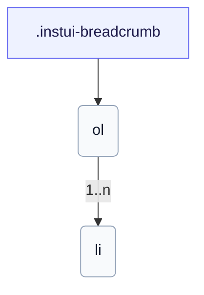

# CSS: breadcrumb

`.instui-breadcrumb` · <span class="instui-pill -color-success pantoken-doc-tag">stable</span> — مسار فتات الخبز مع الفواصل؛ الجزء الأخير هو الصفحة الحالية.

يطوي تلقائيًا إلى سهم رجوع على الشاشات الصغيرة. استخدم `breadcrumb.link` لكل جزء.

**المصدر:** [breadcrumb.css](https://github.com/thedannywahl/pantoken/blob/main/formats/components/src/components/breadcrumb/breadcrumb.css)

## Accessibility

غلّف `&lt;ol&gt;` في علامة مرجعية `<nav aria-label>`؛ ضع علامة على جزء الصفحة الحالية بـ `aria-current="page"`.

## Usage

```css
@import "@pantoken/components/components.css";
@import "@pantoken/components/breadcrumb.css";
```

## Examples

```html
<nav class="instui-breadcrumb" aria-label="Breadcrumb">
  <ol>
    <li>
      <a class="-icon-house" href="#">Home</a>
    </li>
    <li><a href="#">Guides</a></li>
    <li><a href="#">Components</a></li>
    <li aria-current="page">Breadcrumb</li>
  </ol>
</nav>
```

## Structure

```text
.instui-breadcrumb
  ol
    li (1..n)
```



## Modifiers

| Modifier        | Description                                                                                               |
| --------------- | --------------------------------------------------------------------------------------------------------- |
| `.-size-large`  | كبير. @affects breadcrumb.link — يقيّس تباعد فاصل الجزء ليطابق. اسم مستعار طويل لـ `-size-lg`.            |
| `.-size-lg`     | كبير. @affects breadcrumb.link — يقيّس تباعد فاصل الجزء ليطابق.                                           |
| `.-size-md`     | متوسط (افتراضي). @affects breadcrumb.link — يقيّس تباعد فاصل الجزء ليطابق.                                |
| `.-size-medium` | متوسط (افتراضي). @affects breadcrumb.link — يقيّس تباعد فاصل الجزء ليطابق. اسم مستعار طويل لـ `-size-md`. |
| `.-size-sm`     | صغير. @affects breadcrumb.link — يقيّس تباعد فاصل الجزء ليطابق.                                           |
| `.-size-small`  | صغير. @affects breadcrumb.link — يقيّس تباعد فاصل الجزء ليطابق. اسم مستعار طويل لـ `-size-sm`.            |

## Tokens consumed

| Token                                  | Type                                               | Value                                                                        |
| -------------------------------------- | -------------------------------------------------- | ---------------------------------------------------------------------------- |
| `--instui-component-breadcrumb-gap-lg` | `<length>`                                         | `0.5rem`                                                                     |
| `--instui-component-breadcrumb-gap-md` | `<length>`                                         | `0.25rem`                                                                    |
| `--instui-component-breadcrumb-gap-sm` | `<length>`                                         | `0.125rem`                                                                   |
| `--instui-component-link-font-family`  | `[ <font-family-name> \| <generic-font-family> ]#` | `Atkinson Hyperlegible Next, "Helvetica Neue", Helvetica, Arial, sans-serif` |
| `--instui-component-link-font-size-lg` | `<length>`                                         | `1.75rem`                                                                    |
| `--instui-component-link-font-size-md` | `<length>`                                         | `1rem`                                                                       |
| `--instui-component-link-font-size-sm` | `<length>`                                         | `0.875rem`                                                                   |

## Subcomponents

- [breadcrumb.link](/ar/api/css/breadcrumb.link.md)
