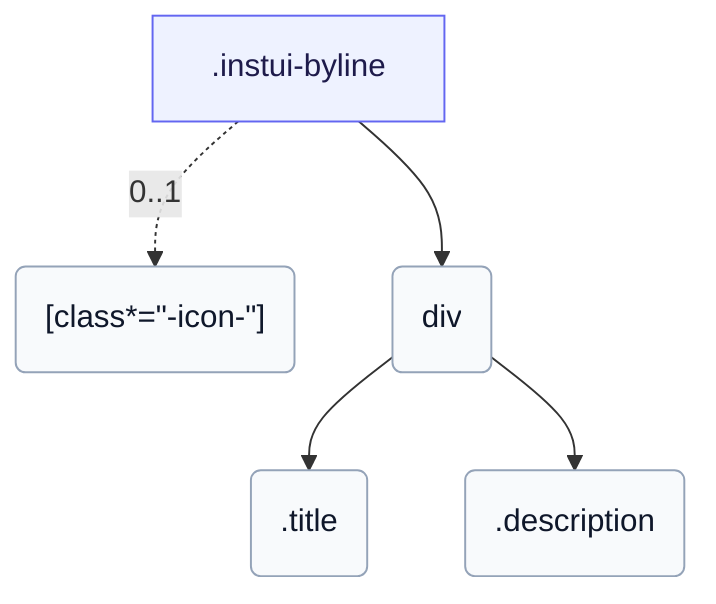

# CSS: byline

`.instui-byline` — كائن وسائط: شخصية رئيسية بجانب عنوان ووصف.

يضبط `gap` الخاص به بين الشكل وكتلة النص؛ ربط معدّل تباعد `-gap-*` يتجاوز تلك القيمة المضمّنة.

**المصدر:** [byline.css](https://github.com/thedannywahl/pantoken/blob/main/formats/components/src/components/byline/byline.css)

## الاستخدام

```css
@import "@pantoken/components/components.css";
@import "@pantoken/components/byline.css";
```

## أمثلة

```html
<div class="instui-byline -size-md">
  <span class="instui-icon -icon-megaphone"></span>
  <div>
    <div class="title">What's new</div>
    <div class="description">The figure can be any leading visual — an icon, an avatar, or an image.</div>
  </div>
</div>
```

## الهيكل

```text
.instui-byline
  [class*="-icon-"] (0..1)
  div
    .title
    .description
```



## المعدّلات

| معدّل | الوصف |
| --- | --- |
| `.-align-content-center` | محاذاة النص عمودياً في منتصف جانب الشخصية الرئيسية. |
| `.-align-content-top` | محاذاة النص إلى أعلى الشخصية الرئيسية. |
| `.-icon-*` | عرض رمز غليف قيادي قبل كتلة النص. |
| `.-size-large` | كبير. اسم طويل لـ `-size-lg`. |
| `.-size-lg` | كبير. |
| `.-size-md` | متوسط. |
| `.-size-medium` | متوسط. اسم طويل لـ `-size-md`. |
| `.-size-sm` | صغير. |
| `.-size-small` | صغير. اسم طويل لـ `-size-sm`. |

## الأجزاء

| جزء | الوصف |
| --- | --- |
| `.description` | نص الجسم الداعم. |
| `.title` | نص العنوان. |

## الرموز المستهلكة

| رمز | نوع | قيمة |
| --- | --- | --- |
| `--instui-component-byline-background` | `<color>` | `#00000000` |
| `--instui-component-byline-color` | `<color>` | `light-dark(#273540, #ffffff)` |
| `--instui-component-byline-description-font-size` | `<length>` | `1rem` |
| `--instui-component-byline-description-font-weight` | `<integer>` | `400` |
| `--instui-component-byline-description-line-height` | `<percentage>` | `125%` |
| `--instui-component-byline-figure-margin` | `<length>` | `0.75rem` |
| `--instui-component-byline-font-family` | `[ <font-family-name> \| <generic-font-family> ]#` | `Atkinson Hyperlegible Next, "Helvetica Neue", Helvetica, Arial, sans-serif` |
| `--instui-component-byline-large` | `<length>` | `62em` |
| `--instui-component-byline-medium` | `<length>` | `48em` |
| `--instui-component-byline-small` | `<length>` | `30em` |
| `--instui-component-byline-title-font-size` | `<length>` | `1.375rem` |
| `--instui-component-byline-title-font-weight` | `<integer>` | `600` |
| `--instui-component-byline-title-line-height` | `<length>` | `1.25rem` |
| `--instui-component-byline-title-margin` | `<length>` | `0 0 0.5rem 0` |

## دعم المتصفّح

- يحتوي أنماط عنصره باستخدام قاعدة CSS `@scope` at-rule؛ يتطلب إصدار حديث من Chromium أو Firefox أو Safari.

