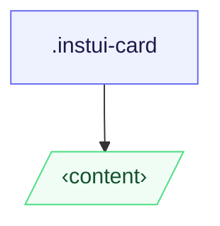

# CSS: card

`.instui-card` — حاوية سطحية تقبل محتوىً عشوائياً.

**المتغير** يتحكم في كيفية تنسيق الأبناء المباشرين: `content` (الافتراضي) يتركهم
  بدون تنسيق؛ `container` يكدّسهم كمناطق محددة بحدود وحشوة. تتدرج الحشوة بحسب
  عرض نافذة العرض وتكون متطابقة في كلا المتغيرين.
  **الحجم** قابل للاستجابة بالكامل — تتزايد الحشوة ونصف القطر الحدّي تلقائياً عند 320px
  (20rem) و640px (40rem) عبر استعلامات الوسائط القياسية `min-width`; لا حاجة لفئة حجم.
  اجمعه مع `@pantoken/components` للعناوين والأزرار والمكونات السطرية الأخرى.

## سهولة الوصول

استخدم `&lt;article&gt;` كعنصر البطاقة عندما تكون البطاقة وحدة محتوى مكتفية ذاتياً؛
  استخدم `&lt;section&gt;` عند تجميعها داخل علامة معلم أكبر. في `-variant-container`، فضّل
  أن تكون عناصر `&lt;section&gt;` أبناً مباشراً حتى تحمل كل منطقة محددة معنى دلالي.

## الاستخدام

@import "@pantoken/plugin-custom-components/custom-components.css";

```css
@import "@pantoken/plugin-custom-components/custom-components.css";
```

## أمثلة

بطاقة المحتوى -nocard
```html
<article class="instui-card">
  <h2 class="instui-heading -h3">Card title</h2>
  <p>Content here.</p>
  <button class="instui-button">Action</button>
</article>
```
بطاقة الحاوية -nocard
```html
<article class="instui-card -variant-container">
  <section>First section</section>
  <section>Second section</section>
</article>
```

## الهيكل

```text
.instui-card
  ‹content›
```



## المعدّلات

| معدّل | الوصف |
| --- | --- |
| `.-variant-container` | بطاقة الحاوية؛ يتحول الأبناء المباشرة إلى مناطق محددة بحدود وحشوة. |
| `.-variant-content` | بطاقة المحتوى القياسية؛ الأبناء بدون تنسيق. الافتراضي عند عدم ضبط أي متغير. |

## الشروط

| نوع | استعلام | الوصف |
| --- | --- | --- |
| media | `(min-width: 20rem)` | — |
| media | `(min-width: 40rem)` | — |

## الرموز المستهلكة

| رمز | نوع | قيمة |
| --- | --- | --- |
| `--instui-component-card-background-color` | `<color>` | `light-dark(#ffffff, #1C222B)` |
| `--instui-component-card-border-radius-base-lg` | `<length>` | `1rem` |
| `--instui-component-card-border-radius-base-md` | `<length>` | `1rem` |
| `--instui-component-card-border-radius-base-sm` | `<length>` | `0.75rem` |
| `--instui-component-card-border-radius-nested-lg` | `<length>` | `0.75rem` |
| `--instui-component-card-border-radius-nested-md` | `<length>` | `0.5rem` |
| `--instui-component-card-border-radius-nested-sm` | `<length>` | `0.5rem` |
| `--instui-component-card-nested-border-color` | `<color>` | `light-dark(#E8EAEC, #2D3D49)` |
| `--instui-component-card-padding-base-lg` | `<length>` | `1.5rem` |
| `--instui-component-card-padding-base-md` | `<length>` | `1rem` |
| `--instui-component-card-padding-base-sm` | `<length>` | `0.75rem` |
| `--instui-component-card-padding-nested-lg` | `<length>` | `1rem` |
| `--instui-component-card-padding-nested-md` | `<length>` | `0.75rem` |
| `--instui-component-card-padding-nested-sm` | `<length>` | `0.5rem` |
| `--instui-component-shared-tokens-spacing-gap-cards-nested-containers-lg` | `<length>` | `1rem` |
| `--instui-component-shared-tokens-spacing-gap-cards-nested-containers-md` | `<length>` | `0.75rem` |
| `--instui-component-shared-tokens-spacing-gap-cards-nested-containers-sm` | `<length>` | `0.5rem` |
| `--instui-component-shared-tokens-stroke-width-sm` | `<length>` | `0.0625rem` |
| `--instui-elevation-card` | `none \| <shadow>#` | — |

## دعم المتصفّح

- `@scope` متاح حديثاً في Baseline 2023؛ تتدهور البطاقة إلى ورقة أنماط مسطحة غير نطاقية
  في المتصفحات الأقدم بدون فقدان في التنسيق المرئي.

## ذات صلة

- [heading](/ar/api/css/heading.md) — ضعها مباشرةً داخل البطاقة أو داخل قسم الحاوية.
- [button](/ar/api/css/button.md) — ضعها مباشرةً داخل البطاقة أو داخل قسم الحاوية.
- [img](/ar/api/css/img.md) — ضعها مباشرةً داخل البطاقة كمنطقة وسائط.
- [badge](/ar/api/css/badge.md) — ضعها مباشرةً داخل البطاقة كمؤشر حالة.

## انظر أيضا

- https://drafts.csswg.org/css-cascade-6/#scoping

