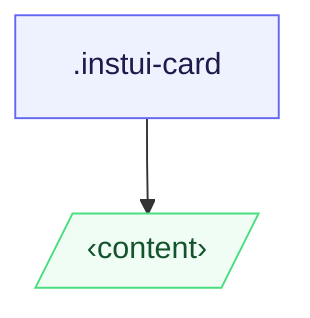

# CSS: card

`.instui-card` — حاوية سطح تقبل محتوى تعسفي.

**Variant** يتحكم في كيفية تصميم الأطفال المباشرين: `content` (افتراضي) يتركهم
بدون تصميم؛ `container` يكدسهم كأقسام محدودة ومحشوة. يتدرج الحشو مع
عرض منفذ العرض وهو نفسه عبر كلا البديلين.
**الحجم** سريع الاستجابة بالكامل — يتم رفع الحشو والحد ضد التجنب تلقائيًا عند 320px
(20rem) و 640px (40rem) عبر `min-width` معايير استفسارات الوسائط؛ لا توجد حاجة لفئة حجم.
اجمع مع `@pantoken/components` للعنوان والزر والمكونات المضمنة الأخرى.

## Accessibility

استخدم `&lt;article&gt;` كعنصر بطاقة عندما تكون البطاقة وحدة محتوى مستقلة؛
استخدم `&lt;section&gt;` عند تجميعها ضمن معلم أكبر. في `-variant-container`، يفضل
`&lt;section&gt;` عناصر كأطفال مباشرين بحيث تحمل كل منطقة محدودة معنى دلالي.

## Usage

@import "@pantoken/plugin-custom-components/custom-components.css";

```css
@import "@pantoken/plugin-custom-components/custom-components.css";
```

## Examples

بطاقة محتوى -nocard

```html
<article class="instui-card">
  <h2 class="instui-heading -h3">Card title</h2>
  <p>Content here.</p>
  <button class="instui-button">Action</button>
</article>
```

بطاقة الحاوية -nocard

```html
<article class="instui-card -variant-container">
  <section>First section</section>
  <section>Second section</section>
</article>
```

## Structure

```text
.instui-card
  ‹content›
```



## Modifiers

| Modifier              | Description                                                                    |
| --------------------- | ------------------------------------------------------------------------------ |
| `.-variant-container` | بطاقة الحاوية؛ الأطفال المباشرون يصبحون أقسام محدودة ومحشوة.                   |
| `.-variant-content`   | بطاقة محتوى قياسية؛ الأطفال بدون تصميم. الافتراضي عندما لا يتم تعيين أي متغير. |

## Conditions

| Type  | Query                | Description |
| ----- | -------------------- | ----------- |
| media | `(min-width: 20rem)` | —           |
| media | `(min-width: 40rem)` | —           |

## Tokens consumed

| Token                                                                     | Type                | Value                          |
| ------------------------------------------------------------------------- | ------------------- | ------------------------------ |
| `--instui-component-card-background-color`                                | `<color>`           | `light-dark(#ffffff, #1C222B)` |
| `--instui-component-card-border-radius-base-lg`                           | `<length>`          | `1rem`                         |
| `--instui-component-card-border-radius-base-md`                           | `<length>`          | `1rem`                         |
| `--instui-component-card-border-radius-base-sm`                           | `<length>`          | `0.75rem`                      |
| `--instui-component-card-border-radius-nested-lg`                         | `<length>`          | `0.75rem`                      |
| `--instui-component-card-border-radius-nested-md`                         | `<length>`          | `0.5rem`                       |
| `--instui-component-card-border-radius-nested-sm`                         | `<length>`          | `0.5rem`                       |
| `--instui-component-card-nested-border-color`                             | `<color>`           | `light-dark(#E8EAEC, #2D3D49)` |
| `--instui-component-card-padding-base-lg`                                 | `<length>`          | `1.5rem`                       |
| `--instui-component-card-padding-base-md`                                 | `<length>`          | `1rem`                         |
| `--instui-component-card-padding-base-sm`                                 | `<length>`          | `0.75rem`                      |
| `--instui-component-card-padding-nested-lg`                               | `<length>`          | `1rem`                         |
| `--instui-component-card-padding-nested-md`                               | `<length>`          | `0.75rem`                      |
| `--instui-component-card-padding-nested-sm`                               | `<length>`          | `0.5rem`                       |
| `--instui-component-shared-tokens-spacing-gap-cards-nested-containers-lg` | `<length>`          | `1rem`                         |
| `--instui-component-shared-tokens-spacing-gap-cards-nested-containers-md` | `<length>`          | `0.75rem`                      |
| `--instui-component-shared-tokens-spacing-gap-cards-nested-containers-sm` | `<length>`          | `0.5rem`                       |
| `--instui-component-shared-tokens-stroke-width-sm`                        | `<length>`          | `0.0625rem`                    |
| `--instui-elevation-card`                                                 | `none \| <shadow>#` | —                              |

## Browser support

- `@scope` هو Baseline 2023 متاح حديثًا؛ تتدهور البطاقة إلى ورقة أنماط مسطحة غير محدودة
  في المتصفحات الأقدم بدون فقدان الأنماط المرئية.

## Related

- [heading](/ar/api/css/heading.md) — ضع مباشرة في البطاقة أو داخل قسم حاوية.
- [button](/ar/api/css/button.md) — ضع مباشرة في البطاقة أو داخل قسم حاوية.
- [img](/ar/api/css/img.md) — ضع مباشرة في البطاقة كمنطقة وسائط.
- [badge](/ar/api/css/badge.md) — ضع مباشرة في البطاقة كمؤشر حالة.

## See also

- https://drafts.csswg.org/css-cascade-6/#scoping
