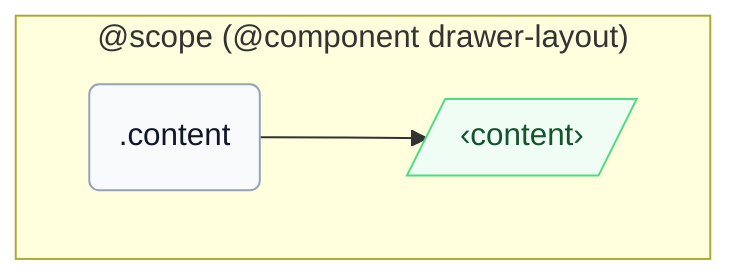

# CSS: drawer-layout.content

`.content` — لوحة المحتوى الأساسية التي تملأ المساحة المتبقية بجانب الدرج.

عندما تنخفض المساحة الخطية للحاوية الأصلية أدنى من `46em` (`16em` عرض الدرج + `30em` نقطة الانقطاع)، تقوم استعلام `@container` على حاوية `pantoken-drawer-layout` للأصل بتخفيض `min-inline-size` لهذا العنصر إلى `0` تلقائياً، مطابقة لتجاوز `[should-overlay-tray]` اليدوي.

## سهولة الوصول

احتفظ بـ `role="region"` (اتفاقية DrawerLayout في InstUI) وسمِّهِ باستخدام `aria-label`/`aria-labelledby` عندما لا يكفي السياق لتحديده.

## الاستخدام

```css
@import "@pantoken/components/components.css";
@import "@pantoken/components/drawer-layout.content.css";
```

## أمثلة

```html
<div class="instui-drawer-layout">
  <div class="content" role="region">
    <p class="instui-text">Tray content</p>
  </div>
</div>
```

## الهيكل

```text
@scope (@component drawer-layout)
  .content
    ‹content›
```



## الشروط

| نوع | استعلام | الوصف |
| --- | --- | --- |
| container | `pantoken-drawer-layout (max-width: 46em)` | — |

## الرموز المستهلكة

| رمز | نوع | قيمة |
| --- | --- | --- |
| `--drawer-layout-content-min-inline-size` | `<length>` | — |
| `--pantoken-bp-md` | `<length>` | `30em` |

## ذات صلة

- [drawer-layout.tray](/ar/api/css/drawer-layout.tray.md) — اللوحة المجاورة في نفس صف الفليكس.

