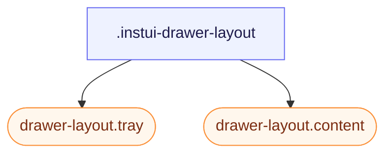

# CSS: drawer-layout

`.instui-drawer-layout` — تخطيط منقسم مع درج جانبي قابل للطي ولوحة محتوى أساسية قابلة للتمرير.

`-placement-end` والافتراضي (start) كلاهما يستخدم خصائص منطقية `flex-direction`/`inset-inline-*`، وليس `left`/`right`، لذا يتبع جانب الدرج `direction`/`dir="rtl"` تلقائيًا — لا حاجة لقواعد RTL منفصلة.

**المصدر:** [drawer-layout.css](https://github.com/thedannywahl/pantoken/blob/main/formats/components/src/components/drawer-layout/drawer-layout.css)

## سهولة الوصول

عندما يعمل الدرج كنافِذِة تنقلية، ضع عليه عنوانًا مُتاحًا أو `aria-label`. امنح `.content` `role="region"` (اتفاقية InstUI لـ DrawerLayout) وسمه بـ `aria-label`/`aria-labelledby` عندما لا يحدد السياق وحده هويته.

## الاستخدام

```css
@import "@pantoken/components/components.css";
@import "@pantoken/components/drawer-layout.css";
```

## أمثلة

```html
<div class="instui-drawer-layout" id="drawer" open>
  <aside class="tray">Navigation</aside>
  <main class="content" role="region">Main content</main>
</div>
```

## الهيكل

```text
.instui-drawer-layout
  drawer-layout.tray (component)
  drawer-layout.content (component)
```



## المعدّلات

| معدّل | الوصف |
| --- | --- |
| `.-open` | اعرض الدرج حتى عندما يكون السمة `open` غائبة. |
| `.-placement-end` | ثبت الدرج على جهة النهاية المضمنة. |
| `.-placement-start` | ثبت الدرج على جهة البداية المضمنة (الافتراضي؛ يتم تعيينه صراحة). |
| `.-should-overlay-tray` | <span class="instui-pill pantoken-doc-tag pantoken-doc-tag-interaction">Interaction</span> — Render the tray as an overlay instead of shrinking content inline. |

## الأجزاء

| جزء | الوصف |
| --- | --- |
| `.content` | اللوحة الرئيسية. |
| `.tray` | لوحة الجانب. |

## خصائص مخصّصة

| خاصية | نوع | افتراضي | الوصف |
| --- | --- | --- | --- |
| `--pantoken-bp-md` | — | — | عتبة العرض لوضع التراكب (`30em`، م temática عبر أدوات الاستجابة). |

## دعم المتصفّح

- يتحوّل أعضاء `drawer-layout.tray`/`drawer-layout.content` تلقائيًا إلى وضع التراكب عبر استعلام `@container` بمجرد أن ينخفض الحجم المضمن لهذا العنصر إلى ما دون عرض الدرج + `--pantoken-bp-md`. كما يقوم السلوك `@pantoken/interactions` بتبديل `[should-overlay-tray]`/`.-should-overlay-tray` (تجاوز يدوي) ويطلق `overlaytraychange` للتطبيقات التي تحتاج التغيير كحدث.

## مكونات فرعية

- [drawer-layout.content](/ar/api/css/drawer-layout.content.md)
- [drawer-layout.tray](/ar/api/css/drawer-layout.tray.md)
- [tray](/ar/api/css/tray.md)

## ذات صلة

- [tray](/ar/api/css/tray.md) — تراكب حافَة مستقل؛ يحافظ هذا التخطيط على الدرج والمحتوى في نفس التدفق.
- [context-view](/ar/api/css/context-view.md) — سطح مُثَبَّت أصغر لإجراءات السياق والتفاصيل.

