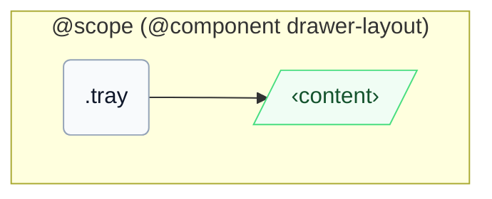

# CSS: drawer-layout.tray

`.tray` — لوحة جانبية بجانب المحتوى الرئيسي، مع معدلات اختيارية للتراكب وسطح شبيه بالصينية.

تستخدم المواضعة `inset-inline-start`/`inset-inline` (وليس `left`/`right`)، لذا يتم إرساء `-placement-end` عند الحافة الخلفية الحقيقية في كلٍ من LTR وRTL.

## سهولة الوصول

إذا استُخدمت للملاحة، غلّف الروابط بعنصر معنوي `&lt;nav&gt;` ووفّر اسمًا قابلاً للوصول.

## الاستخدام

```css
@import "@pantoken/components/components.css";
@import "@pantoken/components/drawer-layout.tray.css";
```

## أمثلة

```html
<div class="instui-drawer-layout" open>
  <aside class="tray" aria-label="Course navigation">
    <a class="instui-link" href="#">Modules</a>
  </aside>
  <main class="content" role="region">Main content</main>
</div>
```

## الهيكل

```text
@scope (@component drawer-layout)
  .tray
    ‹content›
```



## المعدّلات

| معدّل | الوصف |
| --- | --- |
| `.-placement-end` | أرسِ هذا الدرج إلى inline-end عندما يكون وضع التراكب مفعلًا. |
| `.-without-border` | أزل حد حافة اللوحة. |
| `.-without-shadow` | أزل تأثير الارتفاع (elevation) عندما يكون وضع التراكب نشطًا. |

## الشروط

| نوع | استعلام | الوصف |
| --- | --- | --- |
| container | `pantoken-drawer-layout (max-width: 46em)` | — |

## الرموز المستهلكة

| رمز | نوع | قيمة |
| --- | --- | --- |
| `--drawer-layout-tray-width` | — | — |
| `--instui-border-width-sm` | `<length>` | `0.0625rem` |
| `--instui-color-background-elevated-surface-base` | `<color>` | `light-dark(#ffffff, #171B21)` |
| `--instui-color-stroke-base` | `<color>` | `light-dark(#8D959F, #6A7883)` |
| `--instui-component-tray-width-xs` | `<length>` | `16em` |
| `--instui-component-tray-z-index` | `<integer>` | `9999` |
| `--instui-elevation-topmost` | `none \| <shadow>#` | — |

## ذات صلة

- [drawer-layout.content](/ar/api/css/drawer-layout.content.md) — اللوحة الرئيسية التي تتوسع جنبًا إلى جنب مع هذا العنصر.

