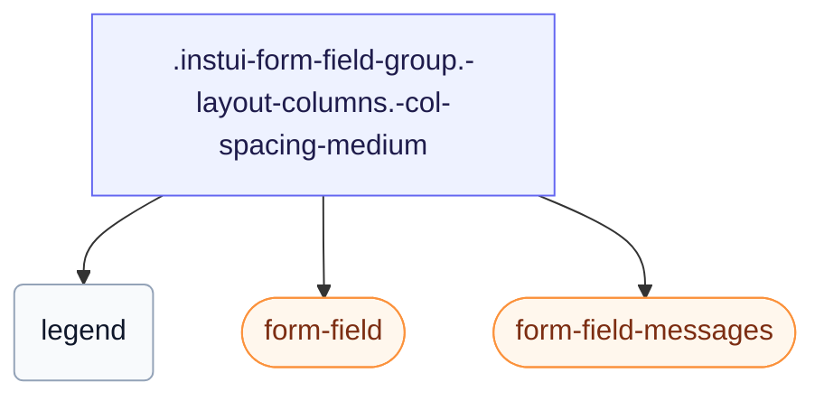

# CSS: form-field-group

`.instui-form-field-group` — مجموعة `&lt;fieldset&gt;` مع وسيلة إيضاح، تخطيط عمودي أو متسلسل، وفواصل قابلة للتعديل.

يحدد `gap` الخاص به بين الحقول، يمكن ضبطه بمُعدِّلات `-col-spacing-*`/`-row-spacing-*` أدناه — يُفضَّل استخدامها بدلًا من ربط مُعدِّل فاصل عام `-gap-*`، لأن الأخير يلغي القيمة المدمجة بالكامل.

**المصدر:** [form-field-group.css](https://github.com/thedannywahl/pantoken/blob/main/formats/components/src/components/form-field-group/form-field-group.css)

## سهولة الوصول

يعرض `&lt;fieldset&gt;` أصليًا مع `&lt;legend&gt;`، بحيث تسمّي نص الوسيلة (legend) المجموعة بأكملها لتقنيات المساعدة.

## الاستخدام

```css
@import "@pantoken/components/components.css";
@import "@pantoken/components/form-field-group.css";
```

## أمثلة

```html
<fieldset class="instui-form-field-group -layout-columns -col-spacing-medium">
  <legend>Shipping address</legend>
  <label class="instui-form-field">
    <span class="label">First name</span>
    <span class="controls"><input class="instui-text-input"></span>
  </label>
  <label class="instui-form-field">
    <span class="label">Last name</span>
    <span class="controls"><input class="instui-text-input"></span>
  </label>
  <label class="instui-form-field">
    <span class="label">City</span>
    <span class="controls"><input class="instui-text-input"></span>
  </label>
  <label class="instui-form-field">
    <span class="label">State</span>
    <span class="controls">
      <select class="instui-simple-select">
        <option>CA</option>
        <option>NY</option>
        <option>TX</option>
      </select>
    </span>
  </label>
  <div class="instui-form-field-messages">
    <span class="instui-form-field-message -type-hint">All fields are used for delivery only.</span>
  </div>
</fieldset>
```

## الهيكل

```text
.instui-form-field-group.-layout-columns.-col-spacing-medium
  legend
  form-field (component)
  form-field-messages (component)
```



## المعدّلات

| معدّل | الوصف |
| --- | --- |
| `.-col-spacing-large` | فاصل أعمدة كبير. |
| `.-col-spacing-medium` | فاصل أعمدة متوسط. |
| `.-col-spacing-none` | لا فاصل أعمدة. |
| `.-col-spacing-small` | فاصل أعمدة صغير. |
| `.-layout-aligned` | محاذاة الحقول الفرعية على شبكة مشتركة. |
| `.-layout-columns` | عرض الحقول الفرعية في أعمدة. |
| `.-layout-inline` | عرض الحقول الفرعية على التوالي في صف. |
| `.-required` | وَسم المجموعة بأنها مطلوبة. |
| `.-row-spacing-large` | فاصل صف كبير. |
| `.-row-spacing-medium` | فاصل صف متوسط. |
| `.-row-spacing-none` | لا فاصل صف. |
| `.-row-spacing-small` | فاصل صف صغير. |
| `.-v-align-bottom` | محاذاة الحقول لأسفل (محاذاة إلى القاعدة). |
| `.-v-align-middle` | محاذاة الحقول إلى الوسط عموديًا. |
| `.-v-align-top` | محاذاة الحقول إلى الأعلى. |

## عناصر زائفة

| عنصر زائف | الوصف |
| --- | --- |
| `::after` | يعرض علامة النجمة الزخرفية للحقل المطلوب بعد نص العنوان عندما تكون المجموعة مطلوبة. |

## الشروط

| نوع | استعلام | الوصف |
| --- | --- | --- |
| supports | `(grid-template-columns: subgrid)` | — |

## الرموز المستهلكة

| رمز | نوع | قيمة |
| --- | --- | --- |
| `--instui-component-form-field-layout-asterisk-color` | `<color>` | `light-dark(#CF1F24, #FA917F)` |
| `--instui-component-form-field-layout-font-family` | `[ <font-family-name> \| <generic-font-family> ]#` | `Atkinson Hyperlegible Next, "Helvetica Neue", Helvetica, Arial, sans-serif` |
| `--instui-component-form-field-layout-font-size` | `<length>` | `1rem` |
| `--instui-component-form-field-layout-font-weight` | `<integer>` | `400` |
| `--instui-component-form-field-layout-gap-inputs` | `<length>` | `0.75rem` |
| `--instui-component-form-field-layout-gap-primitives` | `<length>` | `0.5rem` |
| `--instui-component-form-field-layout-line-height` | `<length>` | `1.125rem` |
| `--instui-component-form-field-layout-text-color` | `<color>` | `light-dark(#273540, #ffffff)` |
| `--instui-spacing-space-lg` | `<length>` | `1rem` |
| `--instui-spacing-space-md` | `<length>` | `0.75rem` |
| `--instui-spacing-space-sm` | `<length>` | `0.5rem` |

## دعم المتصفّح

- وضع `-layout-aligned` يستخدم CSS subgrid وراء شرط `@supports`؛ عندما لا يدعم المتصفح subgrid، تعود الحقول إلى التخطيط المتكدس الخاص بها.

## مكونات فرعية

- [form-field](/ar/api/css/form-field.md)
- [form-field-messages](/ar/api/css/form-field-messages.md)

## ذات صلة

- [form-field](/ar/api/css/form-field.md) — الحقل المفرد الذي تكرّره هذه المجموعة.
- [radio-input-group](/ar/api/css/radio-input-group.md) — يجمع مدخلات الراديو تحت وسيلة.

