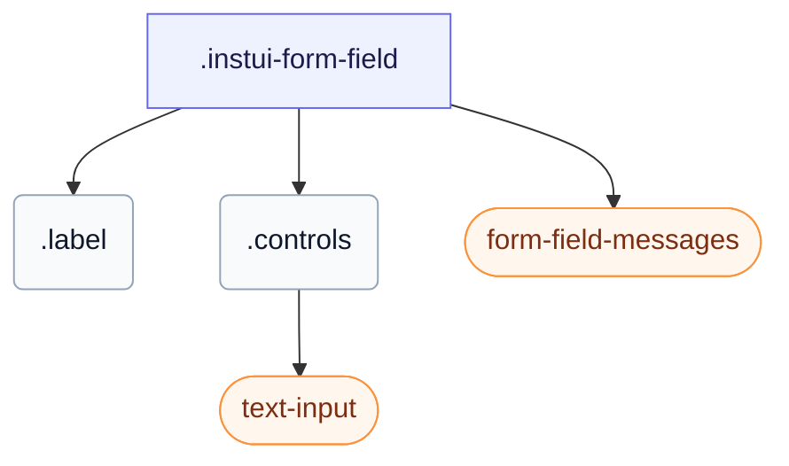

# CSS: form-field

`.instui-form-field` — غلاف لحقل النموذج: تسمية، عناصر التحكم الخاصة به، وتصاميم متراصة، داخلية، أو للقراءة فقط.

تبقى رسالة الخطأ مخفية حتى يصبح عنصر التحكم في الحقل `:user-invalid` (بعد تفاعل المستخدم) أو تضيف الصنف `-invalid`. استخدم `-layout-inline` لوضع التسمية بجانب عناصر التحكم و`-layout-stacked` لوضعها أعلاه. كما يحدد `gap` الخاص به بين التسمية وعناصر التحكم والرسائل؛ سيسيطر تعديل المسافة من فئة المساعدة `-gap-*` على هذه القيمة المضمنة عند تسلسلها.

**المصدر:** [form-field.css](https://github.com/thedannywahl/pantoken/blob/main/formats/components/src/components/form-field/form-field.css)

## سهولة الوصول

عنصر `&lt;label&gt;` يلف عنصر التحكم، لذا فإن نص التسمية يسميه طبيعياً؛ النجمة الخاصة بالحقل المطلوب زخرفية ويجب إخفاؤها عن التقنيات المساعدة (aria-hidden)، وتظهر رسالة الخطأ بمجرد أن يصبح عنصر التحكم `:user-invalid` أو تضيف الصنف `-invalid`.

## الاستخدام

```css
@import "@pantoken/components/components.css";
@import "@pantoken/components/form-field.css";
```

## أمثلة

```html
<label class="instui-form-field">
  <span class="label">Email address</span>
  <span class="controls"><input class="instui-text-input" type="email" placeholder="you@example.com"></span>
  <div class="instui-form-field-messages">
    <span class="instui-form-field-message -type-hint">We'll never share it.</span>
    <span class="instui-form-field-message -type-error">Enter a valid email address.</span>
  </div>
</label>
```

## الهيكل

```text
.instui-form-field
  .label
  .controls
    text-input (component)
  form-field-messages (component)
```



## المعدّلات

| معدّل | الوصف |
| --- | --- |
| `.-inline` | التخطيط الداخلي (اختصار لـ `-layout-inline`). |
| `.-invalid` | حالة غير صالحة (خطأ). |
| `.-label-align-end` | محاذاة نص التسمية إلى النهاية. |
| `.-label-align-start` | محاذاة نص التسمية إلى البداية. |
| `.-layout-inline` | التخطيط الداخلي: التسمية بجانب عناصر التحكم. |
| `.-layout-stacked` | التخطيط المكدس: التسمية أعلى عناصر التحكم. |
| `.-readonly` | حالة للقراءة فقط. |
| `.-v-align-bottom` | محاذاة التسمية إلى الأسفل مع عناصر التحكم. |
| `.-v-align-top` | محاذاة التسمية إلى الأعلى مع عناصر التحكم. |

## الأجزاء

| جزء | الوصف |
| --- | --- |
| `.controls` | منطقة عناصر التحكم بجانب أو أسفل التسمية. |
| `.label` | تسمية الحقل. |

## عناصر زائفة

| عنصر زائف | الوصف |
| --- | --- |
| `::after` | يعرض النجمة الزخرفية للحقل المطلوب بعد نص التسمية عندما يكون الحقل مطلوبًا. |

## الحالات

| حالة | الوصف |
| --- | --- |
| `:required` | — |

## الرموز المستهلكة

| رمز | نوع | قيمة |
| --- | --- | --- |
| `--instui-component-form-field-layout-asterisk-color` | `<color>` | `light-dark(#CF1F24, #FA917F)` |
| `--instui-component-form-field-layout-font-family` | `[ <font-family-name> \| <generic-font-family> ]#` | `Atkinson Hyperlegible Next, "Helvetica Neue", Helvetica, Arial, sans-serif` |
| `--instui-component-form-field-layout-font-size` | `<length>` | `1rem` |
| `--instui-component-form-field-layout-font-weight` | `<integer>` | `400` |
| `--instui-component-form-field-layout-gap-inputs` | `<length>` | `0.75rem` |
| `--instui-component-form-field-layout-gap-primitives` | `<length>` | `0.5rem` |
| `--instui-component-form-field-layout-line-height` | `<length>` | `1.125rem` |
| `--instui-component-form-field-layout-readonly-text-color` | `<color>` | `light-dark(#576773, #AAB0B5)` |
| `--instui-component-form-field-layout-text-color` | `<color>` | `light-dark(#273540, #ffffff)` |

## دعم المتصفّح

- يحتوي أنماط عنصره باستخدام قاعدة CSS `@scope`; يتطلب متصفح Chromium أو Firefox أو Safari حديث.

## مكونات فرعية

- [form-field-messages](/ar/api/css/form-field-messages.md)
- [text-input](/ar/api/css/text-input.md)

## ذات صلة

- [form-field-messages](/ar/api/css/form-field-messages.md) — يعرض تلميح الحقل ورسائل الخطأ والنجاح.
- [form-field-group](/ar/api/css/form-field-group.md) — يجمع الحقول المرتبطة تحت عنوان مشترك.

