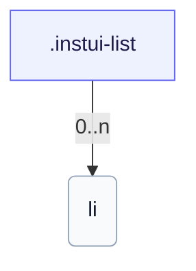

# CSS: list

`.instui-list` — قائمة بمسافات عناصر تحكمها التوكنات.

تحدد `padding-inline-start` الخاصة بها لتهشير القوائم؛ ربط مُعدِّل فاصل `-p*`/`-padding*` يتجاوز تلك القيمة المضمّنة. انظر العضو `list.item` للعناصر الفردية.

**المصدر:** [list.css](https://github.com/thedannywahl/pantoken/blob/main/formats/components/src/components/list/list.css)

## الاستخدام

```css
@import "@pantoken/components/components.css";
@import "@pantoken/components/list.css";
```

## أمثلة

```html
<ul class="instui-list">
  <li>First item</li>
  <li>Second item</li>
  <li>Third item</li>
</ul>
```

## الهيكل

```text
.instui-list
  li (0..n)
```



## المعدّلات

| معدّل | الوصف |
| --- | --- |
| `.-inline` | عرض العناصر في سطر واحد (أفقي). |
| `.-size-large` | كبير. @affects list.item — يضبط تدرج مسافات العناصر ليتطابق. اسم مستعار طويل المدى لـ `-size-lg`. |
| `.-size-lg` | كبير. @affects list.item — يضبط تدرج مسافات العناصر ليتطابق. |
| `.-size-md` | متوسط (افتراضي). @affects list.item — يضبط تدرج مسافات العناصر ليتطابق. |
| `.-size-medium` | متوسط (افتراضي). @affects list.item — يضبط تدرج مسافات العناصر ليتطابق. اسم مستعار طويل المدى لـ `-size-md`. |
| `.-size-sm` | صغير. @affects list.item — يضبط تدرج مسافات العناصر ليتطابق. |
| `.-size-small` | صغير. @affects list.item — يضبط تدرج مسافات العناصر ليتطابق. اسم مستعار طويل المدى لـ `-size-sm`. |
| `.-unstyled` | إزالة العلامات والحشوة. |

## الرموز المستهلكة

| رمز | نوع | قيمة |
| --- | --- | --- |
| `--instui-component-list-item-color` | `<color>` | `light-dark(#273540, #ffffff)` |
| `--instui-component-list-item-font-family` | `[ <font-family-name> \| <generic-font-family> ]#` | `Atkinson Hyperlegible Next, "Helvetica Neue", Helvetica, Arial, sans-serif` |
| `--instui-component-list-item-font-size-large` | `<length>` | `1.25rem` |
| `--instui-component-list-item-font-size-medium` | `<length>` | `1rem` |
| `--instui-component-list-item-font-size-small` | `<length>` | `0.875rem` |
| `--instui-component-list-item-font-weight` | `<integer>` | `400` |
| `--instui-component-list-item-line-height` | `<percentage>` | `150%` |
| `--instui-component-list-item-spacing-medium` | `<length>` | `1.5rem` |
| `--instui-component-list-list-padding` | `<length>` | `2.25rem` |

## مكونات فرعية

- [list.item](/ar/api/css/list.item.md)

