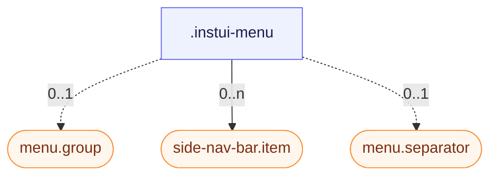

# CSS: menu

`.instui-menu` — سطح قائمة منسدلة من العناصر والمجموعات والفواصل.

قم بإنشاء الإدخالات كـ `.item` (انظر عضو `menu.item`)، وسمّ قسمًا باستخدام `.group` (انظر `menu.group`)، وقسّم الأقسام باستخدام `.separator` (انظر `menu.separator`).

**المصدر:** [group.css](https://github.com/thedannywahl/pantoken/blob/main/formats/components/src/components/menu/members/group/group.css)

## Usage

```css
@import "@pantoken/components/components.css";
@import "@pantoken/components/menu.css";
```

## Examples

-nocard

```html
<div class="instui-menu">
  <div class="group">Actions</div>
  <div class="item">Edit</div>
  <div class="item -active">Duplicate</div>
  <div class="separator"></div>
  <div class="item">Delete</div>
</div>
```

## Structure

```text
.instui-menu
  menu.group (component, 0..1)
  side-nav-bar.item (component, 0..n)
  menu.separator (component, 0..1)
```



## Tokens consumed

| Token                                     | Type       | Value                          |
| ----------------------------------------- | ---------- | ------------------------------ |
| `--instui-border-radius-md`               | `<length>` | `0.5rem`                       |
| `--instui-border-width-sm`                | `<length>` | `0.0625rem`                    |
| `--instui-color-stroke-base`              | `<color>`  | `light-dark(#8D959F, #6A7883)` |
| `--instui-component-menu-item-background` | `<color>`  | `light-dark(#ffffff, #171B21)` |
| `--instui-component-menu-max-width`       | `<length>` | `16em`                         |
| `--instui-component-menu-min-width`       | `<length>` | `8em`                          |
| `--instui-spacing-space-xs`               | `<length>` | `0.25rem`                      |

## Subcomponents

- [menu.group](/ar/api/css/menu.group.md)
- [menu.item](/ar/api/css/menu.item.md)
- [menu.separator](/ar/api/css/menu.separator.md)
- [side-nav-bar.item](/ar/api/css/side-nav-bar.item.md)

## Related

- [tree-browser](/ar/api/css/tree-browser.md) — كلاهما يعرض إدخالات متداخلة قابلة للاختيار.
- [simple-select](/ar/api/css/simple-select.md) — تعيد قائمة الاختيار استخدام سطح هذه القائمة.
