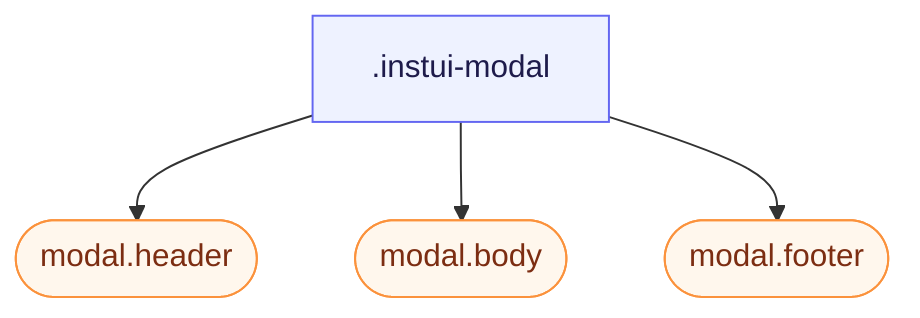

# CSS: modal

`.instui-modal` — سطح حوار (يعمل على &lt;dialog&gt; أصلي)؛ أجزاء رأس/جسم/تذييل.

راجع أعضاء `modal.header` و `modal.body` و `modal.footer` للأجزاء الفردية.

**المصدر:** [body.css](https://github.com/thedannywahl/pantoken/blob/main/formats/components/src/components/modal/members/body/body.css)

<!-- js-requirement -->

> [!TIP]
> **JS Enhancement** — يتم عرض CSS الخاص بهذا المكون والعمل بشكل مستقل؛ اجمعه مع `@pantoken/interactions` لإضافة السلوك التفاعلي. راجع [جدول المعدلات أدناه](#modifiers).

## Accessibility

افتح `&lt;dialog&gt;` الأصلي مع `showModal()` لدلالات الحوار وإغلاق Esc، وقم بتسميته باستخدام `aria-labelledby` يشير إلى `.header`.

## Usage

```css
@import "@pantoken/components/components.css";
@import "@pantoken/components/modal.css";
```

## Demo

```demo
self:modal
```

## Examples

```html
<dialog class="instui-modal -size-sm" id="modal-sm">
  <div class="header"><strong>Small</strong></div>
  <div class="body"><code>-size-sm</code> — a narrow modal.</div>
  <div class="footer">
    <button class="instui-button">Close</button>
  </div>
</dialog>
```

## Structure

```text
.instui-modal
  modal.header (component)
  modal.body (component)
  modal.footer (component)
```



## Modifiers

| Modifier            | Description                                                                                                                            |
| ------------------- | -------------------------------------------------------------------------------------------------------------------------------------- |
| `.-blur`            | ضبب الخلفية خلف الحوار.                                                                                                                |
| `.-color-inverse`   | واجهة مظلمة (يقترن مع جسم الوسائط). @affects modal.header @affects modal.body @affects modal.footer — يعيد تلوين كل جزء للمظهر الداكن. |
| `.-density-compact` | حشو أجزاء أضيق. @affects modal.header @affects modal.body @affects modal.footer — يشد حشو كل جزء.                                      |
| `.-overflow-fit`    | قيد إلى منفذ العرض والتمرير عبر الجسم. @affects modal.body — يقوم بالتمرير عبر الجسم عندما يكون الحوار محدود بمنفذ العرض.              |
| `.-size-auto`       | حجم وفقاً للمحتوى.                                                                                                                     |
| `.-size-fullscreen` | من الحافة إلى الحافة.                                                                                                                  |
| `.-size-large`      | حوار عريض. اسم مستعار طويل `-size-lg`.                                                                                                 |
| `.-size-lg`         | حوار عريض.                                                                                                                             |
| `.-size-sm`         | حوار ضيق.                                                                                                                              |
| `.-size-small`      | حوار ضيق. اسم مستعار طويل `-size-sm`.                                                                                                  |

## Pseudo-elements

| Pseudo-element | Description                                        |
| -------------- | -------------------------------------------------- |
| `::backdrop`   | يخفف الصفحة خلف الحوار كقناعه، ويجمده تحت `-blur`. |

## Tokens consumed

| Token                                               | Type                                               | Value                                                                        |
| --------------------------------------------------- | -------------------------------------------------- | ---------------------------------------------------------------------------- |
| `--instui-component-mask-background-color`          | `<color>`                                          | `light-dark(rgba(255,255,255,0.75), rgba(28,34,43,0.75))`                    |
| `--instui-component-modal-auto-min-width`           | `<length>`                                         | `16em`                                                                       |
| `--instui-component-modal-background-color`         | `<color>`                                          | `light-dark(#ffffff, #171B21)`                                               |
| `--instui-component-modal-border-color`             | `<color>`                                          | `light-dark(#E8EAEC, #334450)`                                               |
| `--instui-component-modal-border-radius`            | `<length>`                                         | `1rem`                                                                       |
| `--instui-component-modal-border-width`             | `<length>`                                         | `0.0625rem`                                                                  |
| `--instui-component-modal-font-family`              | `[ <font-family-name> \| <generic-font-family> ]#` | `Atkinson Hyperlegible Next, "Helvetica Neue", Helvetica, Arial, sans-serif` |
| `--instui-component-modal-inverse-background-color` | `<color>`                                          | `light-dark(#273540, #1C222B)`                                               |
| `--instui-component-modal-inverse-border-color`     | `<color>`                                          | `#334450`                                                                    |
| `--instui-component-modal-inverse-text-color`       | `<color>`                                          | `#ffffff`                                                                    |
| `--instui-component-modal-large-max-width`          | `<length>`                                         | `62em`                                                                       |
| `--instui-component-modal-medium-max-width`         | `<length>`                                         | `48em`                                                                       |
| `--instui-component-modal-small-max-width`          | `<length>`                                         | `30em`                                                                       |
| `--instui-component-modal-text-color`               | `<color>`                                          | `light-dark(#273540, #F2F4F5)`                                               |
| `--instui-elevation-topmost`                        | `none \| <shadow>#`                                | —                                                                            |
| `--instui-spacing-space-xl`                         | `<length>`                                         | `1.5rem`                                                                     |

## Browser support

- ينمط &lt;dialog&gt; أصلي و `::backdrop`؛ يحتاج عرض الطبقة العليا وتنسيق الخلفية إلى متصفح يدعم عنصر الحوار.

## Subcomponents

- [modal.body](/ar/api/css/modal.body.md)
- [modal.footer](/ar/api/css/modal.footer.md)
- [modal.header](/ar/api/css/modal.header.md)

## Related

- [tray](/ar/api/css/tray.md) — الدرج هو نفس نمط التراكب القابل للإغلاق، وهو مثبت على حافة الشاشة.
