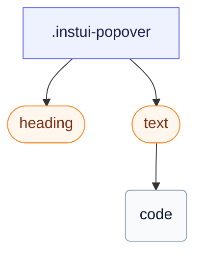

# CSS: popover

`.instui-popover` — سطح مرتفع لـ `[popover]` أصلي، يتم وضعه باستخدام تحديد موضع مرساة CSS.

تحديد موضع المرساة خاص بـ Chromium فقط؛ حماية `@supports` تعني أن `-placement-*` خامل بصمت في مكان آخر وتوسيط UA لـ popover في الطبقة العليا بدلاً من الفشل.

**المصدر:** [popover.css](https://github.com/thedannywahl/pantoken/blob/main/formats/components/src/components/popover/popover.css)

## Usage

```css
@import "@pantoken/components/components.css";
@import "@pantoken/components/popover.css";
```

## Examples

```html
<div class="instui-popover -placement-bottom" id="pop-1">
  <div class="instui-heading -level-h4">Share this page</div>
  <p class="instui-text -size-sm">
    A popover is a lightweight surface anchored to a trigger. This one uses the native
    <code>popover</code> attribute.
  </p>
</div>
```

## Structure

```text
.instui-popover
  heading (component)
  text (component)
    code
```



## Modifiers

| Modifier             | Description                             |
| -------------------- | --------------------------------------- |
| `.-placement-bottom` | اجلس أسفل المرساة.                      |
| `.-placement-end`    | اجلس في النهاية (inline-end) للمرساة.   |
| `.-placement-start`  | اجلس في البداية (inline-start) للمرساة. |
| `.-placement-top`    | اجلس فوق المرساة.                       |

## Conditions

| Type     | Query                                   | Description |
| -------- | --------------------------------------- | ----------- |
| supports | `(position-area: block-end)`            | —           |
| supports | `(transition-behavior: allow-discrete)` | —           |

## Tokens consumed

| Token                                             | Type                | Value                          |
| ------------------------------------------------- | ------------------- | ------------------------------ |
| `--instui-border-width-sm`                        | `<length>`          | `0.0625rem`                    |
| `--instui-color-background-elevated-surface-base` | `<color>`           | `light-dark(#ffffff, #171B21)` |
| `--instui-color-text-base`                        | `<color>`           | `light-dark(#273540, #F2F4F5)` |
| `--instui-component-popover-border-color`         | `<color>`           | `light-dark(#8D959F, #6A7883)` |
| `--instui-component-popover-border-radius`        | `<length>`          | `0.75rem`                      |
| `--instui-elevation-above`                        | `none \| <shadow>#` | —                              |
| `--instui-spacing-space-sm`                       | `<length>`          | `0.5rem`                       |

## Browser support

- يستخدم تحديد موضع مرساة CSS (`position-anchor`/`position-area`) و API `[popover]` الأصلية، كلاهما خاص بـ Chromium فقط اليوم؛ تحافظ حماية `@supports` على الموضع خامل في مكان آخر، حيث يركز UA popover في الطبقة العليا.

## Subcomponents

- [heading](/ar/api/css/heading.md)
- [text](/ar/api/css/text.md)

## Related

- [tooltip](/ar/api/css/tooltip.md) — تلميح أداة هو سطح مرساة أصغر تم تشغيله عند التمرير أو التركيز.
- [context-view](/ar/api/css/context-view.md) — طريقة عرض السياق هي سطح مرساة ذو صلة مع مؤشر.
