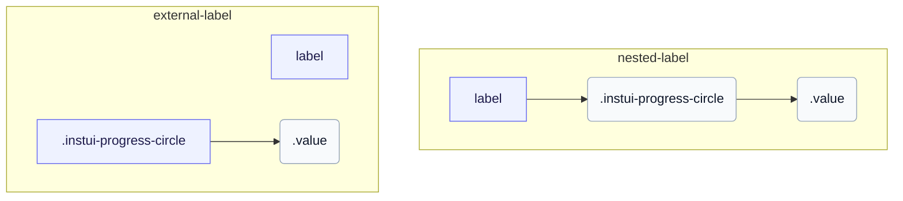

# CSS: progress-circle

`.instui-progress-circle` · <span class="instui-pill -color-success pantoken-doc-tag">stable</span> — حلقة تقدم دائرية يقودها خصائص مخصصة `--value` و `--value-max`.

الحلقة عبارة عن دونات `conic-gradient` مرسومة على `::before` ومقلمة بقناع تدرج شعاعي؛ يدفع القوس ناتج قسمة `--value` على `--value-max`. أضف `-should-animate` وحمّل نقطة الدخول للتفاعلات لتحريكه من الصفر عند التركيب. لا يحتوي InstUI على حالة غير محددة؛ `:indeterminate` هو تقدير خاص بـ pantoken (عنصر `&lt;progress&gt;` أصلي بدون سمة `value`)، يدور الحلقة بقوس ثابت ويخفي `.value` لأنّه لا يوجد رقم ذي معنى للعرض. `&lt;meter&gt;` لا يحتوي على حالة غير محددة، لذا فهو غير متأثر.

**Source:** [progress-circle.css](https://github.com/thedannywahl/pantoken/blob/main/formats/components/src/components/progress-circle/progress-circle.css)

<!-- js-requirement -->
> [!TIP]
> **تحسين JS** — تقوم CSS الخاصة بهذا المكوّن بعرضه والعمل بمفرده؛ اقترنه بـ `@pantoken/interactions` لإضافة السلوك التفاعلي. المُعدّل `-should-animate` يُقاد بواسطة ذلك السلوك. انظر [جدول المُعدّلات أدناه](#modifiers).


## سهولة الوصول

استخدم `&lt;progress&gt;` الأصلي لنطاق إكمال المهمة الذي يبدأ من صفر، و `&lt;meter&gt;` عندما لا يكون الحد الأدنى صفراً. امنح أي من العنصرين اسمًا قابلاً للوصول عن طريق تضمينه في `&lt;label&gt;` أو ربط `&lt;label&gt;` منفصل من خلال مطابقة قيم `for` و `id`.

## الاستخدام

```css
@import "@pantoken/components/components.css";
@import "@pantoken/components/progress-circle.css";
```

## أمثلة

### Nested label
```html
<label>
  Uploading Document: <progress class="instui-progress-circle -size-sm" value="70">70%</progress>
</label>
```
### External label
```html
<label for="score">Score</label>
<meter id="score" class="instui-progress-circle -color-success" min="20" value="40" max="60">50%</meter>
```

## الهيكل

`// Variant: nested-label`

```text
label
  .instui-progress-circle
    .value
```

`// Variant: external-label`

```text
label
.instui-progress-circle
  .value
```



## المعدّلات

| معدّل | الوصف |
| --- | --- |
| `.-color-brand` | لون مقياس العلامة التجارية. |
| `.-color-danger` | لون مقياس الخطر. |
| `.-color-info` | لون مقياس المعلومات. |
| `.-color-primary-inverse` | لون المقياس على الخلفية الداكنة (العكسي الأساسي). |
| `.-color-success` | لون مقياس النجاح. |
| `.-color-warning` | لون مقياس التحذير. |
| `.-meter-color-alert` | <span class="instui-pill -color-danger pantoken-doc-tag">مهجور</span> — use `.-color-warning`. |
| `.-meter-color-brand` | <span class="instui-pill -color-danger pantoken-doc-tag">مهجور</span> — use `.-color-brand`. |
| `.-meter-color-danger` | <span class="instui-pill -color-danger pantoken-doc-tag">مهجور</span> — use `.-color-danger`. |
| `.-meter-color-info` | <span class="instui-pill -color-danger pantoken-doc-tag">مهجور</span> — use `.-color-info`. |
| `.-meter-color-success` | <span class="instui-pill -color-danger pantoken-doc-tag">مهجور</span> — use `.-color-success`. |
| `.-meter-color-warning` | <span class="instui-pill -color-danger pantoken-doc-tag">مهجور</span> — use `.-color-warning`. |
| `.-shold-animate-on-mount` | <span class="instui-pill -color-info pantoken-doc-tag">Alias</span> — maps to `.-should-animate`. |
| `.-should-animate` | <span class="instui-pill pantoken-doc-tag pantoken-doc-tag-interaction">Interaction</span> — Animate the meter, ring, and centered value into place on mount. |
| `.-should-animate-on-mount` | <span class="instui-pill -color-info pantoken-doc-tag">Alias</span> — maps to `.-should-animate`. |
| `.-size-large` | كبير. مرادف وصف طويل لـ `-size-lg`. |
| `.-size-lg` | كبير. |
| `.-size-md` | متوسط (الافتراضي). |
| `.-size-medium` | متوسط (الافتراضي). مرادف وصف طويل لـ `-size-md`. |
| `.-size-sm` | صغير. |
| `.-size-small` | صغير. مرادف وصف طويل لـ `-size-sm`. |
| `.-size-x-small` | صغير جدًا. مرادف وصف طويل لـ `-size-xs`. |
| `.-size-xs` | صغير جدًا. |

## الأجزاء

| جزء | الوصف |
| --- | --- |
| `.value` | نص القيمة الموجود في مركز ثقب الحلقة. |

## عناصر زائفة

| عنصر زائف | الوصف |
| --- | --- |
| `:::indeterminate` | مكوّن مخصّص، ليس جزءًا من InstUI. يُطبّق فقط على `&lt;progress&gt;` الأصلي الذي يفتقد سمة `value`؛ يدير `::before` بدوران بقوس ثابت ويخفي `.value`. |
| `::before` | يرسم الحلقة نفسها: دونات تدرج مخروطية مقلمة بقناع حلقي، حيث يتتبع القوس خاصية `--value` المخصصة. |

## الحالات

| حالة | الوصف |
| --- | --- |
| `:indeterminate` | — |

## خصائص مخصّصة

| خاصية | نوع | افتراضي | الوصف |
| --- | --- | --- | --- |
| `--animation-delay` | `<number>` | — | المللي ثانية للانتظار قبل بدء رسوم متحركة التركيب (الافتراضي `0`). |
| `--max` | `<number>` | — | الحد الأقصى لقيمة التقدم (الافتراضي `100`). |
| `--min` | `<number>` | — | الحد الأدنى لقيمة المقياس (الافتراضي `0`). |
| `--pantoken-pc-fill` | `<color>` | — | لون القوس الممتلئ (المقياس)؛ تحدد المُعدّلات -color-* لونه. |
| `--pantoken-pc-stroke` | `<length>` | — | عرض ضربة الحلقة؛ ضبطته المُعدّلات -size-*.  |
| `--pantoken-pc-track` | `<color>` | — | لون المسار غير الممتلئ. |
| `--value` | `<number>` | — | قيمة التقدّم الحالية؛ مسجَّلة مع @property حتى يمكنها الانتقال. |
| `--value-max` | `<number>` | — | @alias {@link --max} الحد الأقصى لقيمة التقدم (الافتراضي `100`). |
| `--value-now` | `<number>` | — | @alias مرادف لـ `--value`. |

## التحريكات

| تحريك | الوصف |
| --- | --- |
| `pantoken-progress-circle-indeterminate` | — |

## الرموز المستهلكة

| رمز | نوع | قيمة |
| --- | --- | --- |
| `--instui-component-progress-circle-color` | `<color>` | `light-dark(#273540, #ffffff)` |
| `--instui-component-progress-circle-color-inverse` | `<color>` | `light-dark(#ffffff, #1C222B)` |
| `--instui-component-progress-circle-font-family` | `[ <font-family-name> \| <generic-font-family> ]#` | `Atkinson Hyperlegible Next, "Helvetica Neue", Helvetica, Arial, sans-serif` |
| `--instui-component-progress-circle-font-weight` | `<integer>` | `600` |
| `--instui-component-progress-circle-large-size` | `<length>` | `9em` |
| `--instui-component-progress-circle-large-stroke-width` | `<length>` | `0.875em` |
| `--instui-component-progress-circle-line-height` | `<percentage>` | `125%` |
| `--instui-component-progress-circle-medium-size` | `<length>` | `7em` |
| `--instui-component-progress-circle-medium-stroke-width` | `<length>` | `0.625em` |
| `--instui-component-progress-circle-meter-color-brand` | `<color>` | `light-dark(#1D354F, #EEF4FD)` |
| `--instui-component-progress-circle-meter-color-brand-inverse` | `<color>` | `light-dark(#ffffff, #6A7883)` |
| `--instui-component-progress-circle-meter-color-danger` | `<color>` | `#E62429` |
| `--instui-component-progress-circle-meter-color-danger-inverse` | `<color>` | `light-dark(#ffffff, #6A7883)` |
| `--instui-component-progress-circle-meter-color-info` | `<color>` | `#2B7ABC` |
| `--instui-component-progress-circle-meter-color-info-inverse` | `<color>` | `light-dark(#ffffff, #6A7883)` |
| `--instui-component-progress-circle-meter-color-success` | `<color>` | `#03893D` |
| `--instui-component-progress-circle-meter-color-success-inverse` | `<color>` | `light-dark(#ffffff, #6A7883)` |
| `--instui-component-progress-circle-meter-color-warning` | `<color>` | `#CF4A00` |
| `--instui-component-progress-circle-meter-color-warning-inverse` | `<color>` | `light-dark(#ffffff, #6A7883)` |
| `--instui-component-progress-circle-small-size` | `<length>` | `5em` |
| `--instui-component-progress-circle-small-stroke-width` | `<length>` | `0.5em` |
| `--instui-component-progress-circle-track-color` | `<color>` | `light-dark(#ffffff, #10141A)` |
| `--instui-component-progress-circle-track-color-inverse` | `<color>` | `#00000000` |
| `--instui-component-progress-circle-x-small-size` | `<length>` | `3em` |
| `--instui-component-progress-circle-x-small-stroke-width` | `<length>` | `0.2em` |

## دعم المتصفّح

- يسجّل خصائص التقدّم الرقمية مع `@property` ويرسم باستخدام CSS `mask` و `conic-gradient`; حيثما لا تُدعم انتقالات الخصائص المخصصة، لا يزال تُعرض الحلقة لكن لن تُتحرّك.

## ذات صلة

- [progress](/ar/api/css/progress.md) — الشكل الشريطي الخطي لنفس التقدم المحدد.

