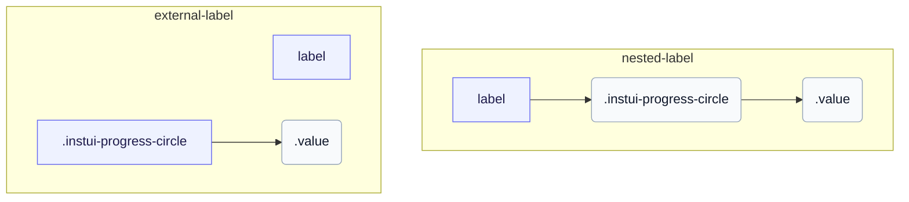

# CSS: progress-circle

`.instui-progress-circle` · <span class="instui-pill -color-success pantoken-doc-tag">مستقر</span> — حلقة تقدم دائري مدفوع بخصائص مخصصة `--value` و `--value-max`.

الحلقة عبارة عن دونات `conic-gradient` مرسومة على `::before` ومقطوعة بقناع تدرج شعاعي؛ `--value` مقسومة على `--value-max` تقود القوس. أضف `-should-animate` وحمّل نقطة دخول التفاعلات لتحريكها من الصفر عند التثبيت. لا يحتوي InstUI على حالة غير محددة؛ `:indeterminate` هو أفضل تخمين خاص بـ pantoken فقط (`&lt;progress&gt;` أصلي بدون سمة `value`)، يدور الحلقة بقوس ثابت ويخفي `.value` لأنه لا توجد أرقام ذات مغزى لعرضها. `&lt;meter&gt;` لا حالة غير محددة، لذا لم يتأثر.

**المصدر:** [progress-circle.css](https://github.com/thedannywahl/pantoken/blob/main/formats/components/src/components/progress-circle/progress-circle.css)

<!-- js-requirement -->

> [!TIP]
> **JS Enhancement** — يتم عرض CSS المكون الخاص به والعمل بشكل مستقل؛ قرنها مع `@pantoken/interactions` لإضافة السلوك التفاعلي. يتم قيادة معدل `-should-animate` من قبل هذا السلوك. انظر [جدول المعدل أدناه](#modifiers).

## Accessibility

استخدم `&lt;progress&gt;` الأصلي لنطاق إكمال المهام الذي يبدأ من صفر و `&lt;meter&gt;` عندما يكون الحد الأدنى غير صفر. أعط أي عنصر اسماً يمكن الوصول إليه بإدراجه في `&lt;label&gt;` أو ربط `&lt;label&gt;` منفصل من خلال مطابقة قيم `for` و `id`.

## Usage

```css
@import "@pantoken/components/components.css";
@import "@pantoken/components/progress-circle.css";
```

## Examples

### Nested label

```html
<label>
  Uploading Document: <progress class="instui-progress-circle -size-sm" value="70">70%</progress>
</label>
```

### External label

```html
<label for="score">Score</label>
<meter id="score" class="instui-progress-circle -color-success" min="20" value="40" max="60">
  50%
</meter>
```

## Structure

`// Variant: nested-label`

```text
label
  .instui-progress-circle
    .value
```

`// Variant: external-label`

```text
label
.instui-progress-circle
  .value
```



## Modifiers

| Modifier                    | Description                                                                                                                                                   |
| --------------------------- | ------------------------------------------------------------------------------------------------------------------------------------------------------------- |
| `.-color-brand`             | لون مقياس العلامة التجارية.                                                                                                                                   |
| `.-color-danger`            | لون مقياس الخطر.                                                                                                                                              |
| `.-color-info`              | لون مقياس المعلومات.                                                                                                                                          |
| `.-color-primary-inverse`   | لون مقياس على الخلفية الداكنة (معكوس أساسي).                                                                                                                  |
| `.-color-success`           | لون مقياس النجاح.                                                                                                                                             |
| `.-color-warning`           | لون مقياس التحذير.                                                                                                                                            |
| `.-meter-color-alert`       | <span class="instui-pill -color-danger pantoken-doc-tag">Deprecated</span> — use `.-color-warning`.                                                           |
| `.-meter-color-brand`       | <span class="instui-pill -color-danger pantoken-doc-tag">Deprecated</span> — use `.-color-brand`.                                                             |
| `.-meter-color-danger`      | <span class="instui-pill -color-danger pantoken-doc-tag">Deprecated</span> — use `.-color-danger`.                                                            |
| `.-meter-color-info`        | <span class="instui-pill -color-danger pantoken-doc-tag">Deprecated</span> — use `.-color-info`.                                                              |
| `.-meter-color-success`     | <span class="instui-pill -color-danger pantoken-doc-tag">Deprecated</span> — use `.-color-success`.                                                           |
| `.-meter-color-warning`     | <span class="instui-pill -color-danger pantoken-doc-tag">Deprecated</span> — use `.-color-warning`.                                                           |
| `.-shold-animate-on-mount`  | <span class="instui-pill -color-info pantoken-doc-tag">Alias</span> — maps to `.-should-animate`.                                                             |
| `.-should-animate`          | <span class="instui-pill pantoken-doc-tag pantoken-doc-tag-interaction">Interaction</span> — Animate the meter, ring, and centered value into place on mount. |
| `.-should-animate-on-mount` | <span class="instui-pill -color-info pantoken-doc-tag">Alias</span> — maps to `.-should-animate`.                                                             |
| `.-size-large`              | كبير. اسم مستعار طويل الشكل لـ `-size-lg`.                                                                                                                    |
| `.-size-lg`                 | كبير.                                                                                                                                                         |
| `.-size-md`                 | متوسط (افتراضي).                                                                                                                                              |
| `.-size-medium`             | متوسط (افتراضي). اسم مستعار طويل الشكل لـ `-size-md`.                                                                                                         |
| `.-size-sm`                 | صغير.                                                                                                                                                         |
| `.-size-small`              | صغير. اسم مستعار طويل الشكل لـ `-size-sm`.                                                                                                                    |
| `.-size-x-small`            | صغير جداً. اسم مستعار طويل الشكل لـ `-size-xs`.                                                                                                               |
| `.-size-xs`                 | صغير جداً.                                                                                                                                                    |

## Parts

| Part     | Description                     |
| -------- | ------------------------------- |
| `.value` | نص القيمة في منتصف فتحة الحلقة. |

## Pseudo-elements

| Pseudo-element     | Description                                                                                                                                  |
| ------------------ | -------------------------------------------------------------------------------------------------------------------------------------------- |
| `:::indeterminate` | مخصص، وليس جزءاً من InstUI. ينطبق فقط على `&lt;progress&gt;` الأصلي المفقود لـ `value` الخاص به؛ يدور `::before` في قوس ثابت ويخفي `.value`. |
| `::before`         | يرسم الحلقة نفسها: دائرة بتدرج مخروطي مقطوعة بقناع شعاعي، حيث يتتبع قوسها خاصية `--value` المخصصة.                                           |

## States

| State            | Description |
| ---------------- | ----------- |
| `:indeterminate` | —           |

## Custom properties

| Property               | Type       | Default | Description                                                   |
| ---------------------- | ---------- | ------- | ------------------------------------------------------------- |
| `--animation-delay`    | `<number>` | —       | ميلي ثانية للانتظار قبل بدء رسم الرسم المتحرك (افتراضي `0`).  |
| `--max`                | `<number>` | —       | قيمة التقدم القصوى (افتراضي `100`).                           |
| `--min`                | `<number>` | —       | قيمة المقياس الدنيا (افتراضي `0`).                            |
| `--pantoken-pc-fill`   | `<color>`  | —       | لون القوس المملوء (المقياس)؛ معدلات -color-* تضبطه.           |
| `--pantoken-pc-stroke` | `<length>` | —       | عرض ضربة الحلقة؛ معدلات -size-* تضبطه.                        |
| `--pantoken-pc-track`  | `<color>`  | —       | لون المسار غير المملوء.                                       |
| `--value`              | `<number>` | —       | قيمة التقدم الحالية؛ مسجلة مع @property بحيث يمكنها الانتقال. |
| `--value-max`          | `<number>` | —       | @alias {@link --max} قيمة التقدم القصوى (افتراضي `100`).      |
| `--value-now`          | `<number>` | —       | @alias اسم مستعار لـ `--value`.                               |

## Animations

| Animation                                | Description |
| ---------------------------------------- | ----------- |
| `pantoken-progress-circle-indeterminate` | —           |

## Tokens consumed

| Token                                                            | Type                                               | Value                                                                        |
| ---------------------------------------------------------------- | -------------------------------------------------- | ---------------------------------------------------------------------------- |
| `--instui-component-progress-circle-color`                       | `<color>`                                          | `light-dark(#273540, #ffffff)`                                               |
| `--instui-component-progress-circle-color-inverse`               | `<color>`                                          | `light-dark(#ffffff, #1C222B)`                                               |
| `--instui-component-progress-circle-font-family`                 | `[ <font-family-name> \| <generic-font-family> ]#` | `Atkinson Hyperlegible Next, "Helvetica Neue", Helvetica, Arial, sans-serif` |
| `--instui-component-progress-circle-font-weight`                 | `<integer>`                                        | `600`                                                                        |
| `--instui-component-progress-circle-large-size`                  | `<length>`                                         | `9em`                                                                        |
| `--instui-component-progress-circle-large-stroke-width`          | `<length>`                                         | `0.875em`                                                                    |
| `--instui-component-progress-circle-line-height`                 | `<percentage>`                                     | `125%`                                                                       |
| `--instui-component-progress-circle-medium-size`                 | `<length>`                                         | `7em`                                                                        |
| `--instui-component-progress-circle-medium-stroke-width`         | `<length>`                                         | `0.625em`                                                                    |
| `--instui-component-progress-circle-meter-color-brand`           | `<color>`                                          | `light-dark(#1D354F, #EEF4FD)`                                               |
| `--instui-component-progress-circle-meter-color-brand-inverse`   | `<color>`                                          | `light-dark(#ffffff, #6A7883)`                                               |
| `--instui-component-progress-circle-meter-color-danger`          | `<color>`                                          | `#E62429`                                                                    |
| `--instui-component-progress-circle-meter-color-danger-inverse`  | `<color>`                                          | `light-dark(#ffffff, #6A7883)`                                               |
| `--instui-component-progress-circle-meter-color-info`            | `<color>`                                          | `#2B7ABC`                                                                    |
| `--instui-component-progress-circle-meter-color-info-inverse`    | `<color>`                                          | `light-dark(#ffffff, #6A7883)`                                               |
| `--instui-component-progress-circle-meter-color-success`         | `<color>`                                          | `#03893D`                                                                    |
| `--instui-component-progress-circle-meter-color-success-inverse` | `<color>`                                          | `light-dark(#ffffff, #6A7883)`                                               |
| `--instui-component-progress-circle-meter-color-warning`         | `<color>`                                          | `#CF4A00`                                                                    |
| `--instui-component-progress-circle-meter-color-warning-inverse` | `<color>`                                          | `light-dark(#ffffff, #6A7883)`                                               |
| `--instui-component-progress-circle-small-size`                  | `<length>`                                         | `5em`                                                                        |
| `--instui-component-progress-circle-small-stroke-width`          | `<length>`                                         | `0.5em`                                                                      |
| `--instui-component-progress-circle-track-color`                 | `<color>`                                          | `light-dark(#ffffff, #10141A)`                                               |
| `--instui-component-progress-circle-track-color-inverse`         | `<color>`                                          | `#00000000`                                                                  |
| `--instui-component-progress-circle-x-small-size`                | `<length>`                                         | `3em`                                                                        |
| `--instui-component-progress-circle-x-small-stroke-width`        | `<length>`                                         | `0.2em`                                                                      |

## Browser support

- يسجل خصائص التقدم الرقمية مع `@property` ويرسم باستخدام CSS `mask` و `conic-gradient`؛ حيث لا تكون انتقالات الخصائص المخصصة مدعومة، لا تزال الحلقة تعرض لكن لن تتحرك.

## Related

- [progress](/ar/api/css/progress.md) — الشكل الخطي للشريط من نفس التقدم المحدد.
