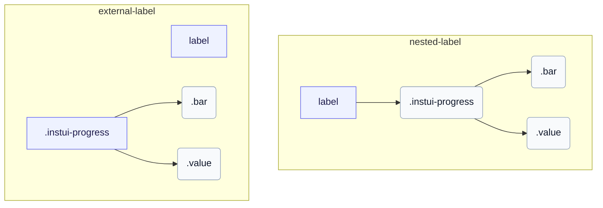

# CSS: progress

`.instui-progress` · <span class="instui-pill -color-success pantoken-doc-tag">مستقر</span> — شريط تقدم محدد بمقياس ملون وأحجام وتسمية قيمة اختيارية.

`.value` هو أخ لـ `.bar`، كلاهما أطفال الجذر — يعكس كيفية دخول progress-circle في جزء `.value` الخاص به. InstUI ليس لديه حالة غير محددة؛ `:indeterminate` هو أفضل تخمين خاص بـ pantoken فقط (`&lt;progress&gt;` الأصلي بدون خاصية `value`)، مع تحريك `.bar` كقطعة منزلقة وإخفاء `.value` حيث لا يوجد رقم معنوي لعرضه. `&lt;meter&gt;` ليس لديه حالة غير محددة، لذلك لن يتأثر.

**المصدر:** [progress.css](https://github.com/thedannywahl/pantoken/blob/main/formats/components/src/components/progress/progress.css)

## Accessibility

استخدم `&lt;progress&gt;` الأصلي لنطاق إكمال المهام الذي يبدأ من صفر و `&lt;meter&gt;` عندما يكون الحد الأدنى غير صفر. أعط أي عنصر اسماً يمكن الوصول إليه بإدراجه في `&lt;label&gt;` أو ربط `&lt;label&gt;` منفصل من خلال مطابقة قيم `for` و `id`.

## Usage

```css
@import "@pantoken/components/components.css";
@import "@pantoken/components/progress.css";
```

## Examples

### Nested label

```html
<label>
  Uploading Document: <progress class="instui-progress -color-brand" value="70">70%</progress>
</label>
```

### External label

```html
<label for="storage-used">Storage used</label>
<meter id="storage-used" class="instui-progress -color-warning" min="20" value="40" max="60">
  50%
</meter>
```

## Structure

`// Variant: nested-label`

```text
label
  .instui-progress
    .bar
    .value
```

`// Variant: external-label`

```text
label
.instui-progress
  .bar
  .value
```



## Modifiers

| Modifier                  | Description                                                                                                                            |
| ------------------------- | -------------------------------------------------------------------------------------------------------------------------------------- |
| `.-color-brand`           | لون مقياس العلامة التجارية.                                                                                                            |
| `.-color-danger`          | لون مقياس الخطر.                                                                                                                       |
| `.-color-info`            | لون مقياس المعلومات.                                                                                                                   |
| `.-color-inverse`         | للخلفيات الداكنة.                                                                                                                      |
| `.-color-primary-inverse` | لون مقياس على الخلفية الداكنة (معكوس أساسي).                                                                                           |
| `.-color-success`         | لون مقياس النجاح.                                                                                                                      |
| `.-color-warning`         | لون مقياس التحذير.                                                                                                                     |
| `.-meter-color-alert`     | <span class="instui-pill -color-danger pantoken-doc-tag">Deprecated</span> — use `.-color-warning`.                                    |
| `.-meter-color-brand`     | <span class="instui-pill -color-danger pantoken-doc-tag">Deprecated</span> — use `.-color-brand`.                                      |
| `.-meter-color-danger`    | <span class="instui-pill -color-danger pantoken-doc-tag">Deprecated</span> — use `.-color-danger`.                                     |
| `.-meter-color-info`      | <span class="instui-pill -color-danger pantoken-doc-tag">Deprecated</span> — use `.-color-info`.                                       |
| `.-meter-color-success`   | <span class="instui-pill -color-danger pantoken-doc-tag">Deprecated</span> — use `.-color-success`.                                    |
| `.-meter-color-warning`   | <span class="instui-pill -color-danger pantoken-doc-tag">Deprecated</span> — use `.-color-warning`.                                    |
| `.-render-value-inside`   | يعرض `.value` داخل المسار، محاذى لبدايته، بدلاً من بجانبه؛ صممه لسهولة القراءة على لون المقياس.                                        |
| `.-should-animate`        | <span class="instui-pill pantoken-doc-tag pantoken-doc-tag-interaction">Interaction</span> — Animate meter changes over half a second. |
| `.-size-large`            | كبير. اسم مستعار طويل الشكل لـ `-size-lg`.                                                                                             |
| `.-size-lg`               | كبير.                                                                                                                                  |
| `.-size-md`               | متوسط (افتراضي).                                                                                                                       |
| `.-size-medium`           | متوسط (افتراضي). اسم مستعار طويل الشكل لـ `-size-md`.                                                                                  |
| `.-size-sm`               | صغير.                                                                                                                                  |
| `.-size-small`            | صغير. اسم مستعار طويل الشكل لـ `-size-sm`.                                                                                             |
| `.-size-x-small`          | صغير جداً. اسم مستعار طويل الشكل لـ `-size-xs`.                                                                                        |
| `.-size-xs`               | صغير جداً.                                                                                                                             |

## Parts

| Part     | Description             |
| -------- | ----------------------- |
| `.bar`   | شريط المقياس المملوء.   |
| `.value` | نص القيمة بجانب الشريط. |

## Pseudo-elements

| Pseudo-element     | Description                                                                                                                               |
| ------------------ | ----------------------------------------------------------------------------------------------------------------------------------------- |
| `:::indeterminate` | مخصص، وليس جزءاً من InstUI. ينطبق فقط على `&lt;progress&gt;` الأصلي المفقود لـ `value` الخاص به؛ يحرك `.bar` كقطعة منزلقة ويخفي `.value`. |
| `::after`          | يرسم قاعدة أسفل المسار كطبقة خاصة به على المقياس، بحيث يبقى الحد الكامل والحد السفلي مستقلين عبر المواضيع.                                |

## States

| State            | Description |
| ---------------- | ----------- |
| `:indeterminate` | —           |

## Custom properties

| Property      | Type       | Default | Description                                              |
| ------------- | ---------- | ------- | -------------------------------------------------------- |
| `--max`       | `<number>` | —       | قيمة التقدم القصوى (افتراضي `100`).                      |
| `--min`       | `<number>` | —       | قيمة المقياس الدنيا (افتراضي `0`).                       |
| `--value`     | `<number>` | —       | قيمة التقدم الحالية.                                     |
| `--value-max` | `<number>` | —       | @alias {@link --max} قيمة التقدم القصوى (افتراضي `100`). |
| `--value-now` | `<number>` | —       | @alias اسم مستعار لـ `--value`.                          |

## Animations

| Animation                         | Description |
| --------------------------------- | ----------- |
| `pantoken-progress-indeterminate` | —           |

## Tokens consumed

| Token                                                               | Type                                               | Value                                                                        |
| ------------------------------------------------------------------- | -------------------------------------------------- | ---------------------------------------------------------------------------- |
| `--instui-color-background-brand`                                   | `<color>`                                          | `light-dark(#1D354F, #EEF4FD)`                                               |
| `--instui-color-background-error`                                   | `<color>`                                          | `#E62429`                                                                    |
| `--instui-color-background-info`                                    | `<color>`                                          | `#2B7ABC`                                                                    |
| `--instui-color-background-success`                                 | `<color>`                                          | `#03893D`                                                                    |
| `--instui-color-background-warning`                                 | `<color>`                                          | `#CF4A00`                                                                    |
| `--instui-component-progress-bar-border-color`                      | `<color>`                                          | `light-dark(#1D354F, #EEF4FD)`                                               |
| `--instui-component-progress-bar-border-color-inverse`              | `<color>`                                          | `light-dark(#ffffff, #6A7883)`                                               |
| `--instui-component-progress-bar-border-radius`                     | `<length>`                                         | `0.5rem`                                                                     |
| `--instui-component-progress-bar-font-family`                       | `[ <font-family-name> \| <generic-font-family> ]#` | `Atkinson Hyperlegible Next, "Helvetica Neue", Helvetica, Arial, sans-serif` |
| `--instui-component-progress-bar-font-weight`                       | `<integer>`                                        | `400`                                                                        |
| `--instui-component-progress-bar-large-height`                      | `<length>`                                         | `2rem`                                                                       |
| `--instui-component-progress-bar-line-height`                       | `<percentage>`                                     | `125%`                                                                       |
| `--instui-component-progress-bar-medium-height`                     | `<length>`                                         | `1.5rem`                                                                     |
| `--instui-component-progress-bar-medium-value-font-size`            | `<length>`                                         | `1rem`                                                                       |
| `--instui-component-progress-bar-meter-color-brand-inverse`         | `<color>`                                          | `light-dark(#ffffff, #10141A)`                                               |
| `--instui-component-progress-bar-small-height`                      | `<length>`                                         | `1rem`                                                                       |
| `--instui-component-progress-bar-text-color`                        | `<color>`                                          | `light-dark(#576773, #AAB0B5)`                                               |
| `--instui-component-progress-bar-text-color-inverse`                | `<color>`                                          | `light-dark(#ffffff, #1C222B)`                                               |
| `--instui-component-progress-bar-track-bottom-border-color`         | `<color>`                                          | `#00000000`                                                                  |
| `--instui-component-progress-bar-track-bottom-border-color-inverse` | `<color>`                                          | `#00000000`                                                                  |
| `--instui-component-progress-bar-track-bottom-border-width`         | `<length>`                                         | `0.0625rem`                                                                  |
| `--instui-component-progress-bar-track-color`                       | `<color>`                                          | `#00000000`                                                                  |
| `--instui-component-progress-bar-track-color-inverse`               | `<color>`                                          | `#00000000`                                                                  |
| `--instui-component-progress-bar-value-padding`                     | `<length>`                                         | `0.5rem`                                                                     |
| `--instui-component-progress-bar-x-small-height`                    | `<length>`                                         | `0.5rem`                                                                     |

## Browser support

- يحدد نطاق قواعد جزء المقياس مع قاعدة `@scope`؛ المتصفحات التي لا تدعم `@scope` تتجاهل تلك القواعد المحددة النطاق.

## Related

- [progress-circle](/ar/api/css/progress-circle.md) — الشكل الدائري للتقدم المحدد نفسه.
