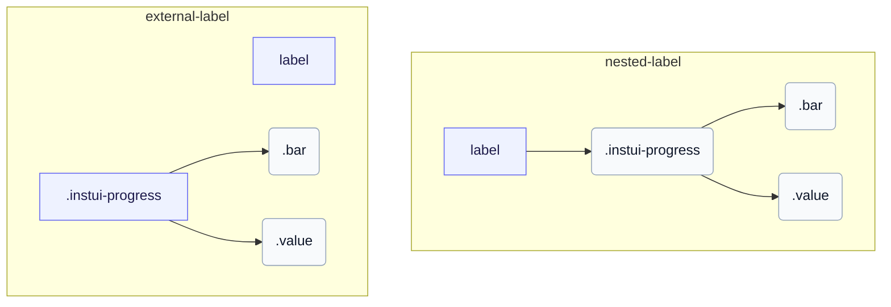

# CSS: progress

`.instui-progress` · <span class="instui-pill -color-success pantoken-doc-tag">stable</span> — شريط تقدم محدد بقيمة مع مقياس ملون، أحجام، وتسميات قيمة اختيارية.

`.value` هو شقيق `.bar`، كلاهما أبناء الجذر — معكوسًا لكيفية تضمين progress-circle لجزء `.value` الخاص به. InstUI ليس له حالة غير محددة؛ `:indeterminate` هو تخمين خاص بـ pantoken (الـ `&lt;progress&gt;` الأصلي بدون سمة `value`), يقوم بتحريك `.bar` كقِطعة منزلقة ويخفي `.value` لأنّه لا يوجد رقم ذي معنى للعرض. `&lt;meter&gt;` ليس له حالة غير محددة، لذا فهو غير متأثر.

**المصدر:** [progress.css](https://github.com/thedannywahl/pantoken/blob/main/formats/components/src/components/progress/progress.css)

## سهولة الوصول

استخدم `&lt;progress&gt;` الأصلي لنطاق إكمال المهمة الذي يبدأ من الصفر و `&lt;meter&gt;` عندما لا يكون الحد الأدنى صفرًا. امنح أيًا من العنصرين اسمًا قابلاً للوصول عن طريق تضمينه في `&lt;label&gt;` أو ربط `&lt;label&gt;` منفصل عبر مطابقة قيم `for` و `id`.

## الاستخدام

```css
@import "@pantoken/components/components.css";
@import "@pantoken/components/progress.css";
```

## أمثلة

### Nested label
```html
<label>
  Uploading Document: <progress class="instui-progress -color-brand" value="70">70%</progress>
</label>
```
### External label
```html
<label for="storage-used">Storage used</label>
<meter id="storage-used" class="instui-progress -color-warning" min="20" value="40" max="60">50%</meter>
```

## الهيكل

`// Variant: nested-label`

```text
label
  .instui-progress
    .bar
    .value
```

`// Variant: external-label`

```text
label
.instui-progress
  .bar
  .value
```



## المعدّلات

| معدّل | الوصف |
| --- | --- |
| `.-color-brand` | لون مقياس العلامة التجارية. |
| `.-color-danger` | لون مقياس الخطر. |
| `.-color-info` | لون المقياس المعلوماتي. |
| `.-color-inverse` | لخلفيات داكنة. |
| `.-color-primary-inverse` | لون المقياس على الداكن (العكسي الأساسي). |
| `.-color-success` | لون مقياس النجاح. |
| `.-color-warning` | لون مقياس التحذير. |
| `.-meter-color-alert` | <span class="instui-pill -color-danger pantoken-doc-tag">مهجور</span> — use `.-color-warning`. |
| `.-meter-color-brand` | <span class="instui-pill -color-danger pantoken-doc-tag">مهجور</span> — use `.-color-brand`. |
| `.-meter-color-danger` | <span class="instui-pill -color-danger pantoken-doc-tag">مهجور</span> — use `.-color-danger`. |
| `.-meter-color-info` | <span class="instui-pill -color-danger pantoken-doc-tag">مهجور</span> — use `.-color-info`. |
| `.-meter-color-success` | <span class="instui-pill -color-danger pantoken-doc-tag">مهجور</span> — use `.-color-success`. |
| `.-meter-color-warning` | <span class="instui-pill -color-danger pantoken-doc-tag">مهجور</span> — use `.-color-warning`. |
| `.-render-value-inside` | يعرض `.value` داخل المسار، بمحاذاة بدايته، بدلًا من جانبه؛ صممه ليكون مقروءًا فوق لون المقياس. |
| `.-should-animate` | <span class="instui-pill pantoken-doc-tag pantoken-doc-tag-interaction">Interaction</span> — Animate meter changes over half a second. |
| `.-size-large` | كبير. تسمية مطوّلة لـ `-size-lg`. |
| `.-size-lg` | كبير. |
| `.-size-md` | متوسط (افتراضي). |
| `.-size-medium` | متوسط (افتراضي). اسم بديل طويل لـ `-size-md`. |
| `.-size-sm` | صغير. |
| `.-size-small` | صغير. تسمية مطوّلة لـ `-size-sm`. |
| `.-size-x-small` | صغير جدًا. اسم بديل طويل لـ `-size-xs`. |
| `.-size-xs` | صغير جدًا. |

## الأجزاء

| جزء | الوصف |
| --- | --- |
| `.bar` | شريط المقياس الممتلئ. |
| `.value` | نص القيمة بجانب الشريط. |

## عناصر زائفة

| عنصر زائف | الوصف |
| --- | --- |
| `:::indeterminate` | مخصص، ليس جزءًا من InstUI. يطبق فقط على `&lt;progress&gt;` الأصلي الذي يفتقد سمة `value`; يقوم بتهيئة `.bar` كقِطعة منزلقة ويخفي `.value`. |
| `::after` | يرسم قاعدة أسفل المسار كطبقة منفصلة فوق المقياس، بحيث تظل الحدود الكاملة والحد السفلي مستقلتين عبر السمات. |

## الحالات

| حالة | الوصف |
| --- | --- |
| `:indeterminate` | — |

## خصائص مخصّصة

| خاصية | نوع | افتراضي | الوصف |
| --- | --- | --- | --- |
| `--max` | `<number>` | — | القيمة القصوى للتقدم (الافتراضية `100`). |
| `--min` | `<number>` | — | قيمة المقياس الدنيا (الافتراضية `0`). |
| `--value` | `<number>` | — | قيمة التقدم الحالية. |
| `--value-max` | `<number>` | — | @alias {@link --max} القيمة القصوى للتقدم (الافتراضية `100`). |
| `--value-now` | `<number>` | — | @alias اسم مرادف لـ `--value`. |

## التحريكات

| تحريك | الوصف |
| --- | --- |
| `pantoken-progress-indeterminate` | — |

## الرموز المستهلكة

| رمز | نوع | قيمة |
| --- | --- | --- |
| `--instui-color-background-brand` | `<color>` | `light-dark(#1D354F, #EEF4FD)` |
| `--instui-color-background-error` | `<color>` | `#E62429` |
| `--instui-color-background-info` | `<color>` | `#2B7ABC` |
| `--instui-color-background-success` | `<color>` | `#03893D` |
| `--instui-color-background-warning` | `<color>` | `#CF4A00` |
| `--instui-component-progress-bar-border-color` | `<color>` | `light-dark(#1D354F, #EEF4FD)` |
| `--instui-component-progress-bar-border-color-inverse` | `<color>` | `light-dark(#ffffff, #6A7883)` |
| `--instui-component-progress-bar-border-radius` | `<length>` | `0.5rem` |
| `--instui-component-progress-bar-font-family` | `[ <font-family-name> \| <generic-font-family> ]#` | `Atkinson Hyperlegible Next, "Helvetica Neue", Helvetica, Arial, sans-serif` |
| `--instui-component-progress-bar-font-weight` | `<integer>` | `400` |
| `--instui-component-progress-bar-large-height` | `<length>` | `2rem` |
| `--instui-component-progress-bar-line-height` | `<percentage>` | `125%` |
| `--instui-component-progress-bar-medium-height` | `<length>` | `1.5rem` |
| `--instui-component-progress-bar-medium-value-font-size` | `<length>` | `1rem` |
| `--instui-component-progress-bar-meter-color-brand-inverse` | `<color>` | `light-dark(#ffffff, #10141A)` |
| `--instui-component-progress-bar-small-height` | `<length>` | `1rem` |
| `--instui-component-progress-bar-text-color` | `<color>` | `light-dark(#576773, #AAB0B5)` |
| `--instui-component-progress-bar-text-color-inverse` | `<color>` | `light-dark(#ffffff, #1C222B)` |
| `--instui-component-progress-bar-track-bottom-border-color` | `<color>` | `#00000000` |
| `--instui-component-progress-bar-track-bottom-border-color-inverse` | `<color>` | `#00000000` |
| `--instui-component-progress-bar-track-bottom-border-width` | `<length>` | `0.0625rem` |
| `--instui-component-progress-bar-track-color` | `<color>` | `#00000000` |
| `--instui-component-progress-bar-track-color-inverse` | `<color>` | `#00000000` |
| `--instui-component-progress-bar-value-padding` | `<length>` | `0.5rem` |
| `--instui-component-progress-bar-x-small-height` | `<length>` | `0.5rem` |

## دعم المتصفّح

- يقصر قواعد جزء المقياس باستخدام توجيه `@scope`; المتصفحات التي لا تدعم `@scope` تتجاهل تلك القواعد المقصورة.

## ذات صلة

- [progress-circle](/ar/api/css/progress-circle.md) — الشكل الدائري لنفس شريط التقدم المحدد.

