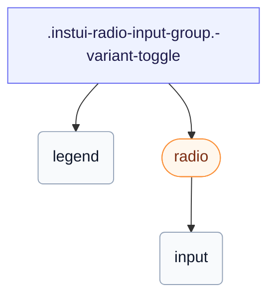

# CSS: radio-input-group

`.instui-radio-input-group` — راديو تحديد واحد `&lt;fieldset&gt;`، عادي أو كبديل مقسم متصل.

يضع `gap` الخاص به بين الراديوهات؛ ربط معدل الخدمة المساعدة للتباعد `-gap-*` يتجاوز تلك القيمة المضمنة.

**المصدر:** [radio-input-group.css](https://github.com/thedannywahl/pantoken/blob/main/formats/components/src/components/radio-input-group/radio-input-group.css)

## Accessibility

يعرض `&lt;fieldset&gt;` أصلي مع `&lt;legend&gt;` يسمي المجموعة؛ تشارك الراديوهات الفرعية واحد `name`، لذلك يمكن تحديد واحد فقط في المرة الواحدة.

## Usage

```css
@import "@pantoken/components/components.css";
@import "@pantoken/components/radio-input-group.css";
```

## Examples

```html
<fieldset class="instui-radio-input-group">
  <legend>T-shirt size</legend>
  <label class="instui-radio"><input type="radio" name="size" checked /> Small</label>
  <label class="instui-radio"><input type="radio" name="size" /> Medium</label>
  <label class="instui-radio"><input type="radio" name="size" /> Large</label>
</fieldset>
```

### Toggle variant

```html
<fieldset class="instui-radio-input-group -variant-toggle">
  <legend>T-shirt size</legend>
  <label class="instui-radio -variant-toggle"
    ><input type="radio" name="size" checked /> Small</label
  >
  <label class="instui-radio -variant-toggle"><input type="radio" name="size" /> Medium</label>
  <label class="instui-radio -variant-toggle"><input type="radio" name="size" /> Large</label>
</fieldset>
```

## Structure

```text
.instui-radio-input-group.-variant-toggle
  legend
  radio (component)
    input
```



## Modifiers

| Modifier           | Description                                                         |
| ------------------ | ------------------------------------------------------------------- |
| `.-layout-columns` | ضع الراديوهات في أعمدة.                                             |
| `.-layout-inline`  | ضع الراديوهات بشكل متسلسل.                                          |
| `.-required`       | وضع علامة على المجموعة كمطلوبة.                                     |
| `.-variant-toggle` | ضع عناصر التبديل الفرعية كعنصر تحكم مقسم (يملأ القطعة المحددة فقط). |

## Pseudo-elements

| Pseudo-element | Description                                                                               |
| -------------- | ----------------------------------------------------------------------------------------- |
| `::after`      | يرسم علامة النجمة الزخرفية للحقل المطلوب بعد نص وسيلة الإيضاح عندما تكون المجموعة مطلوبة. |

## Tokens consumed

| Token                                                 | Type                                               | Value                                                                        |
| ----------------------------------------------------- | -------------------------------------------------- | ---------------------------------------------------------------------------- |
| `--instui-component-form-field-layout-asterisk-color` | `<color>`                                          | `light-dark(#CF1F24, #FA917F)`                                               |
| `--instui-component-form-field-layout-font-family`    | `[ <font-family-name> \| <generic-font-family> ]#` | `Atkinson Hyperlegible Next, "Helvetica Neue", Helvetica, Arial, sans-serif` |
| `--instui-component-form-field-layout-font-size`      | `<length>`                                         | `1rem`                                                                       |
| `--instui-component-form-field-layout-font-weight`    | `<integer>`                                        | `400`                                                                        |
| `--instui-component-form-field-layout-gap-inputs`     | `<length>`                                         | `0.75rem`                                                                    |
| `--instui-component-form-field-layout-gap-primitives` | `<length>`                                         | `0.5rem`                                                                     |
| `--instui-component-form-field-layout-line-height`    | `<length>`                                         | `1.125rem`                                                                   |
| `--instui-component-form-field-layout-text-color`     | `<color>`                                          | `light-dark(#273540, #ffffff)`                                               |
| `--instui-spacing-space-md`                           | `<length>`                                         | `0.75rem`                                                                    |

## Subcomponents

- [radio](/ar/api/css/radio.md)

## Related

- [radio](/ar/api/css/radio.md) — عنصر التحكم الفردي الذي تجمعه هذه المجموعة.
- [form-field-group](/ar/api/css/form-field-group.md) — المغلف العام لتجميع وترتيب الحقول.
