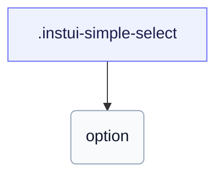

# CSS: simple-select

`.instui-simple-select` — `&lt;select&gt;` أصلي منسق مع علامة قشط، يطابق حالات وأحجام الإدخال النصي.

يلف `&lt;select&gt;` أصلي عادي بدون علامات قائمة/قائمة مخصصة، لذا ينطبق عرض الخيارات الأصلي للمتصفح وسلوك لوحة المفاتيح كما هو؛ إنه يشارك chrome الحقل مع `text-input`.

**المصدر:** [select.css](https://github.com/thedannywahl/pantoken/blob/main/formats/components/src/components/select/select.css)

## Usage

```css
@import "@pantoken/components/components.css";
@import "@pantoken/components/simple-select.css";
```

## Examples

```html
<select class="instui-simple-select">
  <option>Choose a fruit…</option>
  <option>Apple</option>
  <option>Orange</option>
  <option>Pear</option>
</select>
```

## Structure

```text
.instui-simple-select
  option
```



## Modifiers

| Modifier        | Description                                  |
| --------------- | -------------------------------------------- |
| `.-disabled`    | حالة معطلة.                                  |
| `.-invalid`     | حالة غير صحيحة (خطأ).                        |
| `.-readonly`    | حالة القراءة فقط.                            |
| `.-size-large`  | كبير. اسم مستعار طويل الشكل لـ `-size-lg`.   |
| `.-size-lg`     | كبير.                                        |
| `.-size-md`     | (افتراضي) متوسط.                             |
| `.-size-medium` | (افتراضي) متوسط. اسم مستعار طويل `-size-md`. |
| `.-size-sm`     | صغير.                                        |
| `.-size-small`  | صغير. اسم مستعار طويل الشكل لـ `-size-sm`.   |
| `.-success`     | حالة النجاح (صحيحة).                         |

## Pseudo-elements

| Pseudo-element  | Description                                             |
| --------------- | ------------------------------------------------------- |
| `::placeholder` | نص العنصر النائب، باللون الكتوم الذي يتحول عند التمرير. |

## States

| State       | Description |
| ----------- | ----------- |
| `:disabled` | —           |

## Tokens consumed

| Token                                                     | Type                                               | Value                                                                        |
| --------------------------------------------------------- | -------------------------------------------------- | ---------------------------------------------------------------------------- |
| `--instui-component-text-input-background-color`          | `<color>`                                          | `light-dark(#ffffff, #171B21)`                                               |
| `--instui-component-text-input-background-disabled-color` | `<color>`                                          | `light-dark(#E8EAEC, #334450)`                                               |
| `--instui-component-text-input-background-hover-color`    | `<color>`                                          | `light-dark(#ffffff, #171B21)`                                               |
| `--instui-component-text-input-background-readonly-color` | `<color>`                                          | `light-dark(#C7CACD, #6A7883)`                                               |
| `--instui-component-text-input-border-color`              | `<color>`                                          | `light-dark(#7E8792, #5F6E7A)`                                               |
| `--instui-component-text-input-border-disabled-color`     | `<color>`                                          | `light-dark(#C7CACD, #4A5B68)`                                               |
| `--instui-component-text-input-border-hover-color`        | `<color>`                                          | `light-dark(#334450, #7E8792)`                                               |
| `--instui-component-text-input-border-radius`             | `<length>`                                         | `0.75rem`                                                                    |
| `--instui-component-text-input-border-readonly-color`     | `<color>`                                          | `#8D959F`                                                                    |
| `--instui-component-text-input-border-width`              | `<length>`                                         | `0.0625rem`                                                                  |
| `--instui-component-text-input-error-border-color`        | `<color>`                                          | `light-dark(#CF1F24, #F56050)`                                               |
| `--instui-component-text-input-font-family`               | `[ <font-family-name> \| <generic-font-family> ]#` | `Atkinson Hyperlegible Next, "Helvetica Neue", Helvetica, Arial, sans-serif` |
| `--instui-component-text-input-font-size-lg`              | `<length>`                                         | `1.25rem`                                                                    |
| `--instui-component-text-input-font-size-md`              | `<length>`                                         | `1rem`                                                                       |
| `--instui-component-text-input-font-size-sm`              | `<length>`                                         | `0.875rem`                                                                   |
| `--instui-component-text-input-font-weight`               | `<integer>`                                        | `500`                                                                        |
| `--instui-component-text-input-height-lg`                 | `<length>`                                         | `3rem`                                                                       |
| `--instui-component-text-input-height-md`                 | `<length>`                                         | `2.5rem`                                                                     |
| `--instui-component-text-input-height-sm`                 | `<length>`                                         | `2rem`                                                                       |
| `--instui-component-text-input-padding-horizontal-lg`     | `<length>`                                         | `0.75rem`                                                                    |
| `--instui-component-text-input-padding-horizontal-md`     | `<length>`                                         | `0.75rem`                                                                    |
| `--instui-component-text-input-padding-horizontal-sm`     | `<length>`                                         | `0.5rem`                                                                     |
| `--instui-component-text-input-placeholder-color`         | `<color>`                                          | `light-dark(#5F6E7A, #7E8792)`                                               |
| `--instui-component-text-input-placeholder-hover-color`   | `<color>`                                          | `light-dark(#334450, #9EA6AD)`                                               |
| `--instui-component-text-input-success-border-color`      | `<color>`                                          | `light-dark(#037D37, #3EA75B)`                                               |
| `--instui-component-text-input-text-color`                | `<color>`                                          | `light-dark(#273540, #ffffff)`                                               |
| `--instui-component-text-input-text-disabled-color`       | `<color>`                                          | `light-dark(#8D959F, #9EA6AD)`                                               |
| `--instui-component-text-input-text-readonly-color`       | `<color>`                                          | `light-dark(#273540, #ffffff)`                                               |
| `--instui-focus-outline-color-danger`                     | `auto \| <color>`                                  | —                                                                            |
| `--instui-focus-outline-color-success`                    | `auto \| <color>`                                  | —                                                                            |

## Related

- [text-input](/ar/api/css/text-input.md) — يشارك نفس chrome الحقل والحالات والأحجام.
- [menu](/ar/api/css/menu.md) — سطح القائمة المنسدلة الذي تعيد استخدامه قائمة أغنى.
