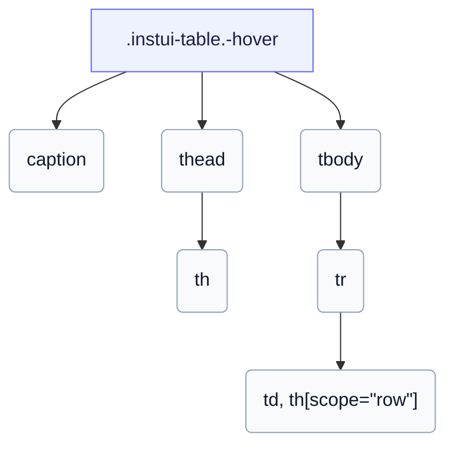

# CSS: table

`.instui-table` — جدول بيانات مُنسَّق لِـ `th` و `td` بالإضافة إلى عنوان اختياري، مع تأثير تحويم، وتخطيط ثابت، وتخطيط بطاقات مكدسة.

لِـ `-layout-stacked`، لا يمكن لـ CSS النقية سحب نص كل رأس عمود إلى خليةه، لذا أعطِ كل خلية `data-label` وتعرض البطاقة المكدسة ذلك عبر `::before`. انظر إلى أعضاء `table.head`، `table.body`، `table.row`، `table.cell`، `table.col-header`، و `table.row-header` للأجزاء الفردية.

**المصدر:** [body.css](https://github.com/thedannywahl/pantoken/blob/main/formats/components/src/components/table/members/body/body.css)

## سهولة الوصول

وسم الجدول بـ `&lt;caption&gt;`، وعَلِّم رؤوس الأعمدة بـ `<th scope="col">` ورؤوس الصفوف بـ `<th scope="row">`، وفي `-layout-stacked` اعطِ كل خلية `data-label` لأن صف الرأس مخفي بصريًا.

## الاستخدام

```css
@import "@pantoken/components/components.css";
@import "@pantoken/components/table.css";
```

## أمثلة

```html
<table class="instui-table -hover">
  <caption>Top-rated films</caption>
  <thead>
    <tr>
      <th scope="col">Rank</th>
      <th scope="col">Title</th>
      <th scope="col">Year</th>
      <th scope="col">Rating</th>
    </tr>
  </thead>
  <tbody>
    <tr>
      <th scope="row">1</th>
      <td>The Shawshank Redemption</td>
      <td>1994</td>
      <td>9.3</td>
    </tr>
    <tr>
      <th scope="row">2</th>
      <td>The Godfather</td>
      <td>1972</td>
      <td>9.2</td>
    </tr>
    <tr>
      <th scope="row">3</th>
      <td>The Godfather: Part II</td>
      <td>1974</td>
      <td>9.0</td>
    </tr>
  </tbody>
</table>
```

## الهيكل

```text
.instui-table.-hover
  caption
  thead
    th
  tbody
    tr
      td, th[scope="row"]
```



## المعدّلات

| معدّل | الوصف |
| --- | --- |
| `.-hover` | تمييز الصفوف عند التحويم. @affects table.row — يحجز ويلَوِّن حد التحويم للصف. |
| `.-layout-fixed` | تخطيط جدول ثابت (أعمدة بعرض متساوٍ). |
| `.-layout-stacked` | كدس كل صف كبطاقة، عبر `data-label` لكل خلية. @affects table.head @affects table.body @affects table.row @affects table.cell @affects table.col-header @affects table.row-header — يكدس كل جزء ككتلة ويخفي/يعلِّم رأس العمود وفقًا لذلك. |

## الأجزاء

| جزء | الوصف |
| --- | --- |
| `.caption` | تسمية جدول اختيارية. |

## الرموز المستهلكة

| رمز | نوع | قيمة |
| --- | --- | --- |
| `--instui-component-table-background` | `<color>` | `light-dark(#ffffff, #10141A)` |
| `--instui-component-table-cell-padding-horizontal` | `<length>` | `0.75rem` |
| `--instui-component-table-cell-padding-vertical` | `<length>` | `0.5rem` |
| `--instui-component-table-col-header-color` | `<color>` | `light-dark(#273540, #F2F4F5)` |
| `--instui-component-table-color` | `<color>` | `light-dark(#273540, #ffffff)` |
| `--instui-component-table-font-family` | `[ <font-family-name> \| <generic-font-family> ]#` | `Atkinson Hyperlegible Next, "Helvetica Neue", Helvetica, Arial, sans-serif` |
| `--instui-component-table-font-size` | `<length>` | `1rem` |
| `--instui-component-table-head-font-weight` | `<integer>` | `600` |

## مكونات فرعية

- [table.body](/ar/api/css/table.body.md)
- [table.cell](/ar/api/css/table.cell.md)
- [table.col-header](/ar/api/css/table.col-header.md)
- [table.head](/ar/api/css/table.head.md)
- [table.row](/ar/api/css/table.row.md)
- [table.row-header](/ar/api/css/table.row-header.md)

