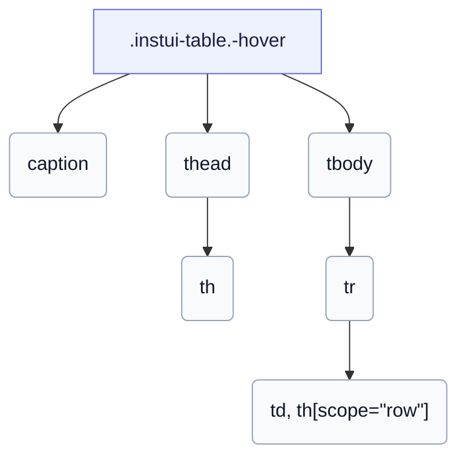

# CSS: table

`.instui-table` — جدول بيانات مصمم لـ `th` و `td` بالإضافة إلى تسمية اختيارية، مع تخطيطات حول التمرير والثابتة والبطاقة المكدسة.

بالنسبة لـ `-layout-stacked`، لا يمكن لـ CSS البحت سحب نص رأس كل عمود إلى خليته، لذا أعطِ كل خلية `data-label` وتظهر البطاقة المكدسة عبر `::before`. انظر إلى أعضاء `table.head` و `table.body` و `table.row` و `table.cell` و `table.col-header` و `table.row-header` للأجزاء الفردية.

**المصدر:** [body.css](https://github.com/thedannywahl/pantoken/blob/main/formats/components/src/components/table/members/body/body.css)

## Accessibility

سمّ الجدول بـ `&lt;caption&gt;`، وضع علامة على رؤوس الأعمدة `<th scope="col">` ورؤوس الصفوف `<th scope="row">`، وفي `-layout-stacked` أعطِ كل خلية `data-label` لأن صف الرأس مخفي بصريًا.

## Usage

```css
@import "@pantoken/components/components.css";
@import "@pantoken/components/table.css";
```

## Examples

```html
<table class="instui-table -hover">
  <caption>
    Top-rated films
  </caption>
  <thead>
    <tr>
      <th scope="col">Rank</th>
      <th scope="col">Title</th>
      <th scope="col">Year</th>
      <th scope="col">Rating</th>
    </tr>
  </thead>
  <tbody>
    <tr>
      <th scope="row">1</th>
      <td>The Shawshank Redemption</td>
      <td>1994</td>
      <td>9.3</td>
    </tr>
    <tr>
      <th scope="row">2</th>
      <td>The Godfather</td>
      <td>1972</td>
      <td>9.2</td>
    </tr>
    <tr>
      <th scope="row">3</th>
      <td>The Godfather: Part II</td>
      <td>1974</td>
      <td>9.0</td>
    </tr>
  </tbody>
</table>
```

## Structure

```text
.instui-table.-hover
  caption
  thead
    th
  tbody
    tr
      td, th[scope="row"]
```



## Modifiers

| Modifier           | Description                                                                                                                                                                                                                                     |
| ------------------ | ----------------------------------------------------------------------------------------------------------------------------------------------------------------------------------------------------------------------------------------------- |
| `.-hover`          | قم بتمييز الصفوف عند التمرير. @affects table.row — احجز وألوّن حد التمرير للصف.                                                                                                                                                                 |
| `.-layout-fixed`   | تخطيط جدول ثابت (أعمدة بعرض متساوٍ).                                                                                                                                                                                                            |
| `.-layout-stacked` | قم بتكديس كل صف كبطاقة، عبر `data-label` لكل خلية. @affects table.head @affects table.body @affects table.row @affects table.cell @affects table.col-header @affects table.row-header — يقوم بتكديس كل جزء كتجمع ويخفي / يسمي الرأس وفقًا لذلك. |

## Parts

| Part       | Description          |
| ---------- | -------------------- |
| `.caption` | تسمية جدول اختيارية. |

## Tokens consumed

| Token                                              | Type                                               | Value                                                                        |
| -------------------------------------------------- | -------------------------------------------------- | ---------------------------------------------------------------------------- |
| `--instui-component-table-background`              | `<color>`                                          | `light-dark(#ffffff, #10141A)`                                               |
| `--instui-component-table-cell-padding-horizontal` | `<length>`                                         | `0.75rem`                                                                    |
| `--instui-component-table-cell-padding-vertical`   | `<length>`                                         | `0.5rem`                                                                     |
| `--instui-component-table-col-header-color`        | `<color>`                                          | `light-dark(#273540, #F2F4F5)`                                               |
| `--instui-component-table-color`                   | `<color>`                                          | `light-dark(#273540, #ffffff)`                                               |
| `--instui-component-table-font-family`             | `[ <font-family-name> \| <generic-font-family> ]#` | `Atkinson Hyperlegible Next, "Helvetica Neue", Helvetica, Arial, sans-serif` |
| `--instui-component-table-font-size`               | `<length>`                                         | `1rem`                                                                       |
| `--instui-component-table-head-font-weight`        | `<integer>`                                        | `600`                                                                        |

## Subcomponents

- [table.body](/ar/api/css/table.body.md)
- [table.cell](/ar/api/css/table.cell.md)
- [table.col-header](/ar/api/css/table.col-header.md)
- [table.head](/ar/api/css/table.head.md)
- [table.row](/ar/api/css/table.row.md)
- [table.row-header](/ar/api/css/table.row-header.md)
