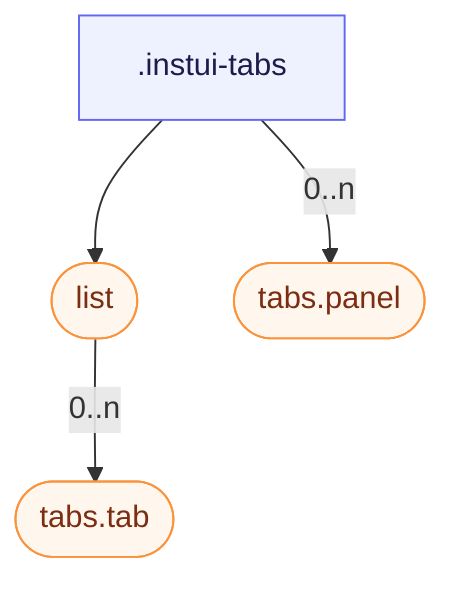

# CSS: tabs

`.instui-tabs` — مجموعة لوحات بعلامات تبويب: قائمة علامات تبويب، علامات قابلة للاختيار، ولوحاتها.

انظر إلى الأعضاء `tabs.tab` و `tabs.panel` لأزرار علامات التبويب الفردية ولوحات المحتوى الخاصة بها.

**المصدر:** [panel.css](https://github.com/thedannywahl/pantoken/blob/main/formats/components/src/components/tabs/members/panel/panel.css)

## سهولة الوصول

اربط قائمة علامات التبويب بالـ role="tablist"، وكل علامة تبويب بالـ role="tab" و aria-selected، وكل لوحة بالـ role="tabpanel".

## الاستخدام

```css
@import "@pantoken/components/components.css";
@import "@pantoken/components/tabs.css";
```

## أمثلة

```html
<div class="instui-tabs">
  <div class="list" role="tablist" aria-label="Default tabs">
    <button class="tab -selected" role="tab" aria-selected="true">Overview</button>
    <button class="tab" role="tab" aria-selected="false">Details</button>
    <button class="tab -disabled" role="tab" aria-disabled="true" disabled>Disabled</button>
    <button class="tab" role="tab" aria-selected="false">History</button>
  </div>
  <div class="panel" role="tabpanel">The Overview tab's content shows here.</div>
</div>
```

## الهيكل

```text
.instui-tabs
  list (component)
    tabs.tab (component, 0..n)
  tabs.panel (component, 0..n)
```



## المعدّلات

| معدّل | الوصف |
| --- | --- |
| `.-overflow-scroll` | حافظ على قائمة علامات التبويب في سطر واحد ودعها تنزلق أفقياً بدلاً من الالتفاف، مع إخفاء شريط التمرير. |
| `.-variant-secondary` | علامات تبويب "مجلد" مستديرة مع علامة مختارة تتصل بصرياً باللوحة أدناه. @affects tabs.tab — يعيد تنسيق أزرار علامات التبويب لتبدو بمظهر "مجلد" مستدير. |

## الأجزاء

| جزء | الوصف |
| --- | --- |
| `.list` | صف علامات التبويب. |

## الرموز المستهلكة

| رمز | نوع | قيمة |
| --- | --- | --- |
| `--instui-component-tabs-default-background` | `<color>` | `#00000000` |

## مكونات فرعية

- [list](/ar/api/css/list.md)
- [tabs.panel](/ar/api/css/tabs.panel.md)
- [tabs.tab](/ar/api/css/tabs.tab.md)

