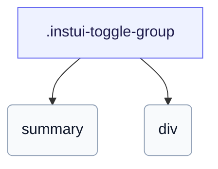

# CSS: toggle-group

`.instui-toggle-group` — عنصر إفصاح محدد بحافة مبني على `&lt;details&gt;`: صف ملخص بشيفرون ومحتوى قابل للطي.

مبني على نفس أساس `&lt;details&gt;` الأصلي مثل toggle-details؛ ضع `&lt;summary&gt;` أولًا ليصبح صف العنوان القابل للنقر وبقية المحتوى قابلة للطي.

**المصدر:** [toggle-group.css](https://github.com/thedannywahl/pantoken/blob/main/formats/components/src/components/toggle-group/toggle-group.css)

## الاستخدام

```css
@import "@pantoken/components/components.css";
@import "@pantoken/components/toggle-group.css";
```

## أمثلة

```html
<details class="instui-toggle-group" open>
  <summary>Advanced settings</summary>
  <div>These options are revealed when the group is expanded. The header row carries a chevron that rotates on open, and the content sits below a divider.</div>
</details>
```

## الهيكل

```text
.instui-toggle-group
  summary
  div
```



## المعدّلات

| معدّل | الوصف |
| --- | --- |
| `.-size-large` | كبير. الاسم الطويل لـ `-size-lg`. |
| `.-size-lg` | كبير. |
| `.-size-sm` | صغير. |
| `.-size-small` | صغير. الاسم الطويل لـ `-size-sm`. |
| `.-without-border` | إزالة الحدود. |

## عناصر زائفة

| عنصر زائف | الوصف |
| --- | --- |
| `::before` | يرسم شيفرون الإفصاح في صف الملخص — رمز مقنع يدور ليشير للأسفل عندما تكون المجموعة مفتوحة. |

## الحالات

| حالة | الوصف |
| --- | --- |
| `:state(open)` | — |

## الرموز المستهلكة

| رمز | نوع | قيمة |
| --- | --- | --- |
| `--instui-border-radius-md` | `<length>` | `0.5rem` |
| `--instui-border-width-sm` | `<length>` | `0.0625rem` |
| `--instui-color-background-elevated-surface-base` | `<color>` | `light-dark(#ffffff, #171B21)` |
| `--instui-component-toggle-details-content-padding-large` | `<length>` | `1.375rem` |
| `--instui-component-toggle-details-content-padding-medium` | `<length>` | `1.125rem` |
| `--instui-component-toggle-details-content-padding-small` | `<length>` | `1.125rem` |
| `--instui-component-toggle-details-font-family` | `[ <font-family-name> \| <generic-font-family> ]#` | `Atkinson Hyperlegible Next, "Helvetica Neue", Helvetica, Arial, sans-serif` |
| `--instui-component-toggle-details-font-size-large` | `<length>` | `1.25rem` |
| `--instui-component-toggle-details-font-size-medium` | `<length>` | `1rem` |
| `--instui-component-toggle-details-font-size-small` | `<length>` | `0.875rem` |
| `--instui-component-toggle-details-font-weight` | `<integer>` | `400` |
| `--instui-component-toggle-details-icon-margin` | `<length>` | `0.375rem` |
| `--instui-component-toggle-details-line-height` | `<percentage>` | `150%` |
| `--instui-component-toggle-details-text-color` | `<color>` | `light-dark(#273540, #ffffff)` |
| `--instui-component-toggle-group-border-color` | `<color>` | `light-dark(#8D959F, #6A7883)` |
| `--instui-icon-chevron-right` | `<image>` | `url('data:image/svg+xml;utf8,%3Csvg%20xmlns%3D%22http%3A%2F%2Fwww.w3.org%2F2000%2Fsvg%22%20width%3D%2224%22%20height%3D%2224%22%20viewBox%3D%220%200%2024%2024%22%20fill%3D%22none%22%20stroke%3D%22currentColor%22%20stroke-width%3D%222%22%20stroke-linecap%3D%22round%22%20stroke-linejoin%3D%22round%22%3E%3Cpath%20d%3D%22m9%2018%206-6-6-6%22%2F%3E%3C%2Fsvg%3E')` |

## ذات صلة

- [toggle-details](/ar/api/css/toggle-details.md) — الصيغة المفردة غير المحاطة لنفس عنصر الإفصاح.

