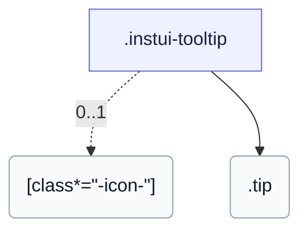

# CSS: tooltip

`.instui-tooltip` — فقاعة تلميح أدوات CSS تظهر عند التحويم والتركيز، قابلة للموضع على أي جهة.

التبديل هو CSS بحت (`:hover`/`:focus-within`), لذا تصل الفقاعة لمستخدمي لوحة المفاتيح فقط عبر مشغّل قابل للتركيز؛ وعلى عكس `popover`، فهي لا تُغلق بنقرة ولا تُفعل بالنقر.

**المصدر:** [tooltip.css](https://github.com/thedannywahl/pantoken/blob/main/formats/components/src/components/tooltip/tooltip.css)

<!-- js-requirement -->
> [!TIP]
> **تحسين JS** — يُقدِّم CSS الخاص بهذا المكوّن العرض والوظيفة بمفرده؛ اقترنه بـ `@pantoken/interactions` لإضافة السلوك التفاعلي. راجع [جدول المعدِّلات أدناه](#modifiers).


## سهولة الوصول

وجِّه المشغّل نحو الفقاعة باستخدام aria-describedby وأعطِ الفقاعة role="tooltip".

## الاستخدام

```css
@import "@pantoken/components/components.css";
@import "@pantoken/components/tooltip.css";
```

## أمثلة

```html
<span class="instui-tooltip" aria-describedby="tt-1">
  <span class="instui-icon -icon-info"></span>
  <span class="tip" id="tt-1" role="tooltip">Default placement is top</span>
</span>
```

## الهيكل

```text
.instui-tooltip
  [class*="-icon-"] (0..1)
  .tip
```



## المعدّلات

| معدّل | الوصف |
| --- | --- |
| `.-icon-*` | اعرض رمز غليف المشغّل بجانب فقاعة التلميح. |

## الأجزاء

| جزء | الوصف |
| --- | --- |
| `.tip` | الفقاعة؛ `-placement-*` يحدّد جهتها. |

## الرموز المستهلكة

| رمز | نوع | قيمة |
| --- | --- | --- |
| `--instui-border-radius-sm` | `<length>` | `0.25rem` |
| `--instui-color-background-inverse` | `<color>` | `light-dark(#334450, #F2F4F5)` |
| `--instui-color-text-inverse` | `<color>` | `light-dark(#ffffff, #1C222B)` |
| `--instui-component-tooltip-font-family` | `[ <font-family-name> \| <generic-font-family> ]#` | `Atkinson Hyperlegible Next, "Helvetica Neue", Helvetica, Arial, sans-serif` |
| `--instui-component-tooltip-font-size` | `<length>` | `0.875rem` |
| `--instui-component-tooltip-font-weight` | `<integer>` | `400` |
| `--instui-component-tooltip-padding` | `<length>` | `0.75rem` |
| `--instui-spacing-space-xs` | `<length>` | `0.25rem` |

## ذات صلة

- [popover](/ar/api/css/popover.md) — السطح المرتكز الأكبر والمفعل بالنقر.
- [context-view](/ar/api/css/context-view.md) — سطح مرتبط مرتكز له مؤشر.

