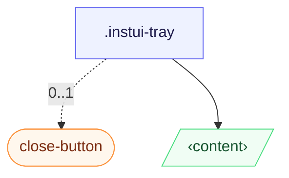

# CSS: tray

`.instui-tray` — لوحة مثبتة على الحافة تنزلق من أي جانب؛ `[popover]` أو `&lt;dialog&gt;` أصلي.

يُحل موضع البداية/النهاية بالنسبة إلى `inset-inline` (منطقي، واعٍ للاتجاه)؛ تحويل الانزلاق يعكس تلقائيًا تحت سلف `[dir="rtl"]`، لذا لا حاجة إلى تعليمات إضافية لتخطيط من اليمين إلى اليسار.

**المصدر:** [tray.css](https://github.com/thedannywahl/pantoken/blob/main/formats/components/src/components/tray/tray.css)

## سهولة الوصول

الصينية هي سطح حوار أو منبثق، فسميها `aria-label` أو `aria-labelledby`، وزر الإغلاق يحمل `aria-label` (في المثال `.instui-close-button` يستخدم `aria-label="Close"`).

## الاستخدام

```css
@import "@pantoken/components/components.css";
@import "@pantoken/components/tray.css";
```

## أمثلة

```html
<div class="instui-tray -placement-end -size-sm">
  <span class="instui-heading -level-h3">Filters</span>
  <p class="-size-sm">A tray slides in from the start edge and fills the viewport height.</p>
</div>
<button class="instui-button -toggle">toggle tray</button>
```

## الهيكل

```text
.instui-tray
  close-button (component, 0..1)
  ‹content›
```



## المعدّلات

| معدّل | الوصف |
| --- | --- |
| `.-placement-bottom` | ثبتها على الحافة السفلية. |
| `.-placement-end` | ثبتها على الحافة النهائية (inline-end). |
| `.-placement-start` | (الافتراضي) ثبتها على الحافة البادئة (inline-start). |
| `.-placement-top` | ثبتها على الحافة العلوية. |
| `.-size-large` | كبير. تسمية مطوّلة لـ `-size-lg`. |
| `.-size-lg` | كبير. |
| `.-size-md` | (الافتراضي) متوسط. |
| `.-size-medium` | (الافتراضي) متوسط. اسم بديل طويل لـ `-size-md`. |
| `.-size-regular` | <span class="instui-pill -color-danger pantoken-doc-tag">مهجور</span> — use `.-size-md`. |
| `.-size-sm` | صغير. |
| `.-size-small` | صغير. تسمية مطوّلة لـ `-size-sm`. |
| `.-size-x-large` | كبير جدًا. اسم بديل طويل لـ `-size-xl`. |
| `.-size-x-small` | صغير جدًا. اسم بديل طويل لـ `-size-xs`. |
| `.-size-xl` | كبير جدًا. |
| `.-size-xs` | صغير جدًا. |

## الشروط

| نوع | استعلام | الوصف |
| --- | --- | --- |
| supports | `(transition-behavior: allow-discrete)` | — |

## الرموز المستهلكة

| رمز | نوع | قيمة |
| --- | --- | --- |
| `--instui-component-tray-background-color` | `<color>` | `light-dark(#ffffff, #1C222B)` |
| `--instui-component-tray-border-color` | `<color>` | `light-dark(#E8EAEC, #334450)` |
| `--instui-component-tray-border-width` | `<length>` | `0.0625rem` |
| `--instui-component-tray-padding` | `<length>` | `1.5rem` |
| `--instui-component-tray-width-lg` | `<length>` | `48em` |
| `--instui-component-tray-width-md` | `<length>` | `30em` |
| `--instui-component-tray-width-sm` | `<length>` | `20em` |
| `--instui-component-tray-width-xl` | `<length>` | `62em` |
| `--instui-component-tray-width-xs` | `<length>` | `16em` |
| `--instui-component-tray-z-index` | `<integer>` | `9999` |
| `--instui-elevation-topmost` | `none \| <shadow>#` | — |
| `--tray-slide-x` | — | `-100%` |
| `--tray-slide-y` | — | `0%` |

## دعم المتصفّح

- يفتح بواجهة `[popover]` الأصلية و`@starting-style`؛ الانزلاق يجلس خلف حارس `@supports (transition-behavior: allow-discrete)`، لذا المتصفحات التي لا تدعمه تفتح الصينية مع ذلك، لكن بدون الانزلاق.

## مكونات فرعية

- [close-button](/ar/api/css/close-button.md)

## ذات صلة

- [modal](/ar/api/css/modal.md) — نفس نمط التراكب القابل للإلغاء، موضوع في الوسط بدل التثبيت على الحافة.
- [popover](/ar/api/css/popover.md) — السطح العام العلوي الذي يبنى عليه هذا.

