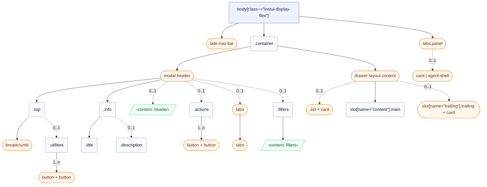

# CSS: wrapper

`body[class~="instui-display-flex"]` — صف غلاف التطبيق: شريط تنقل جانبي، حاوية مع ترويسة، ولوحة اختيارية.

✅ استخدم Wrapper عندما:

- تبني صفحة منتج Canvas كاملة تحتاج إلى غلاف تخطيط متسق
- تستخدم الصفحة GlobalNav كنقطة التنقل الأساسية
- تحتاج الصفحة إلى لوحات جانبية: ContentTabList أو TrailingContentArea أو UtilityPanel
- تحتاج إلى تباعد حاوية ثابت وعرض محتوى أقصى متسق عبر الصفحة بأكملها
🚫 لا تستخدم Wrapper عندما:

- تبني Modal أو Tray أو Drawer — فكلٍ منها له حاويات تخطيط خاصة به
- تغلف جزءًا فرعيًا من الصفحة — Wrapper يحتوي الصفحة كاملة، ليس منطقة جزئية

## سهولة الوصول

- عين منطقة المحتوى الرئيسية كمعلم &lt;main&gt; مع رابط تخطي (skip-nav) ليمرّ مستخدمو لوحة المفاتيح فوق GlobalNav
- أعطِ ContentTabList role="navigation" مع aria-label مميز مثل "Page navigation" — منفصل عن معلم GlobalNav
- أعطِ TrailingContentArea role="complementary" مع aria-label وصفي يعكس محتواه، مثل "تفاصيل الطالب"
- أعطِ كل UtilityPanel aria-label مميزًا: "AI assistant"، "Notifications"، أو "Filters"
- عند فتح UtilityPanel، انقل التركيز إلى اللوحة؛ وعند إغلاقها، أعد التركيز إلى المشغل الذي فتحها

## الاستخدام

```css
@import "@pantoken/plugin-layouts/layouts.css";
```

## الهيكل

```text
body[class~="instui-display-flex"]
  side-nav-bar (component)
  .container
    modal.header (component)
      .top
        breadcrumb (component)
        .utilities (0..1)
          button + button (component, 1..n)
      .info
        .title
        .description (0..1)
      ‹content: header› (0..1)
      .actions (0..1)
        button + button (component, 1..n)
      tabs (component, 0..1)
        tabs (component)
      .filters (0..1)
        ‹content: filters›
    drawer-layout.content (component)
      list + card (component, 0..1)
      slot[name="content"].main
      slot[name="trailing"].trailing + card (component, 0..1)
  tabs.panel (component)
    card | agent-shell (component, 0..1)
```



## فتحات

| فتحة | الوصف |
| --- | --- |
| `content` | محتوى الصفحة الأساسي. |
| `filters` | محتوى عوامل التصفية الاختياري داخل الترويسة. |
| `header` | مكان ترويسة اختياري أسفل وصف الصفحة. |
| `panel` | محتوى لوحة الأدوات. |
| `trailing` | المحتوى التكميلي المتأخر. |

## الأجزاء

| جزء | الوصف |
| --- | --- |
| `.actions` | أزرار الترويسة الاختيارية في نهاية الصف العلوي. |
| `.container` | عمود الصفحة الرئيسي الذي يحتوي الترويسة والمحتوى. |
| `.content` | منطقة المحتوى الأساسية داخل عمود الحاوية. |
| `.description` | وصف الصفحة الاختياري أسفل العنوان. |
| `.filters` | منطقة عوامل التصفية الاختيارية داخل الترويسة. |
| `.header` | منطقة الترويسة داخل عمود الحاوية. |
| `.info` | حاوية لعنوان الصفحة والوصف الاختياري. |
| `.list` | عمود تنقل اختياري داخل المحتوى. |
| `.main` | عمود المحتوى الرئيسي داخل المحتوى. |
| `.panel` | منطقة لوحة الأدوات التي تفتح على الجانب الأيمن من الصفحة. |
| `.tabs` | علامات تبويب تنقل اختيارية في بداية صف المحتوى. |
| `.title` | عنوان الصفحة أسفل الصف العلوي. |
| `.top` | صف شبكة يحتوي على مسارات التنقل (breadcrumbs) والأدوات المساعدة. |
| `.trailing` | عمود تكميلي اختياري داخل المحتوى. |
| `.utilities` | إجراءات الأدوات في نهاية الصف العلوي. |

## الحالات

| حالة | الوصف |
| --- | --- |
| `:optional` | — |

## الرموز المستهلكة

| رمز | نوع | قيمة |
| --- | --- | --- |
| `--instui-background-color-page` | — | — |

## مكونات فرعية

- [agent-shell](/ar/api/css/agent-shell.md)
- [breadcrumb](/ar/api/css/breadcrumb.md)
- [button](/ar/api/css/button.md)
- [card](/ar/api/css/card.md)
- [drawer-layout.content](/ar/api/css/drawer-layout.content.md)
- [list](/ar/api/css/list.md)
- [modal.header](/ar/api/css/modal.header.md)
- [side-nav-bar](/ar/api/css/side-nav-bar.md)
- [tabs](/ar/api/css/tabs.md)
- [tabs.panel](/ar/api/css/tabs.panel.md)

## ذات صلة

- [card](/ar/api/css/card.md)
- [agent-shell](/ar/api/css/agent-shell.md)
- [breadcrumb](/ar/api/css/breadcrumb.md)
- [tabs](/ar/api/css/tabs.md)
- [button](/ar/api/css/button.md)
- [heading](/ar/api/css/heading.md)

