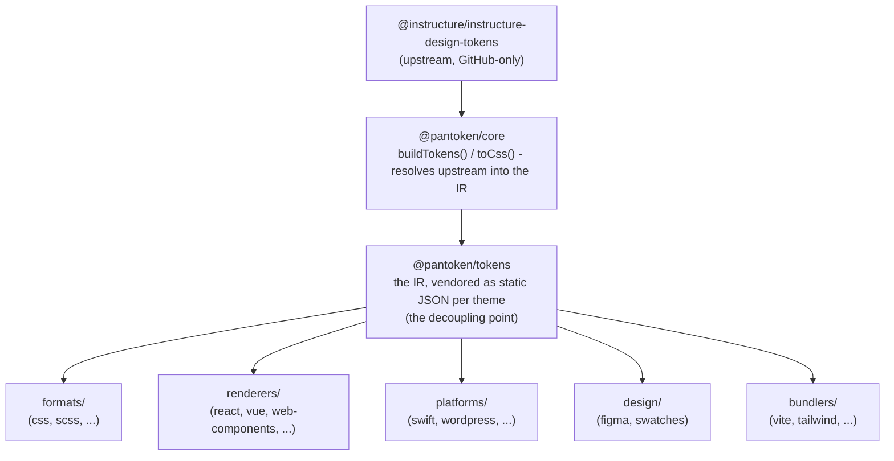

# البنية المعمارية

pantoken لها مهمة واحدة: حل رموز التصميم (design tokens) والأيقونات الخاصة بـ Instructure مرة واحدة، ثم إعادة تشكيل ذلك النموذج لكل هدف. الطبقات أدناه تحافظ على نزاهة عملية إعادة التشكيل وتضمن أن الحزم المنشورة خالية من أي تبعيات خاصة بـ GitHub.

## الطبقات

- **`@pantoken/model`** يحتوي على عقود الأنواع، ولا شيء غيرها. هو مصدر الحقيقة لشكل `Token` وعقدة الإضافة (plugin)، بدون أي تبعيات، بحيث يمكن لأي حزمة الاعتماد عليه بحرية.
- **`@pantoken/core`** هي الحزمة الوحيدة التي تتعامل مع المصدر الصاعد upstream. تقوم بحل الرموز والأيقونات إلى IR القانوني canonical IR وتولد CSS.
- **`@pantoken/tokens`** توفر ذلك الـ IR كـ JSON ثابت في وقت البناء. هذه هي نقطة فصل الارتباط: الحزم المتتابعة تقرأ `@pantoken/tokens`، لا `@pantoken/core`، لذا `npm i pantoken` لا تصل أبداً إلى المصدر الصاعد الخاص بـ GitHub.
- **`@pantoken/utils`** تحمل المساعدات المشتركة — محلل `var(--x)`، تعابير المنتظم للمرجع، تحويل الحالة والألوان، وفحوصات الإنحراف (drift) التي تحافظ على إخراج المولد مطابقاً للـ IR.

## لماذا تُوزّن الرموز

حزمة الرموز الصاعدة upstream مستضافة على GitHub، وليست على npm. لو اعتمدت كل الحزم المتتابعة عليها، فـ `npm i pantoken` سيفشل لأي شخص بدون تلك الصلاحية. بدلاً من ذلك `@pantoken/tokens` تحل المصدر الصاعد مرة واحدة في وقت البناء وتكتب النتيجة إلى JSON ثابت. الحزم المنشورة تحمل ذلك الـ JSON، لذا تُثبَّت بسهولة من npm، تُقفل على semver، وتعمل دون اتصال.

## الدلاء (Buckets)

كل دلاء متتابعة هي وسيلة لاستهلاك الـ IR:

- **formats/** — تحويل الرموز إلى ملف (CSS، SCSS، Less، Stylus، DTCG).
- **renderers/** — تكاملات الإطار والأدوات (React، Vue، Svelte، MUI، Pendo، والمزيد).
- **bundlers/** — ملحقات وإعدادات أدوات البناء (Vite، Next، Tailwind، Panda، PostCSS، webpack).
- **platforms/** — أهداف أصلية ومنشئي مواقع (Swift، Kotlin، Rust، WordPress، Drupal).
- **design/** — حمولات لأدوات التصميم (Figma، عينات الألوان).
- **plugins/** — تحويلات اختيارية توسع مخرجات الرموز أو CSS. انظر [الإضافات](/guide/plugins).

## الإخراج المولد

كل حزمة تُصدر ملفاً تكتبه إلى دليل `generated/` خاص بالحزمة يتم إعادة إنتاجه أثناء البناء، لذا لا يتم الالتزام بأي شيء مولَّد. مهمة مساحة العمل تتحقق من كل ذلك. انظر [الإخراج المولد](/guide/generated-output).
