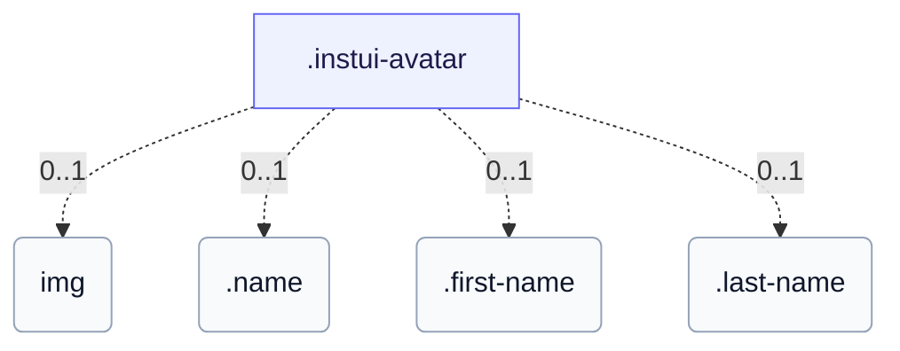

# CSS: avatar

`.instui-avatar` · <span class="instui-pill -color-success pantoken-doc-tag">stable</span> — Un avatar d'usuari que mostra les inicials o una imatge, circular per defecte.

Per defecte, el color de la paleta tenyeix les inicials sobre una superfície transparent; `-has-inverse-color` omple la superfície amb el color i col·loca les inicials al color. La variant `-color-ai` sempre omple amb el gradient violeta→mar. Per a un nom de visualització complet, col·loca'l al contingut (perquè es mantingui a l'arbre d'accessibilitat) i afegeix `data-initials="XX"` per al visual compacte — el text real és el que anuncia un lector de pantalla. Sense `data-initials`, el contingut que es desborda només es talla dur (sense punts suspensius); embolcala en `.name` per a un tall d'una única lletra inicial, o divideix-la en `.first-name`/`.last-name` per a dues lletres tallades (es pot ometre qualsevol meitat i l'altra es manté centrada).

**Font:** [avatar.css](https://github.com/thedannywahl/pantoken/blob/main/formats/components/src/components/avatar/avatar.css)

<!-- js-requirement -->

> [!TIP]
> **JS Enhancement** — El CSS d'aquest component es representa i funciona per si sol; emparella'l amb `@pantoken/interactions` per afegir el comportament interactiu. Mira la [taula de modificadors a continuació](#modifiers).

## Accessibility

Dona a un avatar d'imatge un `alt` significatiu (el nom de la persona), no un genèric "avatar"; per als avatars només de inicials, prefereix el contingut del nom real (text simple, data-initials, .name, o .first-name/.last-name) a les lletres preabrevades, perquè la tecnologia d'assistència anunci el nom real.

## Usage

```css
@import "@pantoken/components/components.css";
@import "@pantoken/components/avatar.css";
```

## Examples

```html
<span class="instui-avatar --me-sm">LH</span>
<span class="instui-avatar -color-ai --me-sm">AI</span>
<span class="instui-avatar --me-sm" data-initials="NV">Dr. Nguyen Van Thoc</span>
<span class="instui-avatar"><span class="name">Miguel Sanchez</span></span>
<span class="instui-avatar"
  ><span class="first-name">Miguel</span> <span class="last-name">Sanchez</span></span
>
```

## Structure

L'avatar mostra un de: una imatge &lt;img&gt;, text simple/data-initials, un envoltant .name, o un parell .first-name/.last-name.

```text
.instui-avatar
  img (0..1)
  .name (0..1)
  .first-name (0..1)
  .last-name (0..1)
```



## Modifiers

| Modifier               | Description                                                                                           |
| ---------------------- | ----------------------------------------------------------------------------------------------------- |
| `.-color-accent1`      | <span class="instui-pill -color-danger pantoken-doc-tag">Deprecated</span> — use `.-color-blue`.      |
| `.-color-accent2`      | <span class="instui-pill -color-danger pantoken-doc-tag">Deprecated</span> — use `.-color-green`.     |
| `.-color-accent3`      | <span class="instui-pill -color-danger pantoken-doc-tag">Deprecated</span> — use `.-color-red`.       |
| `.-color-accent4`      | <span class="instui-pill -color-danger pantoken-doc-tag">Deprecated</span> — use `.-color-orange`.    |
| `.-color-accent5`      | <span class="instui-pill -color-danger pantoken-doc-tag">Deprecated</span> — use `.-color-ash`.       |
| `.-color-accent6`      | <span class="instui-pill -color-danger pantoken-doc-tag">Deprecated</span> — use `.-color-grey`.      |
| `.-color-ai`           | Color de paleta d'accent IA.                                                                          |
| `.-color-ash`          | Color de paleta de cendra.                                                                            |
| `.-color-blue`         | Color de paleta blau.                                                                                 |
| `.-color-green`        | Color de paleta verd.                                                                                 |
| `.-color-grey`         | Color de paleta gris.                                                                                 |
| `.-color-orange`       | Color de paleta taronja.                                                                              |
| `.-color-red`          | Color de paleta vermell.                                                                              |
| `.-has-inverse-color`  | Utilitza el color de text invers (on-dark).                                                           |
| `.-shape-rectangle`    | Forma quadrada (rectangular) en lloc de cercle.                                                       |
| `.-show-border`        | <span class="instui-pill -color-info pantoken-doc-tag">Alias</span> — maps to `.-show-border-always`. |
| `.-show-border-always` | Força l'anell de vora, fins i tot sobre una imatge o una omplerta inversa.                            |
| `.-show-border-never`  | Força l'anell de vora apagat.                                                                         |
| `.-size-2xl`           | Dues mides més grans.                                                                                 |
| `.-size-2xs`           | Dues mides més petites.                                                                               |
| `.-size-large`         | Gran. Àlias de forma llarga de `-size-lg`.                                                            |
| `.-size-lg`            | Gran.                                                                                                 |
| `.-size-md`            | Mitjà (per defecte).                                                                                  |
| `.-size-medium`        | Mitjà (per defecte). Àlias de forma llarga de `-size-md`.                                             |
| `.-size-sm`            | Petit.                                                                                                |
| `.-size-small`         | Petit. Àlias de forma llarga de `-size-sm`.                                                           |
| `.-size-x-large`       | Molt gran. Àlias de forma llarga de `-size-xl`.                                                       |
| `.-size-x-small`       | Molt petit. Àlias de forma llarga de `-size-xs`.                                                      |
| `.-size-xl`            | Molt gran.                                                                                            |
| `.-size-xs`            | Molt petit.                                                                                           |
| `.-size-xx-large`      | Dues mides més grans. Àlias de forma llarga de `-size-2xl`.                                           |
| `.-size-xx-small`      | Dues mides més petites. Àlias de forma llarga de `-size-2xs`.                                         |

## Parts

| Part          | Description                                                                                        |
| ------------- | -------------------------------------------------------------------------------------------------- |
| `.first-name` | Opcional (parella amb .last-name): embolcala el nom donat, tallat a la seva lletra inicial.        |
| `.last-name`  | Opcional (s'emparella amb .first-name): emmarca el cognomen, tallat a la seva lletra inicial.      |
| `.name`       | Opcional: emmarca el nom complet per tallar-lo a una sola lletra inicial sense data-initials o JS. |

## Pseudo-elements

| Pseudo-element | Description |
| -------------- | ----------- |
| `::before`     | —           |

## Tokens consumed

| Token                                                | Type                                               | Value                                                                        |
| ---------------------------------------------------- | -------------------------------------------------- | ---------------------------------------------------------------------------- |
| `--instui-component-avatar-ai-bottom-gradient-color` | `<color>`                                          | `#00828E`                                                                    |
| `--instui-component-avatar-ai-top-gradient-color`    | `<color>`                                          | `#9E58BD`                                                                    |
| `--instui-component-avatar-ash-background-color`     | `<color>`                                          | `light-dark(#273540, #1C222B)`                                               |
| `--instui-component-avatar-ash-text-color`           | `<color>`                                          | `light-dark(#273540, #C7CACD)`                                               |
| `--instui-component-avatar-background-color`         | `<color>`                                          | `light-dark(#ffffff, #10141A)`                                               |
| `--instui-component-avatar-blue-background-color`    | `<color>`                                          | `#2B7ABC`                                                                    |
| `--instui-component-avatar-blue-text-color`          | `<color>`                                          | `light-dark(#2871AF, #7FB4F1)`                                               |
| `--instui-component-avatar-border-color`             | `<color>`                                          | `light-dark(#8D959F, #6A7883)`                                               |
| `--instui-component-avatar-border-width-md`          | `<length>`                                         | `0.125rem`                                                                   |
| `--instui-component-avatar-border-width-sm`          | `<length>`                                         | `0.0625rem`                                                                  |
| `--instui-component-avatar-font-family`              | `[ <font-family-name> \| <generic-font-family> ]#` | `Atkinson Hyperlegible Next, "Helvetica Neue", Helvetica, Arial, sans-serif` |
| `--instui-component-avatar-font-size-lg`             | `<length>`                                         | `1.25rem`                                                                    |
| `--instui-component-avatar-font-size-md`             | `<length>`                                         | `1rem`                                                                       |
| `--instui-component-avatar-font-size-sm`             | `<length>`                                         | `0.875rem`                                                                   |
| `--instui-component-avatar-font-size-xl`             | `<length>`                                         | `1.75rem`                                                                    |
| `--instui-component-avatar-font-size-xs`             | `<length>`                                         | `0.75rem`                                                                    |
| `--instui-component-avatar-font-size2xl`             | `<length>`                                         | `2.5rem`                                                                     |
| `--instui-component-avatar-font-size2xs`             | `<length>`                                         | `0.75rem`                                                                    |
| `--instui-component-avatar-font-weight`              | `<integer>`                                        | `600`                                                                        |
| `--instui-component-avatar-green-background-color`   | `<color>`                                          | `#03893D`                                                                    |
| `--instui-component-avatar-green-text-color`         | `<color>`                                          | `light-dark(#037D37, #61C378)`                                               |
| `--instui-component-avatar-grey-background-color`    | `<color>`                                          | `light-dark(#4A5B68, #576773)`                                               |
| `--instui-component-avatar-grey-text-color`          | `<color>`                                          | `light-dark(#4A5B68, #F2F4F5)`                                               |
| `--instui-component-avatar-orange-background-color`  | `<color>`                                          | `#CF4A00`                                                                    |
| `--instui-component-avatar-orange-text-color`        | `<color>`                                          | `light-dark(#BB4200, #FF905A)`                                               |
| `--instui-component-avatar-rectangle-radius`         | `<length>`                                         | `0.25rem`                                                                    |
| `--instui-component-avatar-red-background-color`     | `<color>`                                          | `#E62429`                                                                    |
| `--instui-component-avatar-red-text-color`           | `<color>`                                          | `light-dark(#CF1F24, #FA917F)`                                               |
| `--instui-component-avatar-size-lg`                  | `<length>`                                         | `3.5rem`                                                                     |
| `--instui-component-avatar-size-md`                  | `<length>`                                         | `3rem`                                                                       |
| `--instui-component-avatar-size-sm`                  | `<length>`                                         | `2.5rem`                                                                     |
| `--instui-component-avatar-size-xl`                  | `<length>`                                         | `4rem`                                                                       |
| `--instui-component-avatar-size-xs`                  | `<length>`                                         | `2rem`                                                                       |
| `--instui-component-avatar-size2xl`                  | `<length>`                                         | `5rem`                                                                       |
| `--instui-component-avatar-size2xs`                  | `<length>`                                         | `1.5rem`                                                                     |
| `--instui-component-avatar-text-on-color`            | `<color>`                                          | `#ffffff`                                                                    |

## Related

- [byline](/ca/api/css/byline.md) — Pot allotjar un avatar com a figura heròica principal.
