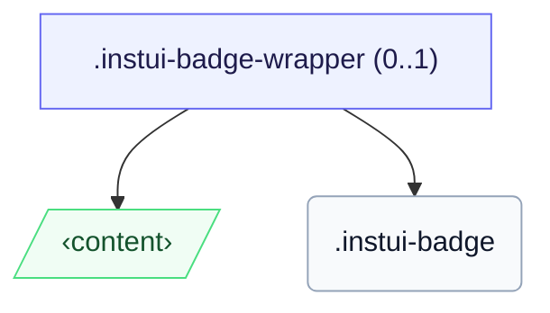

# CSS: badge

`.instui-badge` — Un petit punt de recompte o estat col·locat sobre l'angle d'un objectiu.

Per col·locar una insígnia sobre un objectiu, emmarca tots dos en `.instui-badge-wrapper` (l'ancla de posició) i fixa la insígnia amb un modificador `-placement-*`.

**Font:** [badge.css](https://github.com/thedannywahl/pantoken/blob/main/formats/components/src/components/badge/badge.css)

## Usage

```css
@import "@pantoken/components/components.css";
@import "@pantoken/components/badge.css";
```

## Demo

```demo
self:badge
```

## Examples

```html
<span class="instui-badge-wrapper">
  <button class="instui-button">Inbox</button>
  <span class="instui-badge -placement-top-end">4</span>
</span>
```

## Structure

La insígnia es representa en línia per si sola, o dins d'un `instui-badge-wrapper` opcional que l'ancora sobre un objectiu.

```text
.instui-badge-wrapper (0..1)
  ‹content›
  .instui-badge
```



## Modifiers

| Modifier                   | Description                                                     |
| -------------------------- | --------------------------------------------------------------- |
| `.-color-danger`           | Un recompte d'atenció/error.                                    |
| `.-color-inverse`          | En foscur: un xip lleuger amb text fosc.                        |
| `.-color-success`          | Un recompte positiu/complet.                                    |
| `.-placement-bottom-end`   | Posició a l'angle inferior-final.                               |
| `.-placement-bottom-start` | Posició a l'angle inferior-inicial.                             |
| `.-placement-end-center`   | Posició centrada al marge final.                                |
| `.-placement-start-center` | Posició centrada al marge inicial.                              |
| `.-placement-top-end`      | Posició a l'angle superior-final.                               |
| `.-placement-top-start`    | Posició a l'angle superior-inicial.                             |
| `.-pulse`                  | Un anell d'atenció pulsant.                                     |
| `.-standalone`             | Representa en línia, no posicionat sobre l'angle d'un objectiu. |
| `.-type-notification`      | Només un punt, sense recompte.                                  |

## Pseudo-elements

| Pseudo-element | Description                                                                                   |
| -------------- | --------------------------------------------------------------------------------------------- |
| `::before`     | L'anell d'atenció pulsant dibuixat en el color d'accent de la insígnia (la variant `-pulse`). |

## Custom properties

| Property                  | Type      | Default | Description                                                                        |
| ------------------------- | --------- | ------- | ---------------------------------------------------------------------------------- |
| `--pantoken-badge-accent` | `<color>` | —       | L'emplenament del xip; cada variant `-color-*` i l'anell de puls es llegeix d'ell. |
| `--pantoken-badge-text`   | `<color>` | —       | El color del text, aparellat amb l'accent perquè es mantingui llegible.            |

## Animations

| Animation              | Description                    |
| ---------------------- | ------------------------------ |
| `pantoken-badge-pulse` | L'animació de l'anell de puls. |

## Tokens consumed

| Token                                    | Type                                               | Value                                                                        |
| ---------------------------------------- | -------------------------------------------------- | ---------------------------------------------------------------------------- |
| `--instui-border-width-md`               | `<length>`                                         | `0.125rem`                                                                   |
| `--instui-component-badge-border-radius` | `<length>`                                         | `999rem`                                                                     |
| `--instui-component-badge-color`         | `<color>`                                          | `#ffffff`                                                                    |
| `--instui-component-badge-color-danger`  | `<color>`                                          | `#E62429`                                                                    |
| `--instui-component-badge-color-inverse` | `<color>`                                          | `#273540`                                                                    |
| `--instui-component-badge-color-primary` | `<color>`                                          | `light-dark(#1D354F, #EEF4FD)`                                               |
| `--instui-component-badge-color-success` | `<color>`                                          | `#03893D`                                                                    |
| `--instui-component-badge-font-family`   | `[ <font-family-name> \| <generic-font-family> ]#` | `Atkinson Hyperlegible Next, "Helvetica Neue", Helvetica, Arial, sans-serif` |
| `--instui-component-badge-font-size`     | `<length>`                                         | `0.75rem`                                                                    |
| `--instui-component-badge-font-weight`   | `<integer>`                                        | `600`                                                                        |
| `--instui-component-badge-padding`       | `<length>`                                         | `0.25rem`                                                                    |
| `--instui-component-badge-size`          | `<length>`                                         | `1rem`                                                                       |
| `--instui-spacing-space-sm`              | `<length>`                                         | `0.5rem`                                                                     |

## Related

- [pill](/ca/api/css/pill.md) — La contrapart del xip d'etiqueta en línia.
