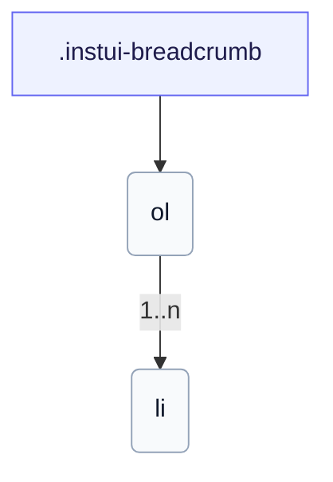

# CSS: breadcrumb

`.instui-breadcrumb` · <span class="instui-pill -color-success pantoken-doc-tag">stable</span> — Un camí de miges amb separadors; l'última miiga és la pàgina actual.

Es col·lapsa automàticament a una fletxa enrere en pantalles petites. Utilitzeu `breadcrumb.link` per a cada miiga.

**Font:** [breadcrumb.css](https://github.com/thedannywahl/pantoken/blob/main/formats/components/src/components/breadcrumb/breadcrumb.css)

## Accessibilitat

Envolteu `&lt;ol&gt;` en un punt de referència `<nav aria-label>`; marqueu la miiga de la pàgina actual amb `aria-current="page"`.

## Ús

```css
@import "@pantoken/components/components.css";
@import "@pantoken/components/breadcrumb.css";
```

## Exemples

```html
<nav class="instui-breadcrumb" aria-label="Breadcrumb">
  <ol>
    <li>
      <a class="-icon-house" href="#">Home</a>
    </li>
    <li><a href="#">Guides</a></li>
    <li><a href="#">Components</a></li>
    <li aria-current="page">Breadcrumb</li>
  </ol>
</nav>
```

## Estructura

```text
.instui-breadcrumb
  ol
    li (1..n)
```



## Modificadors

| Modificador | Descripció |
| --- | --- |
| `.-size-large` | Gran. @affects breadcrumb.link — Escala l'espaiat del separador de la miiga per a concordar. Àlies de forma llarga de `-size-lg`. |
| `.-size-lg` | Gran. @affects breadcrumb.link — Escala l'espaiat del separador de la miiga per a concordar. |
| `.-size-md` | Mitjà (per defecte). @affects breadcrumb.link — Escala l'espaiat del separador de la miiga per a concordar. |
| `.-size-medium` | Mitjà (per defecte). @affects breadcrumb.link — Escala l'espaiat del separador de la miiga per a concordar. Àlies de forma llarga de `-size-md`. |
| `.-size-sm` | Petit. @affects breadcrumb.link — Escala l'espaiat del separador de la miiga per a concordar. |
| `.-size-small` | Petit. @affects breadcrumb.link — Escala l'espaiat del separador de la miiga per a concordar. Àlies de forma llarga de `-size-sm`. |

## Tokens consumits

| Token | Tipus | Valor |
| --- | --- | --- |
| `--instui-component-breadcrumb-gap-lg` | `<length>` | `0.5rem` |
| `--instui-component-breadcrumb-gap-md` | `<length>` | `0.25rem` |
| `--instui-component-breadcrumb-gap-sm` | `<length>` | `0.125rem` |
| `--instui-component-link-font-family` | `[ <font-family-name> \| <generic-font-family> ]#` | `Atkinson Hyperlegible Next, "Helvetica Neue", Helvetica, Arial, sans-serif` |
| `--instui-component-link-font-size-lg` | `<length>` | `1.75rem` |
| `--instui-component-link-font-size-md` | `<length>` | `1rem` |
| `--instui-component-link-font-size-sm` | `<length>` | `0.875rem` |

## Subcomponents

- [breadcrumb.link](/ca/api/css/breadcrumb.link.md)

