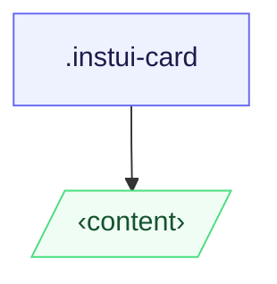

# CSS: card

`.instui-card` — Un contenidor de superfície que accepta contingut arbitrari.

**Variant** controla com s'estilen els fills directes: `content` (per defecte) els deixa
  sense estil; `container` els apila com a seccions delimitades i amb farciment. El farciment s'escala amb
  l'amplada de la finestra gràfica i és igual en ambdues variants.
  **Size** és totalment responsiu — el farciment i la radi de vora pugen automàticament a 320px
  (20rem) i 640px (40rem) via consultes multimèdia estàndard `min-width`; no es necessita cap classe de mida.
  Emparella amb `@pantoken/components` per a encapçalament, botó i altres components en línia.

## Accessibilitat

Utilitza `&lt;article&gt;` com a element de targeta quan la targeta és una unitat de contingut autònoma;
  utilitza `&lt;section&gt;` quan s'agrupa dins d'un punt de referència més gran. En `-variant-container`, prefereix
  elements `&lt;section&gt;` com a fills directes de manera que cada regió delimitada tingui significat semàntic.

## Ús

@import "@pantoken/plugin-custom-components/custom-components.css";

```css
@import "@pantoken/plugin-custom-components/custom-components.css";
```

## Exemples

Targeta de contingut -nocard
```html
<article class="instui-card">
  <h2 class="instui-heading -h3">Card title</h2>
  <p>Content here.</p>
  <button class="instui-button">Action</button>
</article>
```
Targeta de contenidor -nocard
```html
<article class="instui-card -variant-container">
  <section>First section</section>
  <section>Second section</section>
</article>
```

## Estructura

```text
.instui-card
  ‹content›
```



## Modificadors

| Modificador | Descripció |
| --- | --- |
| `.-variant-container` | Targeta de contenidor; els fills directes es converteixen en seccions delimitades i amb farciment. |
| `.-variant-content` | Targeta de contingut estàndard; els fills no estan estilitzats. Per defecte quan no es defineix cap variant. |

## Condicions

| Tipus | Consulta | Descripció |
| --- | --- | --- |
| media | `(min-width: 20rem)` | — |
| media | `(min-width: 40rem)` | — |

## Tokens consumits

| Token | Tipus | Valor |
| --- | --- | --- |
| `--instui-component-card-background-color` | `<color>` | `light-dark(#ffffff, #1C222B)` |
| `--instui-component-card-border-radius-base-lg` | `<length>` | `1rem` |
| `--instui-component-card-border-radius-base-md` | `<length>` | `1rem` |
| `--instui-component-card-border-radius-base-sm` | `<length>` | `0.75rem` |
| `--instui-component-card-border-radius-nested-lg` | `<length>` | `0.75rem` |
| `--instui-component-card-border-radius-nested-md` | `<length>` | `0.5rem` |
| `--instui-component-card-border-radius-nested-sm` | `<length>` | `0.5rem` |
| `--instui-component-card-nested-border-color` | `<color>` | `light-dark(#E8EAEC, #2D3D49)` |
| `--instui-component-card-padding-base-lg` | `<length>` | `1.5rem` |
| `--instui-component-card-padding-base-md` | `<length>` | `1rem` |
| `--instui-component-card-padding-base-sm` | `<length>` | `0.75rem` |
| `--instui-component-card-padding-nested-lg` | `<length>` | `1rem` |
| `--instui-component-card-padding-nested-md` | `<length>` | `0.75rem` |
| `--instui-component-card-padding-nested-sm` | `<length>` | `0.5rem` |
| `--instui-component-shared-tokens-spacing-gap-cards-nested-containers-lg` | `<length>` | `1rem` |
| `--instui-component-shared-tokens-spacing-gap-cards-nested-containers-md` | `<length>` | `0.75rem` |
| `--instui-component-shared-tokens-spacing-gap-cards-nested-containers-sm` | `<length>` | `0.5rem` |
| `--instui-component-shared-tokens-stroke-width-sm` | `<length>` | `0.0625rem` |
| `--instui-elevation-card` | `none \| <shadow>#` | — |

## Suport del navegador

- `@scope` és Baseline 2023 Newly Available; la targeta es degrada a un full d'estils pla sense àmbit
  en navegadors més antics sense pèrdua de l'estil visible.

## Relacionat

- [heading](/ca/api/css/heading.md) — Coloca directament a la targeta o dins d'una secció de contenidor.
- [button](/ca/api/css/button.md) — Coloca directament a la targeta o dins d'una secció de contenidor.
- [img](/ca/api/css/img.md) — Coloca directament a la targeta com una regió multimèdia.
- [badge](/ca/api/css/badge.md) — Coloca directament a la targeta com a indicador d'estat.

## Vegeu també

- https://drafts.csswg.org/css-cascade-6/#scoping

