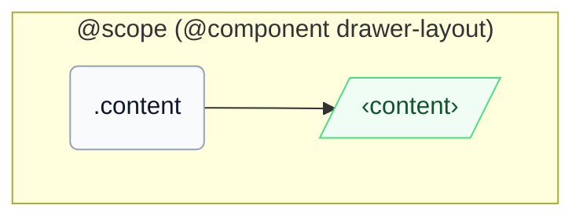

# CSS: drawer-layout.content

`.content` — El panell de contingut principal que ocupa l'espai restant al costat de la safata.

Un cop la mida en línia del pare es redueix per sota de `46em` (amplada de la safata `16em` + punt de ruptura `30em`), una consulta `@container` al contenidor `pantoken-drawer-layout` del pare redueix automàticament `min-inline-size` d'aquest membre a `0`, coincidint amb l'anul·lació manual `[should-overlay-tray]`.

## Accessibilitat

Porta `role="region"` (convenció DrawerLayout d'InstUI) i nomena-ho amb `aria-label`/`aria-labelledby` quan el context sol no l'identifica.

## Ús

```css
@import "@pantoken/components/components.css";
@import "@pantoken/components/drawer-layout.content.css";
```

## Exemples

```html
<div class="instui-drawer-layout">
  <div class="content" role="region">
    <p class="instui-text">Tray content</p>
  </div>
</div>
```

## Estructura

```text
@scope (@component drawer-layout)
  .content
    ‹content›
```



## Condicions

| Tipus | Consulta | Descripció |
| --- | --- | --- |
| container | `pantoken-drawer-layout (max-width: 46em)` | — |

## Tokens consumits

| Token | Tipus | Valor |
| --- | --- | --- |
| `--drawer-layout-content-min-inline-size` | `<length>` | — |
| `--pantoken-bp-md` | `<length>` | `30em` |

## Relacionat

- [drawer-layout.tray](/ca/api/css/drawer-layout.tray.md) — El panell adjacent a la mateixa fila flex.

