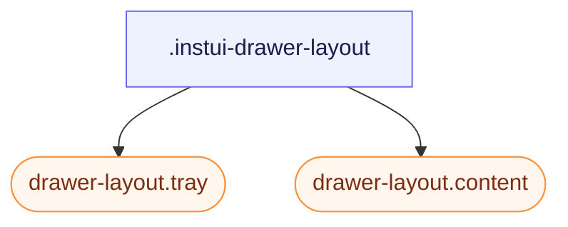

# CSS: drawer-layout

`.instui-drawer-layout` — Un disseny dividit amb una safata lateral que es pot plegar i un panell de contingut principal desplaçable.

`-placement-end` i per defecte (start) tots dos utilitzen propietats lògiques `flex-direction`/`inset-inline-*`, no `left`/`right`, per la qual cosa el costat de la safata segueix `direction`/`dir="rtl"` automàticament — no calen regles RTL separades.

**Font:** [drawer-layout.css](https://github.com/thedannywahl/pantoken/blob/main/formats/components/src/components/drawer-layout/drawer-layout.css)

## Accessibilitat

Quan la safata actua com a navegació, etiqueta-la amb un encapçalament accessible o `aria-label`. Dona `.content` `role="region"` (convenció DrawerLayout d'InstUI) i nomena-ho amb `aria-label`/`aria-labelledby` quan el context sol no l'identifica.

## Ús

```css
@import "@pantoken/components/components.css";
@import "@pantoken/components/drawer-layout.css";
```

## Exemples

```html
<div class="instui-drawer-layout" id="drawer" open>
  <aside class="tray">Navigation</aside>
  <main class="content" role="region">Main content</main>
</div>
```

## Estructura

```text
.instui-drawer-layout
  drawer-layout.tray (component)
  drawer-layout.content (component)
```



## Modificadors

| Modificador | Descripció |
| --- | --- |
| `.-open` | Mostra la safata fins i tot quan l'atribut `open` està absent. |
| `.-placement-end` | Acobla la safata al costat en línia-final. |
| `.-placement-start` | Acobla la safata al costat en línia-inici (per defecte; configura-ho explícitament). |
| `.-should-overlay-tray` | <span class="instui-pill pantoken-doc-tag pantoken-doc-tag-interaction">Interaction</span> — Render the tray as an overlay instead of shrinking content inline. |

## Parts

| Part | Descripció |
| --- | --- |
| `.content` | El panell principal. |
| `.tray` | El panell lateral. |

## Propietats personalitzades

| Propietat | Tipus | Predeterminat | Descripció |
| --- | --- | --- | --- |
| `--pantoken-bp-md` | — | — | Llindar d'amplada per al mode de superposició (`30em`, tematitzat mitjançant utilitats responsives). |

## Suport del navegador

- Els membres `drawer-layout.tray`/`drawer-layout.content` canvien al mode de superposició automàticament mitjançant una consulta `@container` un cop la mida en línia d'aquest element es redueix per sota de tray-width + `--pantoken-bp-md`. El comportament `@pantoken/interactions` també commuta `[should-overlay-tray]`/`.-should-overlay-tray` (una anul·lació manual) i emet `overlaytraychange` per a aplicacions que necessiten el canvi com a esdeveniment.

## Subcomponents

- [drawer-layout.content](/ca/api/css/drawer-layout.content.md)
- [drawer-layout.tray](/ca/api/css/drawer-layout.tray.md)
- [tray](/ca/api/css/tray.md)

## Relacionat

- [tray](/ca/api/css/tray.md) — Una superposició de vora autònoma; aquest disseny manté la safata i el contingut en el mateix flux.
- [context-view](/ca/api/css/context-view.md) — Una superfície més petita ancorada per a accions contextuals i detalls.

