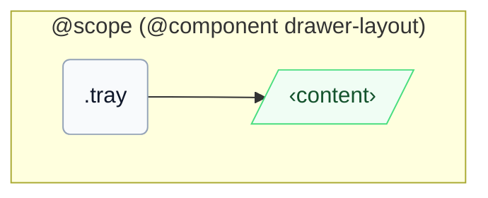

# CSS: drawer-layout.tray

`.tray` — El panell lateral al costat del contingut principal, amb superposició opcional i modificadors de superfície tipus safata.

El posicionament utilitza `inset-inline-start`/`inset-inline` (mai `left`/`right`), per la qual cosa `-placement-end` s'acobla al veritable vora final tant en LTR com en RTL.

## Accessibility

Si s'utilitza com a navegació, encapsula els enllaços en un `&lt;nav&gt;` semàntic i proporciona un nom accessible.

## Usage

```css
@import "@pantoken/components/components.css";
@import "@pantoken/components/drawer-layout.tray.css";
```

## Examples

```html
<div class="instui-drawer-layout" open>
  <aside class="tray" aria-label="Course navigation">
    <a class="instui-link" href="#">Modules</a>
  </aside>
  <main class="content" role="region">Main content</main>
</div>
```

## Structure

```text
@scope (@component drawer-layout)
  .tray
    ‹content›
```



## Modifiers

| Modifier           | Description                                                               |
| ------------------ | ------------------------------------------------------------------------- |
| `.-placement-end`  | Acobla aquesta safata a inline-end quan el mode de superposició és actiu. |
| `.-without-border` | Elimina la vora de la vora del panell.                                    |
| `.-without-shadow` | Elimina l'elevació quan el mode de superposició és actiu.                 |

## Conditions

| Type      | Query                                      | Description |
| --------- | ------------------------------------------ | ----------- |
| container | `pantoken-drawer-layout (max-width: 46em)` | —           |

## Tokens consumed

| Token                                             | Type                | Value                          |
| ------------------------------------------------- | ------------------- | ------------------------------ |
| `--drawer-layout-tray-width`                      | —                   | —                              |
| `--instui-border-width-sm`                        | `<length>`          | `0.0625rem`                    |
| `--instui-color-background-elevated-surface-base` | `<color>`           | `light-dark(#ffffff, #171B21)` |
| `--instui-color-stroke-base`                      | `<color>`           | `light-dark(#8D959F, #6A7883)` |
| `--instui-component-tray-width-xs`                | `<length>`          | `16em`                         |
| `--instui-component-tray-z-index`                 | `<integer>`         | `9999`                         |
| `--instui-elevation-topmost`                      | `none \| <shadow>#` | —                              |

## Related

- [drawer-layout.content](/ca/api/css/drawer-layout.content.md) — El panell principal que es flexa al costat d'aquest membre.
