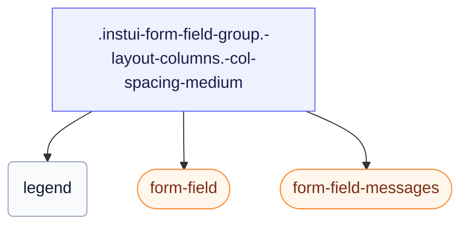

# CSS: form-field-group

`.instui-form-field-group` — Un grup `&lt;fieldset&gt;` amb una llegenda, un disseny de columna o en línia, i espaiat configurable.

Estableix el seu propi `gap` entre camps, ajustable amb els modificadors `-col-spacing-*`/`-row-spacing-*` següents — preferiu aquests en lloc d'encadenar un modificador d'utilitat d'espaiament genèric `-gap-*`, que sobrescriu el valor incorporat completament.

**Font:** [form-field-group.css](https://github.com/thedannywahl/pantoken/blob/main/formats/components/src/components/form-field-group/form-field-group.css)

## Accessibilitat

Renderitza un `&lt;fieldset&gt;` natiu amb un `&lt;legend&gt;`, de manera que el text de la llegenda nomena tot el grup per a la tecnologia d'assistència.

## Ús

```css
@import "@pantoken/components/components.css";
@import "@pantoken/components/form-field-group.css";
```

## Exemples

```html
<fieldset class="instui-form-field-group -layout-columns -col-spacing-medium">
  <legend>Shipping address</legend>
  <label class="instui-form-field">
    <span class="label">First name</span>
    <span class="controls"><input class="instui-text-input"></span>
  </label>
  <label class="instui-form-field">
    <span class="label">Last name</span>
    <span class="controls"><input class="instui-text-input"></span>
  </label>
  <label class="instui-form-field">
    <span class="label">City</span>
    <span class="controls"><input class="instui-text-input"></span>
  </label>
  <label class="instui-form-field">
    <span class="label">State</span>
    <span class="controls">
      <select class="instui-simple-select">
        <option>CA</option>
        <option>NY</option>
        <option>TX</option>
      </select>
    </span>
  </label>
  <div class="instui-form-field-messages">
    <span class="instui-form-field-message -type-hint">All fields are used for delivery only.</span>
  </div>
</fieldset>
```

## Estructura

```text
.instui-form-field-group.-layout-columns.-col-spacing-medium
  legend
  form-field (component)
  form-field-messages (component)
```



## Modificadors

| Modificador | Descripció |
| --- | --- |
| `.-col-spacing-large` | Espaiat gran entre columnes. |
| `.-col-spacing-medium` | Espaiat mitjà entre columnes. |
| `.-col-spacing-none` | Sense espaiat entre columnes. |
| `.-col-spacing-small` | Espaiat petit entre columnes. |
| `.-layout-aligned` | Alineeu els camps fills a una graella compartida. |
| `.-layout-columns` | Disposeu els camps fills en columnes. |
| `.-layout-inline` | Disposeu els camps fills en línia, en una fila. |
| `.-required` | Marqueu el grup com a obligatori. |
| `.-row-spacing-large` | Espaiat gran entre files. |
| `.-row-spacing-medium` | Espaiat mitjà entre files. |
| `.-row-spacing-none` | Sense espaiat entre files. |
| `.-row-spacing-small` | Espaiat petit entre files. |
| `.-v-align-bottom` | Alineeu els camps a la part inferior. |
| `.-v-align-middle` | Alineeu els camps al centre. |
| `.-v-align-top` | Alineeu els camps a la part superior. |

## Pseudoelements

| Pseudoelement | Descripció |
| --- | --- |
| `::after` | Renderitza l'asterisc decoratiu de camp obligatori després del text de la llegenda quan el grup és obligatori. |

## Condicions

| Tipus | Consulta | Descripció |
| --- | --- | --- |
| supports | `(grid-template-columns: subgrid)` | — |

## Tokens consumits

| Token | Tipus | Valor |
| --- | --- | --- |
| `--instui-component-form-field-layout-asterisk-color` | `<color>` | `light-dark(#CF1F24, #FA917F)` |
| `--instui-component-form-field-layout-font-family` | `[ <font-family-name> \| <generic-font-family> ]#` | `Atkinson Hyperlegible Next, "Helvetica Neue", Helvetica, Arial, sans-serif` |
| `--instui-component-form-field-layout-font-size` | `<length>` | `1rem` |
| `--instui-component-form-field-layout-font-weight` | `<integer>` | `400` |
| `--instui-component-form-field-layout-gap-inputs` | `<length>` | `0.75rem` |
| `--instui-component-form-field-layout-gap-primitives` | `<length>` | `0.5rem` |
| `--instui-component-form-field-layout-line-height` | `<length>` | `1.125rem` |
| `--instui-component-form-field-layout-text-color` | `<color>` | `light-dark(#273540, #ffffff)` |
| `--instui-spacing-space-lg` | `<length>` | `1rem` |
| `--instui-spacing-space-md` | `<length>` | `0.75rem` |
| `--instui-spacing-space-sm` | `<length>` | `0.5rem` |

## Suport del navegador

- El mode `-layout-aligned` utilitza subgrid CSS darrere d'una protecció `@supports`; on subgrid no és compatible, els camps es repleguen al seu disseny apilat propi.

## Subcomponents

- [form-field](/ca/api/css/form-field.md)
- [form-field-messages](/ca/api/css/form-field-messages.md)

## Relacionat

- [form-field](/ca/api/css/form-field.md) — El camp únic que aquest grup repeteix.
- [radio-input-group](/ca/api/css/radio-input-group.md) — Agrupa les entrades de ràdio sota una llegenda.

