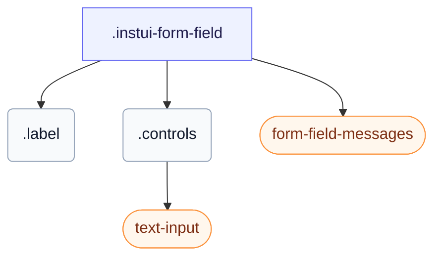

# CSS: form-field

`.instui-form-field` — Un embolcall de form-field: una etiqueta, els seus controls i dissenys en línia, obligatori o de només lectura.

Un missatge d'error es manté amagat fins que el control del camp estigui `:user-invalid` (després que l'usuari interactuï) o afegiu la classe `-invalid`. Useu `-layout-inline` per col·locar l'etiqueta al costat dels controls i `-layout-stacked` per col·locar-la a sobre. També estableix el seu propi `gap` entre l'etiqueta, els controls i els missatges; encadenar un modificador d'utilitat d'espaiament `-gap-*` sobrescriu aquest valor incorporat.

**Font:** [form-field.css](https://github.com/thedannywahl/pantoken/blob/main/formats/components/src/components/form-field/form-field.css)

## Accessibility

L'element `&lt;label&gt;` envolup el control, de manera que el text de l'etiqueta el nomena de manera nativa; l'asterisc obligatori és decoratiu i s'ha de tenir amagat de la tecnologia d'assistència (aria-hidden), i el missatge d'error apareix una vegada que el control estigui `:user-invalid` o afegiu la classe `-invalid`.

## Usage

```css
@import "@pantoken/components/components.css";
@import "@pantoken/components/form-field.css";
```

## Examples

```html
<label class="instui-form-field">
  <span class="label">Email address</span>
  <span class="controls"
    ><input class="instui-text-input" type="email" placeholder="you@example.com"
  /></span>
  <div class="instui-form-field-messages">
    <span class="instui-form-field-message -type-hint">We'll never share it.</span>
    <span class="instui-form-field-message -type-error">Enter a valid email address.</span>
  </div>
</label>
```

## Structure

```text
.instui-form-field
  .label
  .controls
    text-input (component)
  form-field-messages (component)
```



## Modifiers

| Modifier              | Description                                             |
| --------------------- | ------------------------------------------------------- |
| `.-inline`            | Disseny en línia (abreviació de `-layout-inline`).      |
| `.-invalid`           | Estat no vàlid (error).                                 |
| `.-label-align-end`   | Alineeu el text de l'etiqueta al final.                 |
| `.-label-align-start` | Alineeu el text de l'etiqueta al començament.           |
| `.-layout-inline`     | Disseny en línia: etiqueta al costat dels controls.     |
| `.-layout-stacked`    | Disseny apilat: etiqueta per sobre dels controls.       |
| `.-readonly`          | Estat de només lectura.                                 |
| `.-v-align-bottom`    | Alineeu l'etiqueta amb els controls a la part inferior. |
| `.-v-align-top`       | Alineeu l'etiqueta amb els controls a la part superior. |

## Parts

| Part        | Description                                    |
| ----------- | ---------------------------------------------- |
| `.controls` | L'àrea de control al costat o sota l'etiqueta. |
| `.label`    | L'etiqueta del camp.                           |

## Pseudo-elements

| Pseudo-element | Description                                                                                                   |
| -------------- | ------------------------------------------------------------------------------------------------------------- |
| `::after`      | Renderitza l'asterisc decoratiu de camp obligatori després del text de l'etiqueta quan el camp és obligatori. |

## States

| State       | Description |
| ----------- | ----------- |
| `:required` | —           |

## Tokens consumed

| Token                                                      | Type                                               | Value                                                                        |
| ---------------------------------------------------------- | -------------------------------------------------- | ---------------------------------------------------------------------------- |
| `--instui-component-form-field-layout-asterisk-color`      | `<color>`                                          | `light-dark(#CF1F24, #FA917F)`                                               |
| `--instui-component-form-field-layout-font-family`         | `[ <font-family-name> \| <generic-font-family> ]#` | `Atkinson Hyperlegible Next, "Helvetica Neue", Helvetica, Arial, sans-serif` |
| `--instui-component-form-field-layout-font-size`           | `<length>`                                         | `1rem`                                                                       |
| `--instui-component-form-field-layout-font-weight`         | `<integer>`                                        | `400`                                                                        |
| `--instui-component-form-field-layout-gap-inputs`          | `<length>`                                         | `0.75rem`                                                                    |
| `--instui-component-form-field-layout-gap-primitives`      | `<length>`                                         | `0.5rem`                                                                     |
| `--instui-component-form-field-layout-line-height`         | `<length>`                                         | `1.125rem`                                                                   |
| `--instui-component-form-field-layout-readonly-text-color` | `<color>`                                          | `light-dark(#576773, #AAB0B5)`                                               |
| `--instui-component-form-field-layout-text-color`          | `<color>`                                          | `light-dark(#273540, #ffffff)`                                               |

## Browser support

- Conté els seus estils d'element amb la regla `@scope` de CSS; necessita un Chromium, Firefox o Safari recent.

## Subcomponents

- [form-field-messages](/ca/api/css/form-field-messages.md)
- [text-input](/ca/api/css/text-input.md)

## Related

- [form-field-messages](/ca/api/css/form-field-messages.md) — Renderitza els missatges de pista, error i èxit del camp.
- [form-field-group](/ca/api/css/form-field-group.md) — Agrupa els camps relacionats sota una llegenda compartida.
