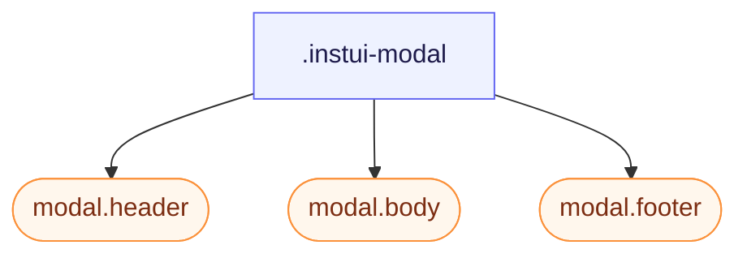

# CSS: modal

`.instui-modal` — Una superfície de diàleg (funciona en un &lt;dialog&gt; natiu); parts capçalera/cos/peu de pàgina.

Consulteu els membres `modal.header`, `modal.body` i `modal.footer` per als apartats individuals.

**Font:** [body.css](https://github.com/thedannywahl/pantoken/blob/main/formats/components/src/components/modal/members/body/body.css)

<!-- js-requirement -->

> [!TIP]
> **JS Enhancement** — El CSS d'aquest component es representa i funciona per si sol; emparella'l amb `@pantoken/interactions` per afegir el comportament interactiu. Mira la [taula de modificadors a continuació](#modifiers).

## Accessibility

Obriu l'`&lt;dialog&gt;` natiu amb `showModal()` per a la semàntica modal i el tancament amb Esc, i anomeneu-lo amb `aria-labelledby` apuntant a `.header`.

## Usage

```css
@import "@pantoken/components/components.css";
@import "@pantoken/components/modal.css";
```

## Demo

```demo
self:modal
```

## Examples

```html
<dialog class="instui-modal -size-sm" id="modal-sm">
  <div class="header"><strong>Small</strong></div>
  <div class="body"><code>-size-sm</code> — a narrow modal.</div>
  <div class="footer">
    <button class="instui-button">Close</button>
  </div>
</dialog>
```

## Structure

```text
.instui-modal
  modal.header (component)
  modal.body (component)
  modal.footer (component)
```



## Modifiers

| Modifier            | Description                                                                                                                                                                        |
| ------------------- | ---------------------------------------------------------------------------------------------------------------------------------------------------------------------------------- |
| `.-blur`            | Desenfoqueu el fons darrera el modal.                                                                                                                                              |
| `.-color-inverse`   | Chrome sobre fons fosc (s'emparella amb un cos de mitjà). @affects modal.header @affects modal.body @affects modal.footer — Recoloreix cada part per a l'aparença sobre fons fosc. |
| `.-density-compact` | Espaiat de parts més estret. @affects modal.header @affects modal.body @affects modal.footer — Estreny l'espaiat de cada part.                                                     |
| `.-overflow-fit`    | Restringiu a la finestra de visualització i desplaceu el cos. @affects modal.body — Desplaça el cos quan el modal està limitat a la finestra de visualització.                     |
| `.-size-auto`       | Dimensionat al contingut.                                                                                                                                                          |
| `.-size-fullscreen` | D'extrem a extrem.                                                                                                                                                                 |
| `.-size-large`      | Un modal ample. Àlies de forma llarga de `-size-lg`.                                                                                                                               |
| `.-size-lg`         | Un modal ample.                                                                                                                                                                    |
| `.-size-sm`         | Un modal estret.                                                                                                                                                                   |
| `.-size-small`      | Un modal estret. Àlies de forma llarga de `-size-sm`.                                                                                                                              |

## Pseudo-elements

| Pseudo-element | Description                                                                    |
| -------------- | ------------------------------------------------------------------------------ |
| `::backdrop`   | Enfosqueix la pàgina darrera el diàleg com a màscara, i l'escuma sota `-blur`. |

## Tokens consumed

| Token                                               | Type                                               | Value                                                                        |
| --------------------------------------------------- | -------------------------------------------------- | ---------------------------------------------------------------------------- |
| `--instui-component-mask-background-color`          | `<color>`                                          | `light-dark(rgba(255,255,255,0.75), rgba(28,34,43,0.75))`                    |
| `--instui-component-modal-auto-min-width`           | `<length>`                                         | `16em`                                                                       |
| `--instui-component-modal-background-color`         | `<color>`                                          | `light-dark(#ffffff, #171B21)`                                               |
| `--instui-component-modal-border-color`             | `<color>`                                          | `light-dark(#E8EAEC, #334450)`                                               |
| `--instui-component-modal-border-radius`            | `<length>`                                         | `1rem`                                                                       |
| `--instui-component-modal-border-width`             | `<length>`                                         | `0.0625rem`                                                                  |
| `--instui-component-modal-font-family`              | `[ <font-family-name> \| <generic-font-family> ]#` | `Atkinson Hyperlegible Next, "Helvetica Neue", Helvetica, Arial, sans-serif` |
| `--instui-component-modal-inverse-background-color` | `<color>`                                          | `light-dark(#273540, #1C222B)`                                               |
| `--instui-component-modal-inverse-border-color`     | `<color>`                                          | `#334450`                                                                    |
| `--instui-component-modal-inverse-text-color`       | `<color>`                                          | `#ffffff`                                                                    |
| `--instui-component-modal-large-max-width`          | `<length>`                                         | `62em`                                                                       |
| `--instui-component-modal-medium-max-width`         | `<length>`                                         | `48em`                                                                       |
| `--instui-component-modal-small-max-width`          | `<length>`                                         | `30em`                                                                       |
| `--instui-component-modal-text-color`               | `<color>`                                          | `light-dark(#273540, #F2F4F5)`                                               |
| `--instui-elevation-topmost`                        | `none \| <shadow>#`                                | —                                                                            |
| `--instui-spacing-space-xl`                         | `<length>`                                         | `1.5rem`                                                                     |

## Browser support

- Estilitza un &lt;dialog&gt; natiu i la seva `::backdrop`; la renderització de capa superior i l'estil de fons necessiten un navegador que suporti l'element de diàleg.

## Subcomponents

- [modal.body](/ca/api/css/modal.body.md)
- [modal.footer](/ca/api/css/modal.footer.md)
- [modal.header](/ca/api/css/modal.header.md)

## Related

- [tray](/ca/api/css/tray.md) — Una safata és el mateix patró de superposició descaratable, ancorat a una vora de pantalla.
