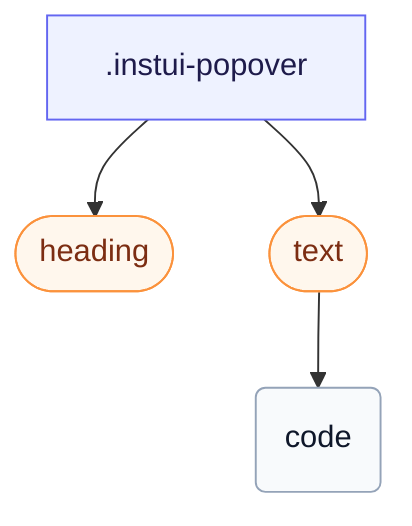

# CSS: popover

`.instui-popover` — Una superfície elevada per a un `[popover]` natiu, posicionada amb posicionament d'ancoratge CSS.

El posicionament d'ancoratge és només de Chromium; la protecció `@supports` significa que `-placement-*` és silenciosament inert en altri llocs i la UA centra la finestra flotant a la capa superior en lloc de fallar.

**Font:** [popover.css](https://github.com/thedannywahl/pantoken/blob/main/formats/components/src/components/popover/popover.css)

## Usage

```css
@import "@pantoken/components/components.css";
@import "@pantoken/components/popover.css";
```

## Examples

```html
<div class="instui-popover -placement-bottom" id="pop-1">
  <div class="instui-heading -level-h4">Share this page</div>
  <p class="instui-text -size-sm">
    A popover is a lightweight surface anchored to a trigger. This one uses the native
    <code>popover</code> attribute.
  </p>
</div>
```

## Structure

```text
.instui-popover
  heading (component)
  text (component)
    code
```



## Modifiers

| Modifier             | Description                                |
| -------------------- | ------------------------------------------ |
| `.-placement-bottom` | Seure per sota de l'ancla.                 |
| `.-placement-end`    | Seure al final (inline-end) de l'ancla.    |
| `.-placement-start`  | Seure a l'inici (inline-start) de l'ancla. |
| `.-placement-top`    | Seure per sobre de l'ancla.                |

## Conditions

| Type     | Query                                   | Description |
| -------- | --------------------------------------- | ----------- |
| supports | `(position-area: block-end)`            | —           |
| supports | `(transition-behavior: allow-discrete)` | —           |

## Tokens consumed

| Token                                             | Type                | Value                          |
| ------------------------------------------------- | ------------------- | ------------------------------ |
| `--instui-border-width-sm`                        | `<length>`          | `0.0625rem`                    |
| `--instui-color-background-elevated-surface-base` | `<color>`           | `light-dark(#ffffff, #171B21)` |
| `--instui-color-text-base`                        | `<color>`           | `light-dark(#273540, #F2F4F5)` |
| `--instui-component-popover-border-color`         | `<color>`           | `light-dark(#8D959F, #6A7883)` |
| `--instui-component-popover-border-radius`        | `<length>`          | `0.75rem`                      |
| `--instui-elevation-above`                        | `none \| <shadow>#` | —                              |
| `--instui-spacing-space-sm`                       | `<length>`          | `0.5rem`                       |

## Browser support

- Utilitza posicionament d'ancoratge CSS (`position-anchor`/`position-area`) i l'API `[popover]` natiu, tots dos només de Chromium avui; una protecció `@supports` manté la col·locació inert en altri lloc, on la UA centra la finestra flotant a la capa superior.

## Subcomponents

- [heading](/ca/api/css/heading.md)
- [text](/ca/api/css/text.md)

## Related

- [tooltip](/ca/api/css/tooltip.md) — Una descripció emergent és una superfície d'ancoratge més petita, activada per hovering o enfocament.
- [context-view](/ca/api/css/context-view.md) — La vista de context és una superfície d'ancoratge relacionada amb un punter.
