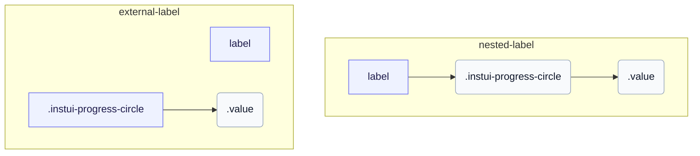

# CSS: progress-circle

`.instui-progress-circle` · <span class="instui-pill -color-success pantoken-doc-tag">estable</span> — Un anell de progrés circular controlat per les propietats personalitzades `--value` i `--value-max`.

L'anell és una rosquilla `conic-gradient` pintada a `::before` i retallada amb una màscara de gradient radial; `--value` dividit per `--value-max` impulsa l'arc. Afegeix `-should-animate` i carrega el punt d'entrada d'interaccions per animar-lo de zero al muntatge. InstUI no té un estat indeterminat; `:indeterminate` és la millor conjectura només de pantoken (natiu `&lt;progress&gt;` sense atribut `value`), girant l'anell en un arc fix i amagant `.value` ja que no hi ha cap número significatiu a mostrar. `&lt;meter&gt;` no té estat indeterminat, per tant no es veu afectat.

**Font:** [progress-circle.css](https://github.com/thedannywahl/pantoken/blob/main/formats/components/src/components/progress-circle/progress-circle.css)

<!-- js-requirement -->
> [!TIP]
> **Millora JS** — El CSS d'aquest component es renderitza i funciona per si sol; parella'l amb `@pantoken/interactions` per afegir el comportament interactiu. El seu modificador `-should-animate` està impulsat per aquest comportament. Veu la [taula de modificadors més avall](#modifiers).


## Accessibilitat

Utilitza native `&lt;progress&gt;` per a un rang de finalització de tasques basat en zero i `&lt;meter&gt;` quan el mínim és diferent de zero. Dona a qualsevol element un nom accessible niuant-lo a `&lt;label&gt;` o associant un `&lt;label&gt;` separat coincidint `for` i `id` values.

## Ús

```css
@import "@pantoken/components/components.css";
@import "@pantoken/components/progress-circle.css";
```

## Exemples

### Nested label
```html
<label>
  Uploading Document: <progress class="instui-progress-circle -size-sm" value="70">70%</progress>
</label>
```
### External label
```html
<label for="score">Score</label>
<meter id="score" class="instui-progress-circle -color-success" min="20" value="40" max="60">50%</meter>
```

## Estructura

`// Variant: nested-label`

```text
label
  .instui-progress-circle
    .value
```

`// Variant: external-label`

```text
label
.instui-progress-circle
  .value
```



## Modificadors

| Modificador | Descripció |
| --- | --- |
| `.-color-brand` | Color del comptador de marca. |
| `.-color-danger` | Color del comptador de perill. |
| `.-color-info` | Color del comptador informatiu. |
| `.-color-primary-inverse` | Color del comptador en fosc (inversió primària). |
| `.-color-success` | Color del comptador d'èxit. |
| `.-color-warning` | Color del comptador d'avís. |
| `.-meter-color-alert` | <span class="instui-pill -color-danger pantoken-doc-tag">Deprecat</span> — use `.-color-warning`. |
| `.-meter-color-brand` | <span class="instui-pill -color-danger pantoken-doc-tag">Deprecat</span> — use `.-color-brand`. |
| `.-meter-color-danger` | <span class="instui-pill -color-danger pantoken-doc-tag">Deprecat</span> — use `.-color-danger`. |
| `.-meter-color-info` | <span class="instui-pill -color-danger pantoken-doc-tag">Deprecat</span> — use `.-color-info`. |
| `.-meter-color-success` | <span class="instui-pill -color-danger pantoken-doc-tag">Deprecat</span> — use `.-color-success`. |
| `.-meter-color-warning` | <span class="instui-pill -color-danger pantoken-doc-tag">Deprecat</span> — use `.-color-warning`. |
| `.-shold-animate-on-mount` | <span class="instui-pill -color-info pantoken-doc-tag">Alias</span> — maps to `.-should-animate`. |
| `.-should-animate` | <span class="instui-pill pantoken-doc-tag pantoken-doc-tag-interaction">Interaction</span> — Animate the meter, ring, and centered value into place on mount. |
| `.-should-animate-on-mount` | <span class="instui-pill -color-info pantoken-doc-tag">Alias</span> — maps to `.-should-animate`. |
| `.-size-large` | Gran. Àlias de forma llarga de `-size-lg`. |
| `.-size-lg` | Gran. |
| `.-size-md` | Mitjà (per defecte). |
| `.-size-medium` | Mitjà (per defecte). Alias de forma llarga de `-size-md`. |
| `.-size-sm` | Petit. |
| `.-size-small` | Petit. Àlias de forma llarga de `-size-sm`. |
| `.-size-x-small` | Molt petit. Àlias de forma llarga de `-size-xs`. |
| `.-size-xs` | Molt petit. |

## Parts

| Part | Descripció |
| --- | --- |
| `.value` | El text de valor centrat en el forat de l'anell. |

## Pseudoelements

| Pseudoelement | Descripció |
| --- | --- |
| `:::indeterminate` | Personalitzat, no és part de InstUI. S'aplica només a un `&lt;progress&gt;` natiu que falta el seu atribut `value`; gira `::before` en un arc fix i amaga `.value`. |
| `::before` | Dibuixa l'anell: una rosquilla amb gradient cònic escapçada amb una màscara radial, l'arc de la qual segueix la propietat personalitzada `--value`. |

## Estats

| Estat | Descripció |
| --- | --- |
| `:indeterminate` | — |

## Propietats personalitzades

| Propietat | Tipus | Predeterminat | Descripció |
| --- | --- | --- | --- |
| `--animation-delay` | `<number>` | — | Mil·lisegons a esperar abans de començar l'animació de muntatge (per defecte `0`). |
| `--max` | `<number>` | — | El valor de progres màxim (per defecte `100`). |
| `--min` | `<number>` | — | El valor mínim del comptador (per defecte `0`). |
| `--pantoken-pc-fill` | `<color>` | — | Color de l'arc emplenat (comptador); els modificadors -color-* l'estableixen. |
| `--pantoken-pc-stroke` | `<length>` | — | L'amplada de la traça de l'anell; els modificadors -size-* l'estableixen. |
| `--pantoken-pc-track` | `<color>` | — | Color de la pista sense emplenar. |
| `--value` | `<number>` | — | El valor de progres actual; registrat amb @property perquè pugui fer la transició. |
| `--value-max` | `<number>` | — | @alias {@link --max} El valor de progres màxim (per defecte `100`). |
| `--value-now` | `<number>` | — | @alias Alias per a `--value`. |

## Animacions

| Animació | Descripció |
| --- | --- |
| `pantoken-progress-circle-indeterminate` | — |

## Tokens consumits

| Token | Tipus | Valor |
| --- | --- | --- |
| `--instui-component-progress-circle-color` | `<color>` | `light-dark(#273540, #ffffff)` |
| `--instui-component-progress-circle-color-inverse` | `<color>` | `light-dark(#ffffff, #1C222B)` |
| `--instui-component-progress-circle-font-family` | `[ <font-family-name> \| <generic-font-family> ]#` | `Atkinson Hyperlegible Next, "Helvetica Neue", Helvetica, Arial, sans-serif` |
| `--instui-component-progress-circle-font-weight` | `<integer>` | `600` |
| `--instui-component-progress-circle-large-size` | `<length>` | `9em` |
| `--instui-component-progress-circle-large-stroke-width` | `<length>` | `0.875em` |
| `--instui-component-progress-circle-line-height` | `<percentage>` | `125%` |
| `--instui-component-progress-circle-medium-size` | `<length>` | `7em` |
| `--instui-component-progress-circle-medium-stroke-width` | `<length>` | `0.625em` |
| `--instui-component-progress-circle-meter-color-brand` | `<color>` | `light-dark(#1D354F, #EEF4FD)` |
| `--instui-component-progress-circle-meter-color-brand-inverse` | `<color>` | `light-dark(#ffffff, #6A7883)` |
| `--instui-component-progress-circle-meter-color-danger` | `<color>` | `#E62429` |
| `--instui-component-progress-circle-meter-color-danger-inverse` | `<color>` | `light-dark(#ffffff, #6A7883)` |
| `--instui-component-progress-circle-meter-color-info` | `<color>` | `#2B7ABC` |
| `--instui-component-progress-circle-meter-color-info-inverse` | `<color>` | `light-dark(#ffffff, #6A7883)` |
| `--instui-component-progress-circle-meter-color-success` | `<color>` | `#03893D` |
| `--instui-component-progress-circle-meter-color-success-inverse` | `<color>` | `light-dark(#ffffff, #6A7883)` |
| `--instui-component-progress-circle-meter-color-warning` | `<color>` | `#CF4A00` |
| `--instui-component-progress-circle-meter-color-warning-inverse` | `<color>` | `light-dark(#ffffff, #6A7883)` |
| `--instui-component-progress-circle-small-size` | `<length>` | `5em` |
| `--instui-component-progress-circle-small-stroke-width` | `<length>` | `0.5em` |
| `--instui-component-progress-circle-track-color` | `<color>` | `light-dark(#ffffff, #10141A)` |
| `--instui-component-progress-circle-track-color-inverse` | `<color>` | `#00000000` |
| `--instui-component-progress-circle-x-small-size` | `<length>` | `3em` |
| `--instui-component-progress-circle-x-small-stroke-width` | `<length>` | `0.2em` |

## Suport del navegador

- Registra les propietats de progres numèric amb `@property` i pinta amb CSS `mask` i `conic-gradient`; on les transicions de propietats personalitzades no són compatibles, l'anell encara es renderitza però no s'anima.

## Relacionat

- [progress](/ca/api/css/progress.md) — La forma de barra lineal del mateix progres determinat.

