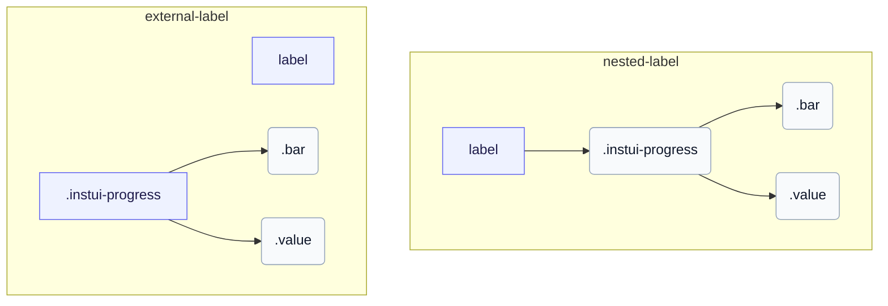

# CSS: progress

`.instui-progress` · <span class="instui-pill -color-success pantoken-doc-tag">stable</span> — Una barra de progres determinada amb un comptador de color, mides i una etiqueta de valor opcional.

`.value` és germà de `.bar`, tots dos fills de l'arrel — mirant com progress-circle nidifica la seva pròpia part `.value`. InstUI no té estat indeterminat; `:indeterminate` és la millor conjectura només de pantoken (native `&lt;progress&gt;` sense atribut `value`), animant `.bar` com a segment lliscant i amagant `.value` ja que no hi ha un número significatiu per mostrar. `&lt;meter&gt;` no té estat indeterminat, per tant és inafectat.

**Font:** [progress.css](https://github.com/thedannywahl/pantoken/blob/main/formats/components/src/components/progress/progress.css)

## Accessibilitat

Utilitza native `&lt;progress&gt;` per a un rang de finalització de tasques basat en zero i `&lt;meter&gt;` quan el mínim és diferent de zero. Dona a qualsevol element un nom accessible niuant-lo a `&lt;label&gt;` o associant un `&lt;label&gt;` separat coincidint `for` i `id` values.

## Ús

```css
@import "@pantoken/components/components.css";
@import "@pantoken/components/progress.css";
```

## Exemples

### Nested label
```html
<label>
  Uploading Document: <progress class="instui-progress -color-brand" value="70">70%</progress>
</label>
```
### External label
```html
<label for="storage-used">Storage used</label>
<meter id="storage-used" class="instui-progress -color-warning" min="20" value="40" max="60">50%</meter>
```

## Estructura

`// Variant: nested-label`

```text
label
  .instui-progress
    .bar
    .value
```

`// Variant: external-label`

```text
label
.instui-progress
  .bar
  .value
```



## Modificadors

| Modificador | Descripció |
| --- | --- |
| `.-color-brand` | Color del comptador de marca. |
| `.-color-danger` | Color del comptador de perill. |
| `.-color-info` | Color del comptador informatiu. |
| `.-color-inverse` | Per a fons foscos. |
| `.-color-primary-inverse` | Color del comptador en fosc (inversió primària). |
| `.-color-success` | Color del comptador d'èxit. |
| `.-color-warning` | Color del comptador d'avís. |
| `.-meter-color-alert` | <span class="instui-pill -color-danger pantoken-doc-tag">Deprecat</span> — use `.-color-warning`. |
| `.-meter-color-brand` | <span class="instui-pill -color-danger pantoken-doc-tag">Deprecat</span> — use `.-color-brand`. |
| `.-meter-color-danger` | <span class="instui-pill -color-danger pantoken-doc-tag">Deprecat</span> — use `.-color-danger`. |
| `.-meter-color-info` | <span class="instui-pill -color-danger pantoken-doc-tag">Deprecat</span> — use `.-color-info`. |
| `.-meter-color-success` | <span class="instui-pill -color-danger pantoken-doc-tag">Deprecat</span> — use `.-color-success`. |
| `.-meter-color-warning` | <span class="instui-pill -color-danger pantoken-doc-tag">Deprecat</span> — use `.-color-warning`. |
| `.-render-value-inside` | Renderitza `.value` dins de la pista, alineat al seu inici, en lloc de al costat; estilitza'l per a llegibilitat sobre el color del comptador. |
| `.-should-animate` | <span class="instui-pill pantoken-doc-tag pantoken-doc-tag-interaction">Interaction</span> — Animate meter changes over half a second. |
| `.-size-large` | Gran. Àlias de forma llarga de `-size-lg`. |
| `.-size-lg` | Gran. |
| `.-size-md` | Mitjà (per defecte). |
| `.-size-medium` | Mitjà (per defecte). Alias de forma llarga de `-size-md`. |
| `.-size-sm` | Petit. |
| `.-size-small` | Petit. Àlias de forma llarga de `-size-sm`. |
| `.-size-x-small` | Molt petit. Àlias de forma llarga de `-size-xs`. |
| `.-size-xs` | Molt petit. |

## Parts

| Part | Descripció |
| --- | --- |
| `.bar` | La barra de comptador emplenade. |
| `.value` | El text de valor al costat de la barra. |

## Pseudoelements

| Pseudoelement | Descripció |
| --- | --- |
| `:::indeterminate` | Personalitzat, no és part de InstUI. S'aplica només a un `&lt;progress&gt;` natiu que falta el seu atribut `value`; anima `.bar` com a segment lliscant i amaga `.value`. |
| `::after` | Dibuixa la regla inferior de la pista com a capa pròpia sobre el comptador, perquè la vora completa i la vora inferior es mantinguin independents entre temes. |

## Estats

| Estat | Descripció |
| --- | --- |
| `:indeterminate` | — |

## Propietats personalitzades

| Propietat | Tipus | Predeterminat | Descripció |
| --- | --- | --- | --- |
| `--max` | `<number>` | — | El valor de progres màxim (per defecte `100`). |
| `--min` | `<number>` | — | El valor mínim del comptador (per defecte `0`). |
| `--value` | `<number>` | — | El valor de progres actual. |
| `--value-max` | `<number>` | — | @alias {@link --max} El valor de progres màxim (per defecte `100`). |
| `--value-now` | `<number>` | — | @alias Alias per a `--value`. |

## Animacions

| Animació | Descripció |
| --- | --- |
| `pantoken-progress-indeterminate` | — |

## Tokens consumits

| Token | Tipus | Valor |
| --- | --- | --- |
| `--instui-color-background-brand` | `<color>` | `light-dark(#1D354F, #EEF4FD)` |
| `--instui-color-background-error` | `<color>` | `#E62429` |
| `--instui-color-background-info` | `<color>` | `#2B7ABC` |
| `--instui-color-background-success` | `<color>` | `#03893D` |
| `--instui-color-background-warning` | `<color>` | `#CF4A00` |
| `--instui-component-progress-bar-border-color` | `<color>` | `light-dark(#1D354F, #EEF4FD)` |
| `--instui-component-progress-bar-border-color-inverse` | `<color>` | `light-dark(#ffffff, #6A7883)` |
| `--instui-component-progress-bar-border-radius` | `<length>` | `0.5rem` |
| `--instui-component-progress-bar-font-family` | `[ <font-family-name> \| <generic-font-family> ]#` | `Atkinson Hyperlegible Next, "Helvetica Neue", Helvetica, Arial, sans-serif` |
| `--instui-component-progress-bar-font-weight` | `<integer>` | `400` |
| `--instui-component-progress-bar-large-height` | `<length>` | `2rem` |
| `--instui-component-progress-bar-line-height` | `<percentage>` | `125%` |
| `--instui-component-progress-bar-medium-height` | `<length>` | `1.5rem` |
| `--instui-component-progress-bar-medium-value-font-size` | `<length>` | `1rem` |
| `--instui-component-progress-bar-meter-color-brand-inverse` | `<color>` | `light-dark(#ffffff, #10141A)` |
| `--instui-component-progress-bar-small-height` | `<length>` | `1rem` |
| `--instui-component-progress-bar-text-color` | `<color>` | `light-dark(#576773, #AAB0B5)` |
| `--instui-component-progress-bar-text-color-inverse` | `<color>` | `light-dark(#ffffff, #1C222B)` |
| `--instui-component-progress-bar-track-bottom-border-color` | `<color>` | `#00000000` |
| `--instui-component-progress-bar-track-bottom-border-color-inverse` | `<color>` | `#00000000` |
| `--instui-component-progress-bar-track-bottom-border-width` | `<length>` | `0.0625rem` |
| `--instui-component-progress-bar-track-color` | `<color>` | `#00000000` |
| `--instui-component-progress-bar-track-color-inverse` | `<color>` | `#00000000` |
| `--instui-component-progress-bar-value-padding` | `<length>` | `0.5rem` |
| `--instui-component-progress-bar-x-small-height` | `<length>` | `0.5rem` |

## Suport del navegador

- Abasta les regles de part de comptador amb la regla at `@scope`; els navegadors sense suport `@scope` ignoren aquestes regles d'abast.

## Relacionat

- [progress-circle](/ca/api/css/progress-circle.md) — La forma circular del mateix progres determinat.

