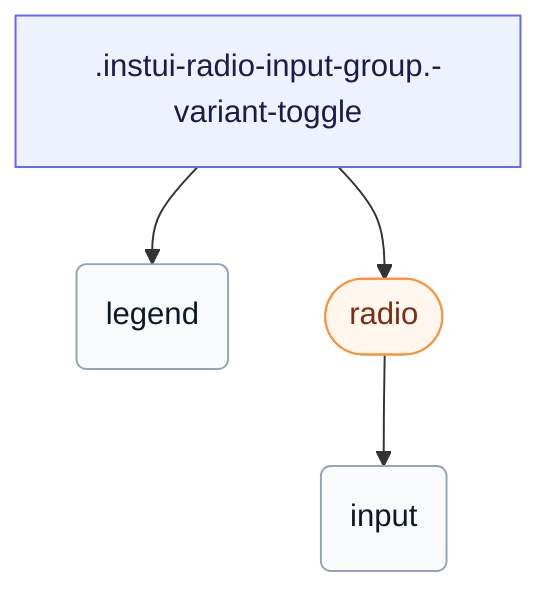

# CSS: radio-input-group

`.instui-radio-input-group` — Un `&lt;fieldset&gt;` de ràdio de selecció única, pla o com a commutador segmentat connectat.

Estableix el seu propi `gap` entre ràdios; encadenar un modificador d'utilitat d'espaiat `-gap-*` substitueix aquest valor integrat.

**Font:** [radio-input-group.css](https://github.com/thedannywahl/pantoken/blob/main/formats/components/src/components/radio-input-group/radio-input-group.css)

## Accessibilitat

Renderitza un `&lt;fieldset&gt;` natiu amb un `&lt;legend&gt;` que anomena el grup; les ràdios fills comparteixen un `name`, així que només es pot seleccionar una alhora.

## Ús

```css
@import "@pantoken/components/components.css";
@import "@pantoken/components/radio-input-group.css";
```

## Exemples

```html
<fieldset class="instui-radio-input-group">
  <legend>T-shirt size</legend>
  <label class="instui-radio"><input type="radio" name="size" checked> Small</label>
  <label class="instui-radio"><input type="radio" name="size"> Medium</label>
  <label class="instui-radio"><input type="radio" name="size"> Large</label>
</fieldset>
```
### Toggle variant
```html
<fieldset class="instui-radio-input-group -variant-toggle">
  <legend>T-shirt size</legend>
  <label class="instui-radio -variant-toggle"><input type="radio" name="size" checked> Small</label>
  <label class="instui-radio -variant-toggle"><input type="radio" name="size"> Medium</label>
  <label class="instui-radio -variant-toggle"><input type="radio" name="size"> Large</label>
</fieldset>
```

## Estructura

```text
.instui-radio-input-group.-variant-toggle
  legend
  radio (component)
    input
```



## Modificadors

| Modificador | Descripció |
| --- | --- |
| `.-layout-columns` | Disposa les ràdios en columnes. |
| `.-layout-inline` | Disposa les ràdios en línia. |
| `.-required` | Marqueu el grup com a obligatori. |
| `.-variant-toggle` | Disposa els commutadors fills com a control segmentat (només el segment seleccionat s'emplena). |

## Pseudoelements

| Pseudoelement | Descripció |
| --- | --- |
| `::after` | Renderitza l'asterisc decoratiu de camp obligatori després del text de la llegenda quan el grup és obligatori. |

## Tokens consumits

| Token | Tipus | Valor |
| --- | --- | --- |
| `--instui-component-form-field-layout-asterisk-color` | `<color>` | `light-dark(#CF1F24, #FA917F)` |
| `--instui-component-form-field-layout-font-family` | `[ <font-family-name> \| <generic-font-family> ]#` | `Atkinson Hyperlegible Next, "Helvetica Neue", Helvetica, Arial, sans-serif` |
| `--instui-component-form-field-layout-font-size` | `<length>` | `1rem` |
| `--instui-component-form-field-layout-font-weight` | `<integer>` | `400` |
| `--instui-component-form-field-layout-gap-inputs` | `<length>` | `0.75rem` |
| `--instui-component-form-field-layout-gap-primitives` | `<length>` | `0.5rem` |
| `--instui-component-form-field-layout-line-height` | `<length>` | `1.125rem` |
| `--instui-component-form-field-layout-text-color` | `<color>` | `light-dark(#273540, #ffffff)` |
| `--instui-spacing-space-md` | `<length>` | `0.75rem` |

## Subcomponents

- [radio](/ca/api/css/radio.md)

## Relacionat

- [radio](/ca/api/css/radio.md) — El control individual que aquest grup col·lecció.
- [form-field-group](/ca/api/css/form-field-group.md) — L'envolupant general per agrupar i disposar camps.

