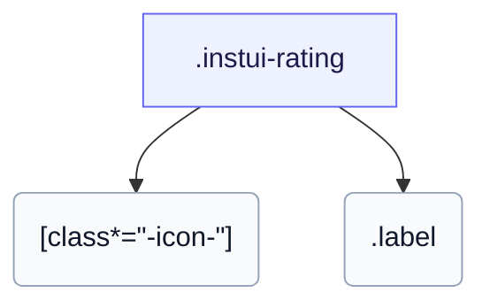

# CSS: rating

`.instui-rating` — Una valoració per estrelles amb glifos plens i buits i una etiqueta numèrica opcional.

Estableix el seu propi `gap` entre glifos estel·lars; encadenar un modificador d'utilitat d'espaçament `-gap-*` substitueix aquest valor integrat.

**Font:** [rating.css](https://github.com/thedannywahl/pantoken/blob/main/formats/components/src/components/rating/rating.css)

## Accessibilitat

Doneu-li role="img" i un aria-label que indiqui la valoració, ja que les estrelles són glifos d'icona.

## Ús

```css
@import "@pantoken/components/components.css";
@import "@pantoken/components/rating.css";
```

## Exemples

```html
<span class="instui-rating -size-sm" role="img" aria-label="2 out of 3 stars">
  <span class="instui-icon -icon-star-solid"></span> <span class="instui-icon -icon-star-solid"></span> <span class="instui-icon -icon-star"></span>
  <span class="label">2/3</span>
</span>
```

## Estructura

```text
.instui-rating
  [class*="-icon-"]
  .label
```



## Modificadors

| Modificador | Descripció |
| --- | --- |
| `.-icon-*` | Renderitzar glifos d'estrella amb classes d'icona (per exemple, `-icon-star-solid`). |
| `.-size-large` | Gran. Àlias de forma llarga de `-size-lg`. |
| `.-size-lg` | Gran. |
| `.-size-sm` | Petit. |
| `.-size-small` | Petit. Àlias de forma llarga de `-size-sm`. |

## Parts

| Part | Descripció |
| --- | --- |
| `.label` | L'etiqueta numèrica, p. ex. "3/5". |

## Tokens consumits

| Token | Tipus | Valor |
| --- | --- | --- |
| `--instui-color-text-base` | `<color>` | `light-dark(#273540, #F2F4F5)` |
| `--instui-component-rating-icon-icon-empty-color` | `<color>` | `light-dark(#1D354F, #EEF4FD)` |
| `--instui-component-rating-icon-icon-filled-color` | `<color>` | `light-dark(#1D354F, #EEF4FD)` |
| `--instui-component-rating-icon-icon-margin` | `<length>` | `0.125rem` |
| `--instui-component-rating-icon-large-icon-font-size` | `<length>` | `2.375rem` |
| `--instui-component-rating-icon-medium-icon-font-size` | `<length>` | `1.375rem` |
| `--instui-component-rating-icon-small-icon-font-size` | `<length>` | `1rem` |
| `--instui-font-family-base` | `[ <font-family-name> \| <generic-font-family> ]#` | `Atkinson Hyperlegible Next, "Helvetica Neue", Helvetica, Arial, sans-serif` |
| `--instui-font-size-text-base` | `<length>` | `1rem` |

