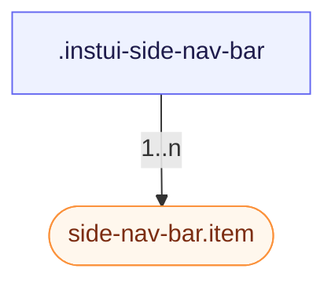

# CSS: side-nav-bar

`.instui-side-nav-bar` — Una barra de navegació vertical d'elements d'icona sobre etiqueta, amb un mode només d'icones minimitzat.

Estableix el seu propi `gap` entre elements de navegació i el seu `padding`; encadenar un modificador d'utilitat d'espaiat `-gap-*`/`-p-*`/`-padding-*` anul·la aquests valors integrats. Mireu el membre `side-nav-bar.item` per als elements de navegació individuals.

**Font:** [item.css](https://github.com/thedannywahl/pantoken/blob/main/formats/components/src/components/side-nav-bar/members/item/item.css)

## Accessibilitat

Etiqueteu el `&lt;nav&gt;` amb aria-label per que sigui anunciat com a punt de referència de navegació nomenat.

## Ús

```css
@import "@pantoken/components/components.css";
@import "@pantoken/components/side-nav-bar.css";
```

## Exemples

```html
<nav class="instui-side-nav-bar" aria-label="Primary">
  <a class="item -selected" href="#">
    <span class="instui-icon -icon-house"></span>
    <span class="label">Home</span>
  </a>
  <a class="item" href="#">
    <span class="instui-icon -icon-inbox"></span>
    <span class="label">Inbox</span>
  </a>
  <a class="item" href="#">
    <span class="instui-icon -icon-calendar"></span>
    <span class="label">Calendar</span>
  </a>
  <a class="item" href="#">
    <span class="instui-icon -icon-settings"></span>
    <span class="label">Settings</span>
  </a>
</nav>
```

## Estructura

```text
.instui-side-nav-bar
  side-nav-bar.item (component, 1..n)
```



## Modificadors

| Modificador | Descripció |
| --- | --- |
| `.-icon-*` | Renderitzeu una icona de símbol en cada element de navegació. |
| `.-minimized` | Contraure a només icones (etiquetes ocultes). @affects side-nav-bar.item — Oculta l'etiqueta de l'element. |

## Parts

| Part | Descripció |
| --- | --- |
| `.label` | L'etiqueta de text de l'element de navegació. |

## Tokens consumits

| Token | Tipus | Valor |
| --- | --- | --- |
| `--instui-component-side-nav-bar-background-color` | `<color>` | `light-dark(#ffffff, #273540)` |
| `--instui-component-side-nav-bar-content-gap` | `<length>` | `0.25rem` |
| `--instui-component-side-nav-bar-content-margin` | `<length>` | `0.375rem` |
| `--instui-component-side-nav-bar-font-color` | `<color>` | `light-dark(#273540, #ffffff)` |
| `--instui-component-side-nav-bar-item-font-family` | `[ <font-family-name> \| <generic-font-family> ]#` | `Atkinson Hyperlegible Next, "Helvetica Neue", Helvetica, Arial, sans-serif` |
| `--instui-component-side-nav-bar-minimized-width` | `<length>` | `3.75rem` |

## Subcomponents

- [side-nav-bar.item](/ca/api/css/side-nav-bar.item.md)

